Bheki was the first cyclone of the 2024-2025 south-west Indian ocean season. Originating from a monsoonal disturbance on November 11th, the storm initially struggled with structural issues, wind shear and dry air. Despite this by November 12th it managed to consolidate a decently organized, albeit elongated low level center.

On the 13th the cyclone underwent a period of quick strengthening, and by the 14th it had been named Bheki by MFR. Soon after receiving its name, the system began building a proper CDO, managing to do so by the late morning. A microwave pass from around midnight of the 13th-14th showcased that the storm was making good progress structure wise, exhibiting a curved band wrapping around the western side of its center.

| 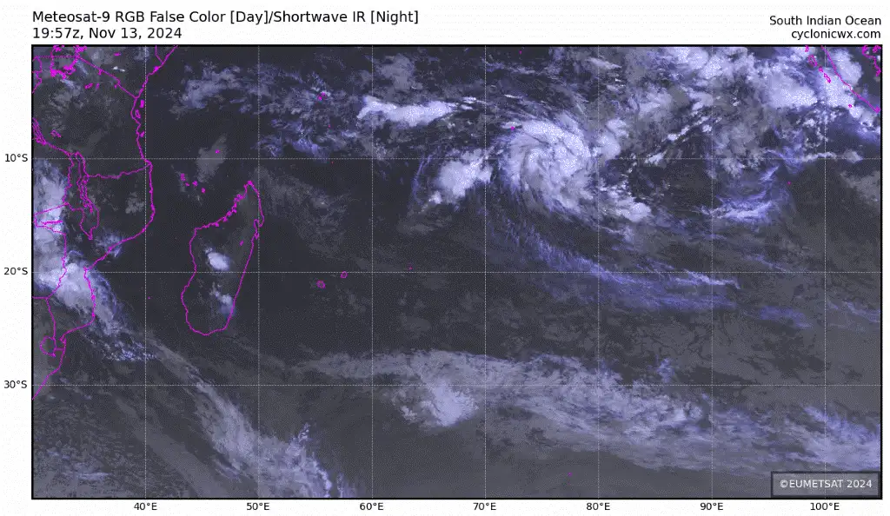 | 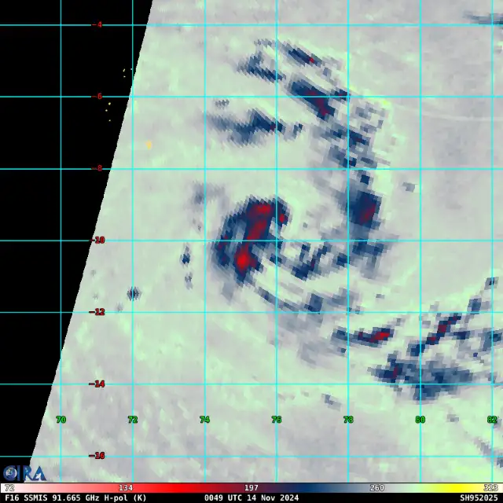 |
| -------------------------------------------------------------------------------------------------- | ------------------------------------------------------------------------------------------------------------- |

Originally forecast to harbor winds of 80 knots at peak intensity, Bheki did not garner the attention of many people. Soon, however, it became evident that the storm was intensifying faster than expected, and its peak would likely exceed forecast.

As the day progressed Bheki would increase convective coverage over its LLC, and by the 15th large convective bursts would begin wrapping around the cyclone's core. A microwave pass around mid-day on the 15th showed that Bheki's mid level core became increasingly organized, now exhibiting a strong curved band which curled around the storm's center.

| 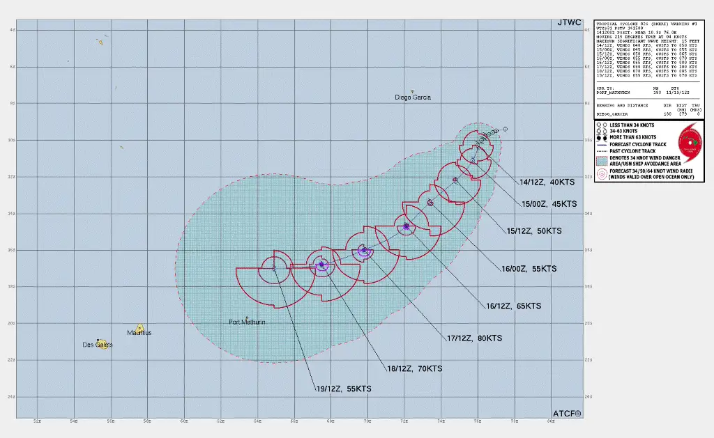 |  |
| ------------------------------------------------------------------------------------------------------------------------------------------------------------------------- | ------------------------------------------------------------------------------------ |

In the evening on the 15th, the storm made its first attempt at forming an eye. VHTs repeatedly fired in the eyewall and curled rapidly around the center. This process repeated for the first half of the 16th, with VHTs covering the eye, or insufficient subsidence not allowing for the eye to properly form, despite a few good attempts, during which the nascent eye would pop up on satellite imagery.

By mid day, the situation would change. Following a powerful VHT the eye began to rapidly warm, reaching 8 degrees Celsius soon after forming. The cyclone had rapidly intensified, and now was entering a 24 hour window of favorable environmental parameters before running into cold water.

| 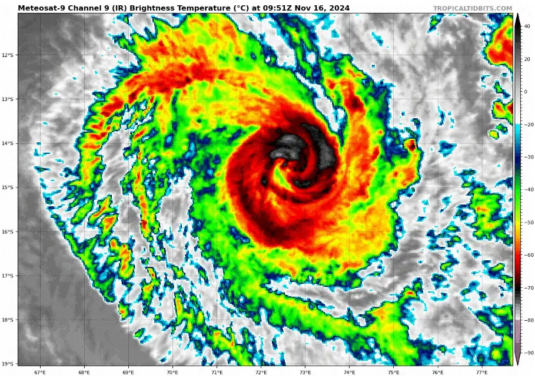 | 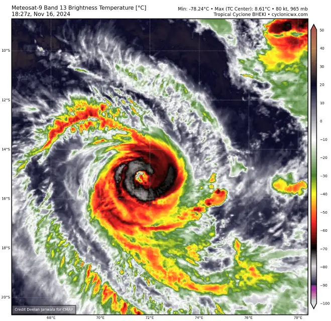 |
| -------------------------------------------------------------------------------------------------------- | ----------------------------------------------------------------------------------------------- |

Aftter the formation of the eye, Bheki's CDO began rapidly cooling, indicating that the system had continued to intensify. This fact was evident in a microwave image taken around the evening of the 16th, which showcased the cyclone's powerful mid level core and well defined eye. Much of this intensification can be attributed to the storm's incredible outflow channels, which radiated outwards in a dual channel mode. Satellite presentation continued to improve throughout the evening and well into the 17th. 

| 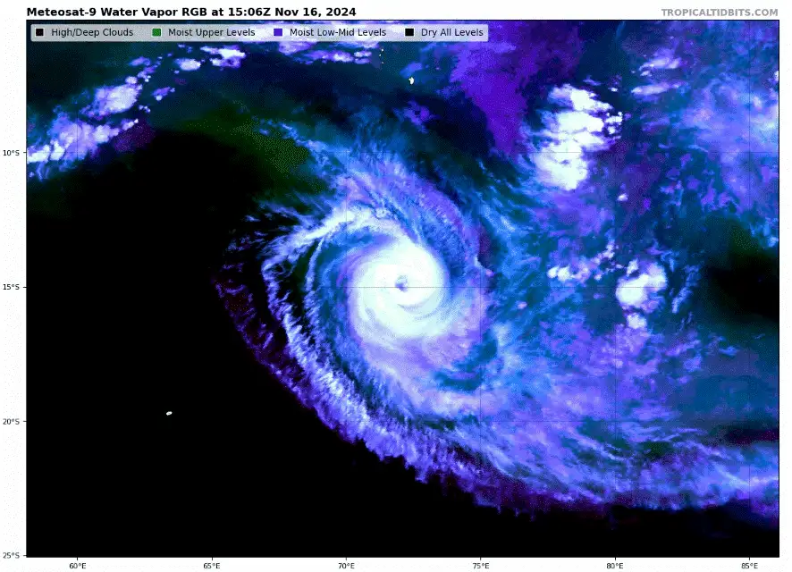 | 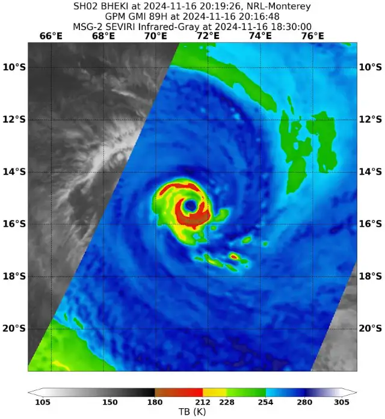 |
| ----------------------------------------------------------------------------------------------------------- | --------------------------------------------------------------------------------------------------------------------------------------------------- |

Bheki peaked around noon of November 17th. The storm's appearance improved drastically, CDO cooled and eye became more axis symmetric. Intensification was quite steady as the eye stabilized, and convective activity became stronger. The result was a stunning cyclone in the open seas of the south west Indian ocean, however this peak would not last long as northwesterly shear increased and sea surface temperatures below the storm slowly decreased.

| 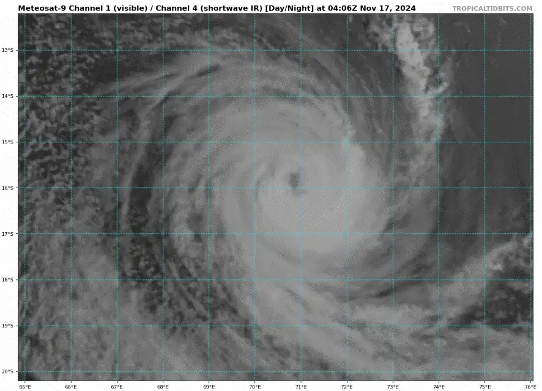                                   | 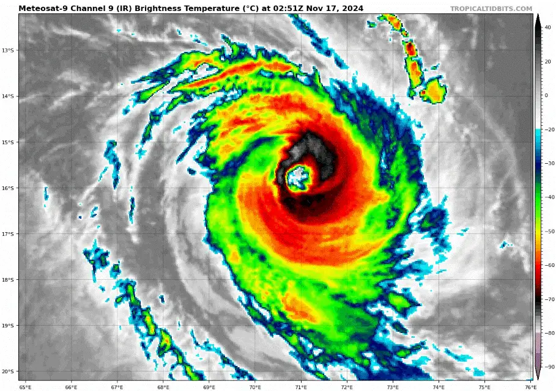                  |
| --------------------------------------------------------------------------------------------------------------------------------------- | ---------------------------------------------------------------------------------------------- |
| 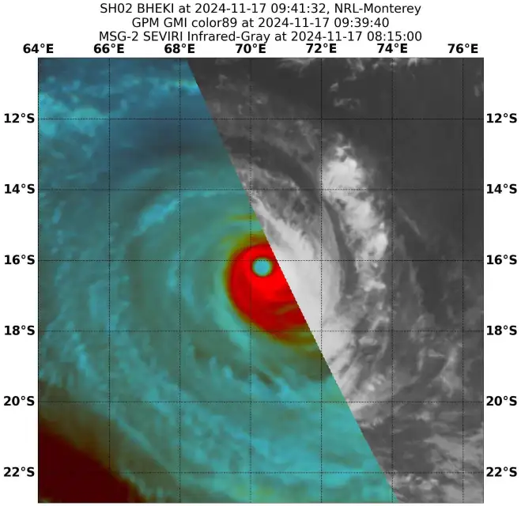 |  |

Despite its intensity, the storm's peak did not last for long. A mere 2-3 hours after the eye became fully clear and axis symmetric, shear picked up, which in turn lead to Bheki weakening. The CDO switched from a stable convective mode into a burst cycle, outflow became highly disorganized, and the entire cyclone became asymmetric towards the south east. Despite the weakening trend, the well established eye managed to sustain itself for a few more hours.

By the evening of the 18th what remained of Bheki was its low level center and disorganized bursts of convection. 

| 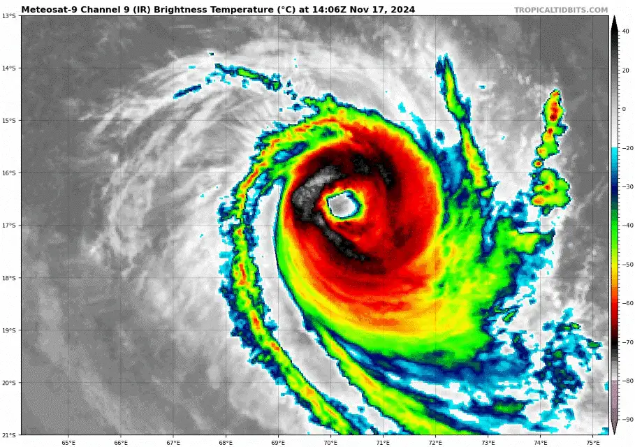 | 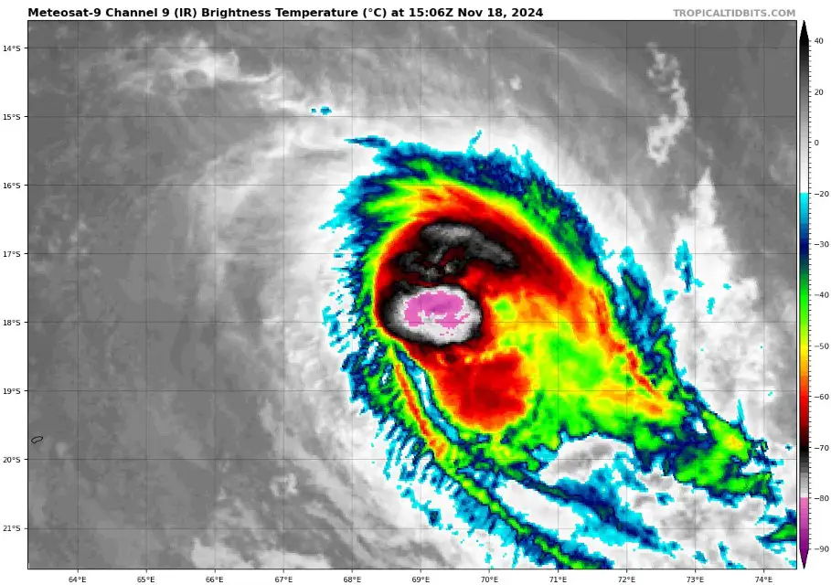 |
| ---------------------------------------------------------------------------------------------------- | ------------------------------------------------------------------------------------------------------ |

Bheki remained disorganized throughout the 19th, however once more exceeded model expectations, with convection curling around its center. This did not last long however, as shear picked up once more in tune with falling oceanic heat content, which lead to the storm losing all deep moist convection, becoming a naked swirl in the ocean covered by its former outflow. 

|  | 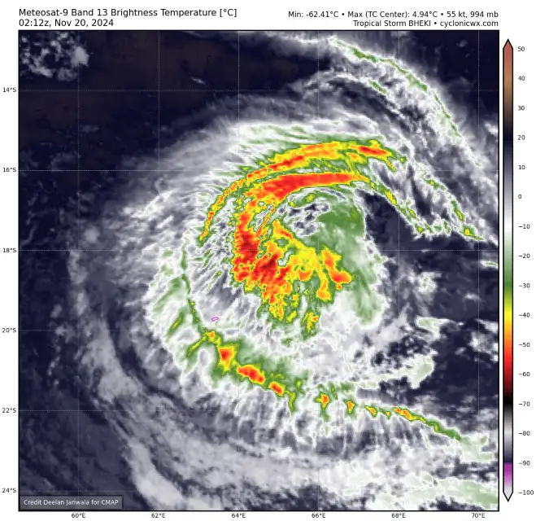 |
| --------------------------------------------------------------------------------------------------------------------------- | -------------------------------------------------------------------------------------------------------------- |

As the LLC of Bheki moved southwestward singular cells of convection, not even bursts fired on its periphery. The vortex then moved next to the islands of Mauritius and La Reunion, attempting for a final time to defy expectations by producing large bursts of convection near its center.

An ASCAT pass around this time showed the storm had maintained winds of 45 knots, leading to MFR reissuing advisories concerning Bheki. However, as per usual with this storm, this did not last long. By the morning of the 23rd all convection had faded, and the now tiny vortex would dissipate later in the day.

| 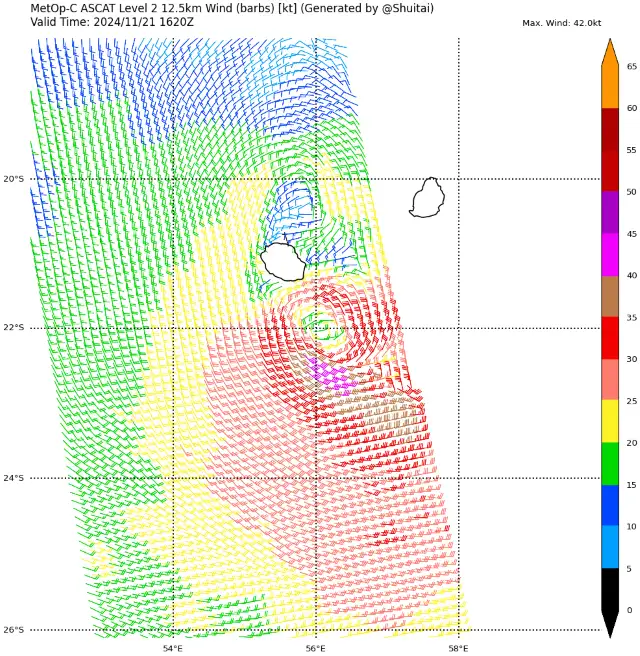 | 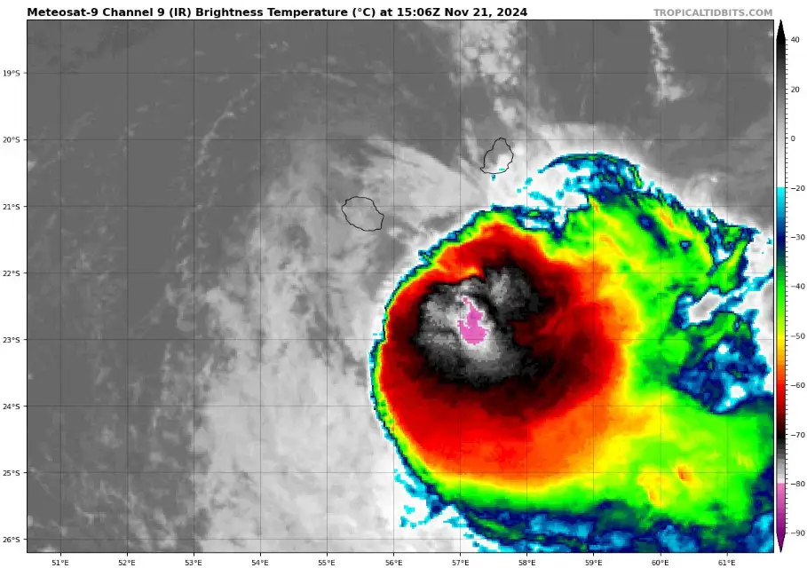 |
| ---------------------------------------------------------------------------------------------------------------------- | ---------------------------------------------------------------------------------------------------- |

#### Gallery of valuable data, imagery and extra stuff.

| 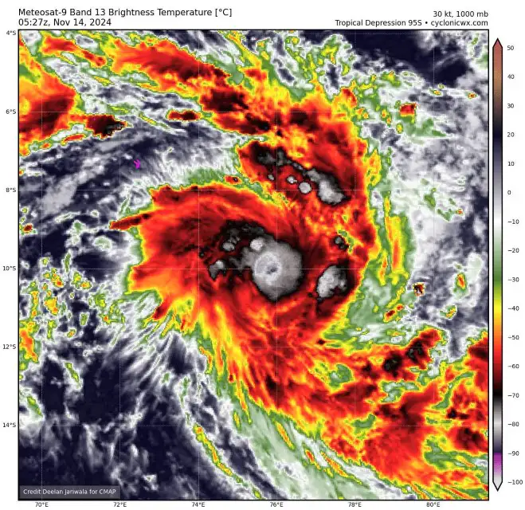                                                   | 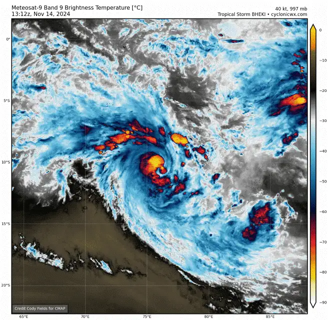                  | 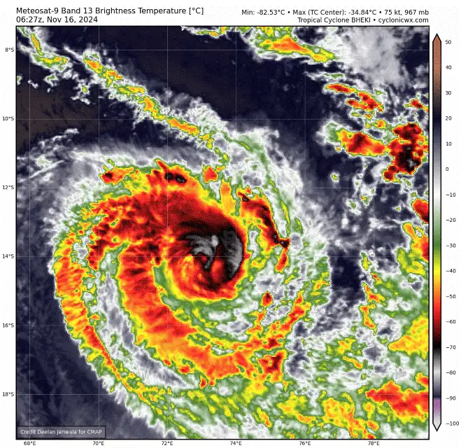 |
| --------------------------------------------------------------------------------------------------------------------------------- | -------------------------------------------------------------------------------------------------- | ---------------------------------------------------------------------------------------- |
| 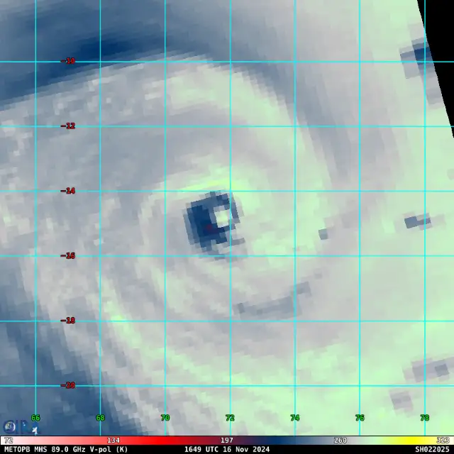 | 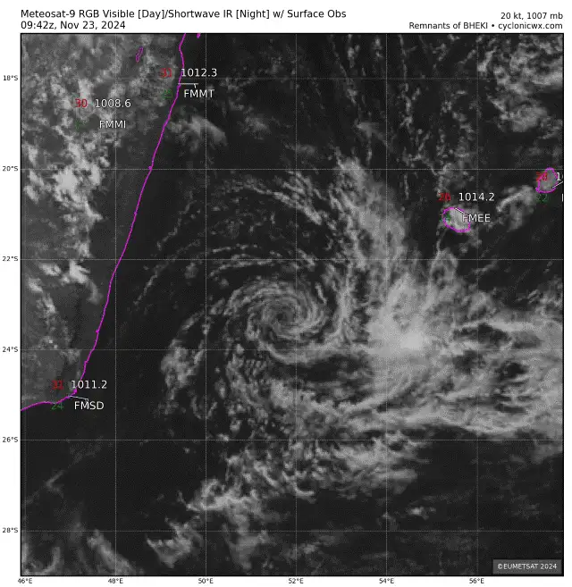 | 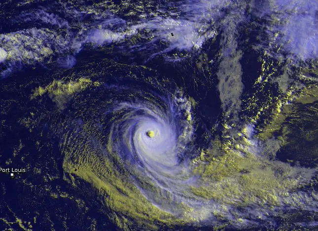                |
