Krosa originated from a broad and heavily sheared disturbance which slowly consolidated during mid-July. Late on July 23rd the system organized enough to get classified by JTWC as 12W.

The following day JMA would name the tropical cyclone Krosa, becoming the 9th named storm of the western Pacific typhoon season. 

| 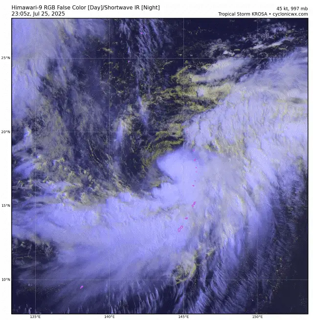 |
| -------------------------------------------------------------------- |

The cyclone had positioned itself in the south eastern quadrant of an upper level low (ULL), and thus, was heavily sheared from the north west. Due to its somewhat unusual monsoonal-ULL origin, the storm was enveloped in a line of thunderstorms stretching from the west to the north-north east. 

Despite heavy shear, Krosa would continuously fire deep convective bursts, mainly thanks to the ample upper level divergence and the broadness of the low pressure area that the storm was enveloped in, allowing for easier ascent of air in and around the cyclone. 

In spite of being fairly weak - harboring winds of around 50 to 55 knots - the storm's wind field was unusually large, once again due to the wide monsoonal region of convection the storm was enveloped in.

| 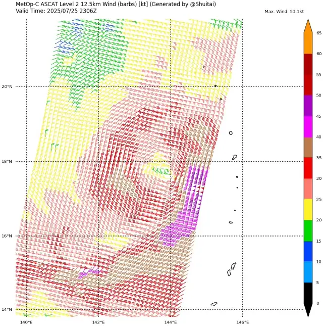 | 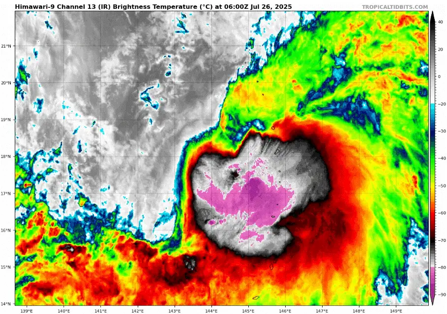 |
| -------------------------------------------------------------------------------------------------------- | ----------------------------------------------------------------------------------------- |

As shear began to diminish, Krosa slowly curled convection around its center, eventually  strengthening and achieving typhoon status by July 27th. A low level microwave pass from the early morning of the twenty seventh showed a wrapped band structure with a broad eye, poising the storm for the formation of a proper eyewall.

After it's typhoon classification, Krosa did not halt its intensification trend. By mid day on the 27th the storm would begin firing dual VHTs around a large center, a common sign of a quickly organizing storm. A nascent eye also became apparent on enhanced visible imagery.

| 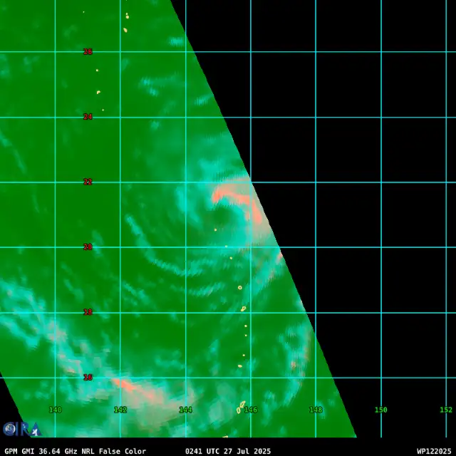 | 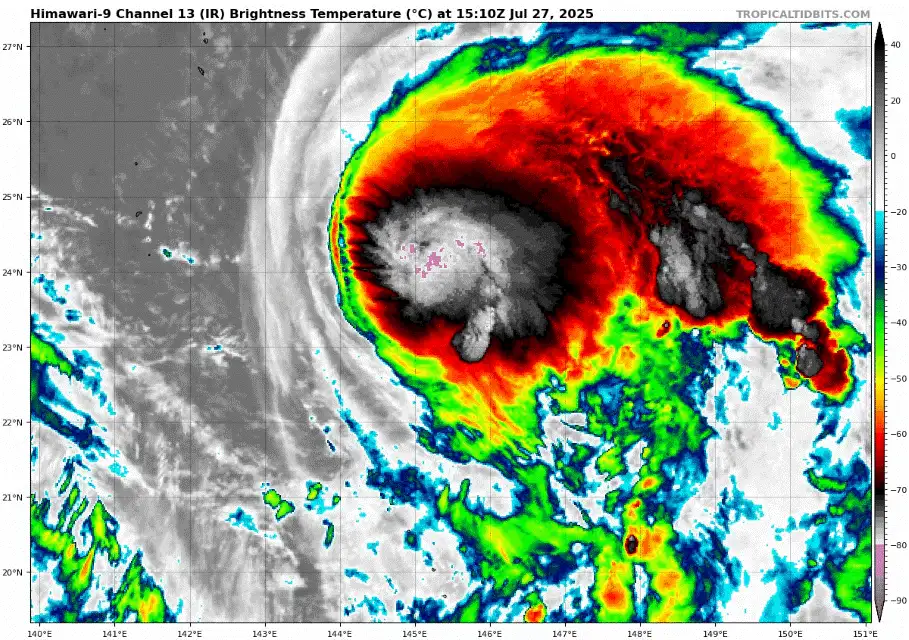 |
| ------------------------------------------------------------------------------------------------------------------------ | ----------------------------------------------------------------------------- |

Throughout the rest of the day and early on the 28th the storm intensified steadily, attaining its peak as a high end category 1 equivalent typhoon with winds of 80 knots and a fairly low pressure of 962 millibars. Soon enough, a well defined eye appeared on visible and infrared satellite imagery, indicative of a maturing cyclone.

During this time Krosa fought off the upper level low's influence, managing to form a decently pronounced cirrus shield. 

| 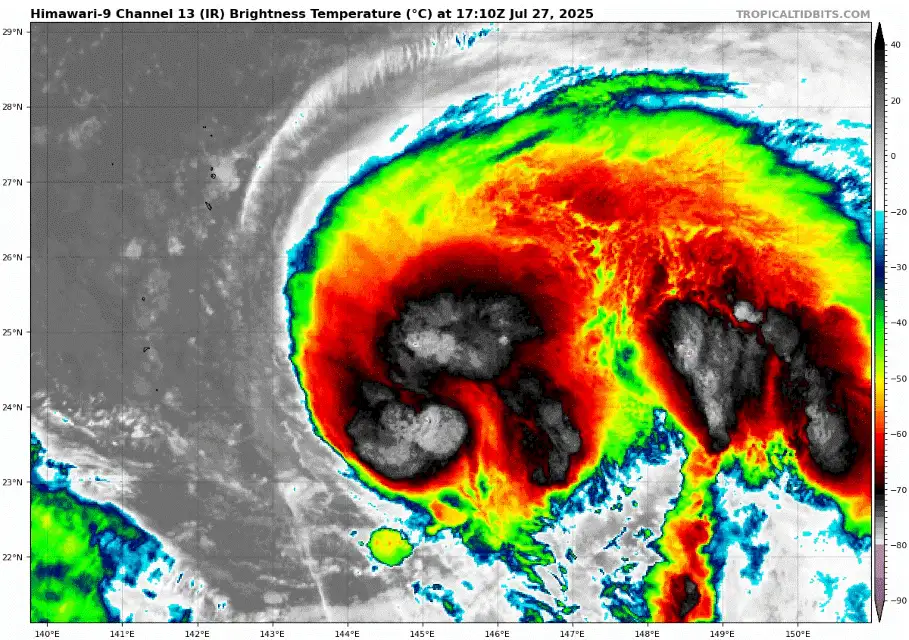          | 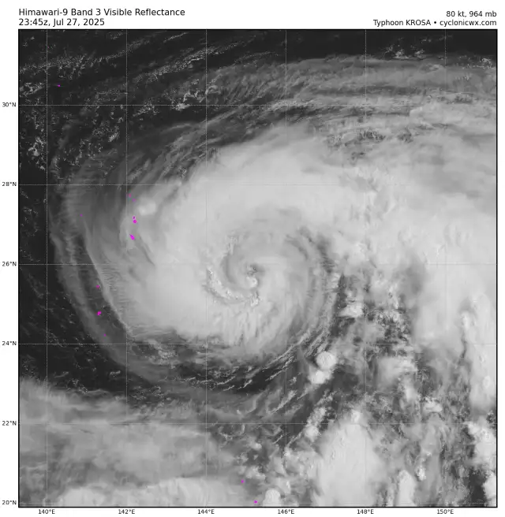                                       |
| ---------------------------------------------------------------------------------------------------------- | ------------------------------------------------------------------------------------------------------------------ |
| 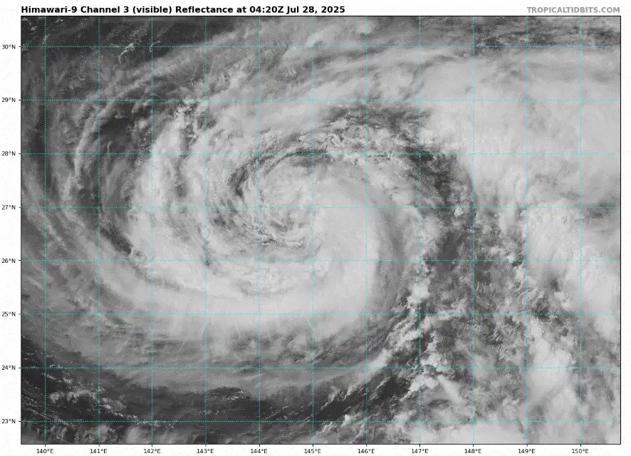 | 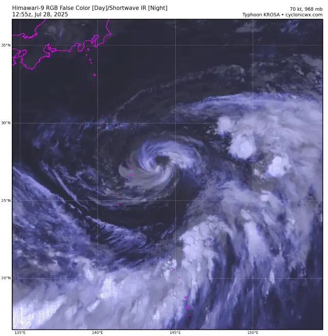 |

After about half a day of the storm's convection withering in dry air, the storm began firing central bursts once more. Becoming fully superpositioned with the upper level low swirling above it, the environment around Krosa would become decently favorable. 

Krosa would remain in a somewhat conducive environment throughout the 29th, and by the 30th it would begin to intensify more steadily, soon enough approaching its 2nd peak.

| 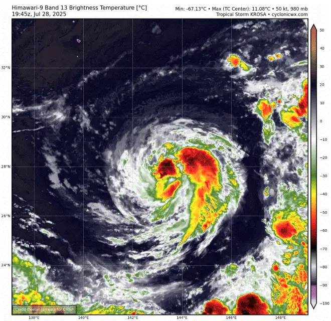 | 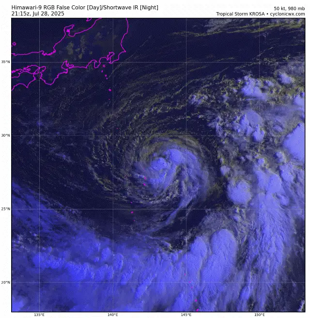 |
| ---------------------------------------------------------------------------------------------------- | ------------------------------------------------------------------------------------------------------ |

As the storm approached Japan sea surface temperatures remained steady around 28 degrees Celsius. This fact, combined with very low wind shear allowed Krosa to attain its secondary peak, just shy of category 1 intensity on the SSHWS.

The storm became highly photogenic as dry air still enveloped its core. Despite the low moisture content around it, Krosa managed to form a moisture bubble, which isolated it from the hostile conditions. Large VHTs would fire around the cyclone's center, wrapping fully and forming a large eye. Krosa would retain these features, as well as its intensity throughout July 30th, 31st and August 1st. 

| 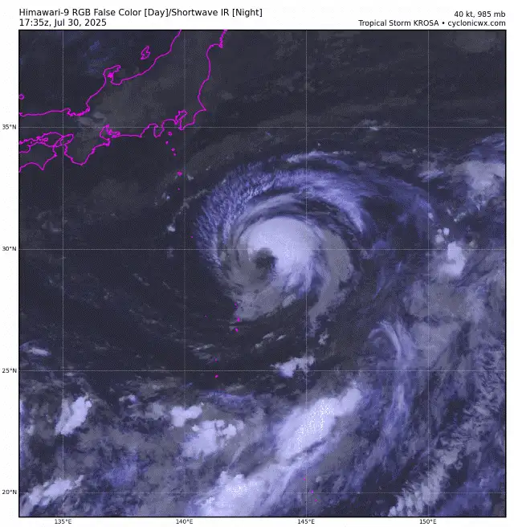                        | 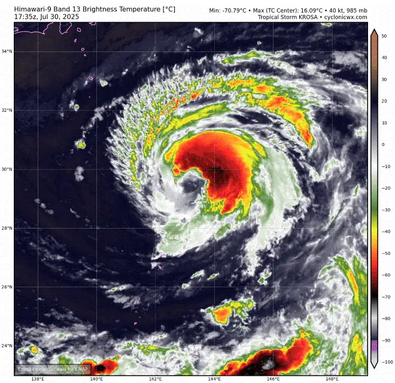                             |
| ------------------------------------------------------------------------------------------------- | ------------------------------------------------------------------------------------------------------ |
| 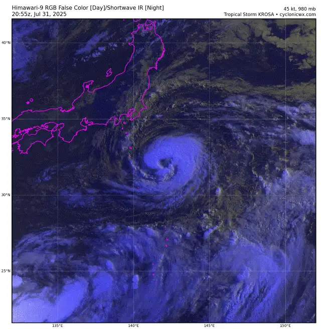 | 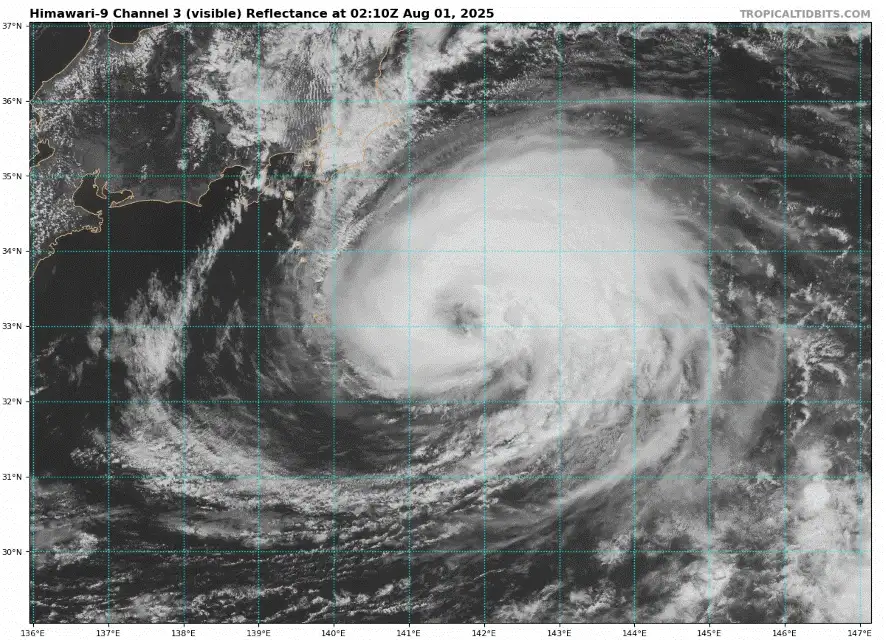 |

After its closest approach to Japan, the storm would begin to weaken as it crossed the 26 degree Celsius isotherm, slowly withering away in the subtropical regions of the western Pacific ocean, eventually becoming extratropical on August 3rd. Throughout its life typhoon Krosa produced 11.82 units of ACE, at the time the highest in the season.

#### Gallery of valuable data, imagery and extra stuff.

|  |        | 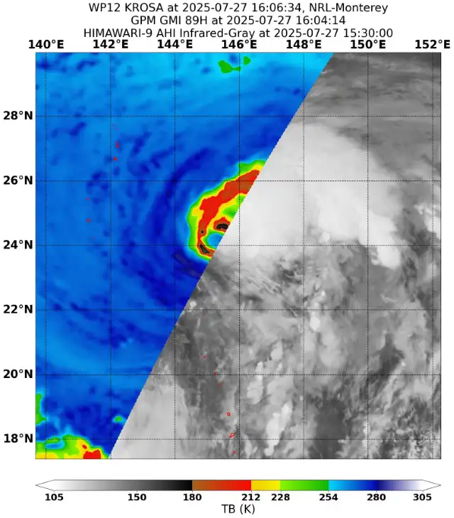 |
| --------------------------------------------------------------------------------------------- | ------------------------------------------------------------------------------------------------------------------ | ---------------------------------------------------------------------------------------------------------------------------------------------------- |
| 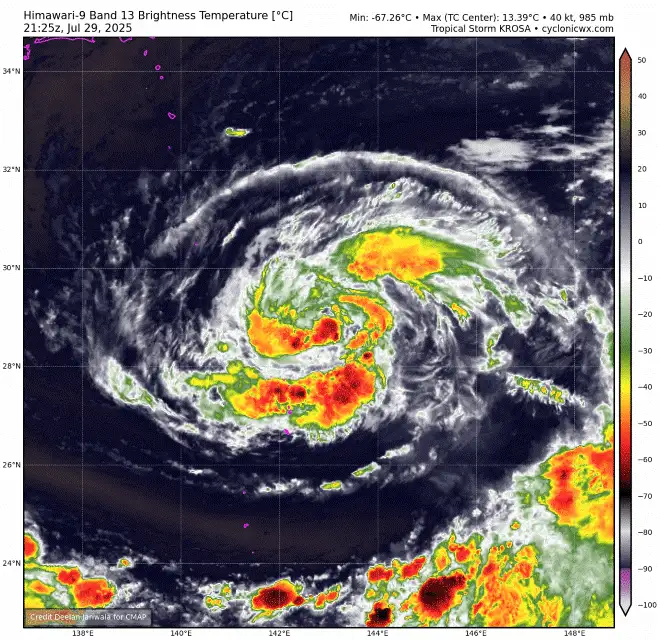                         | 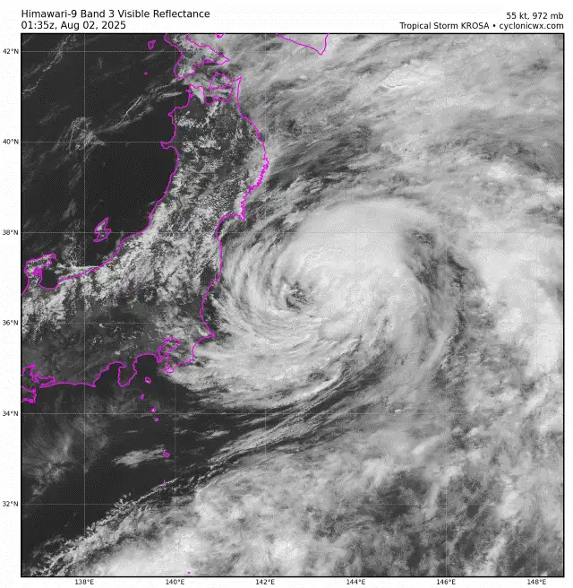 | 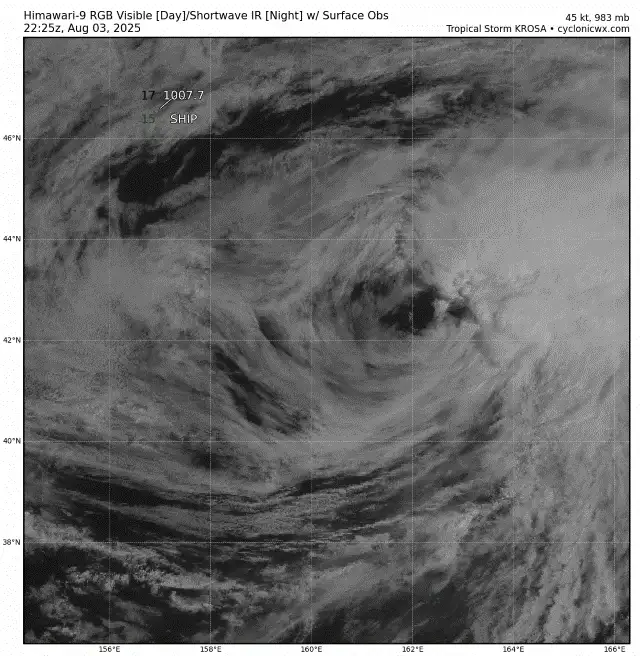                                                                     |
