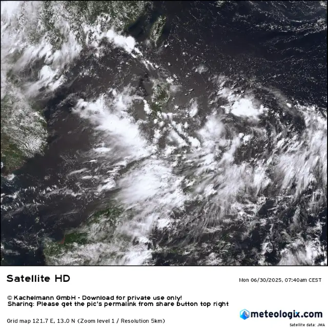
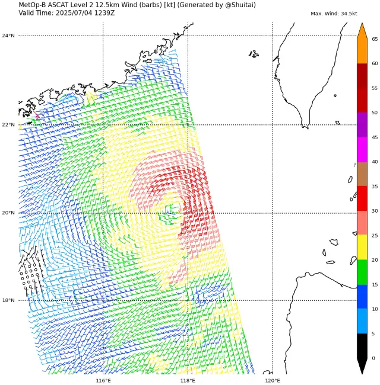
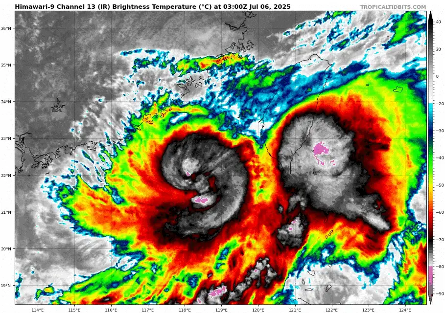
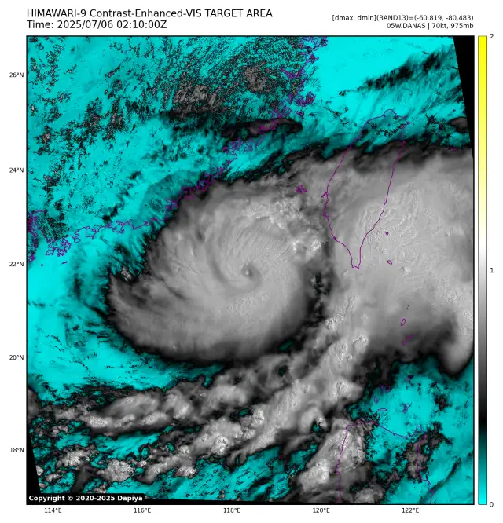
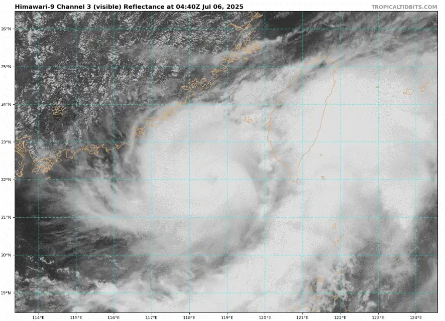
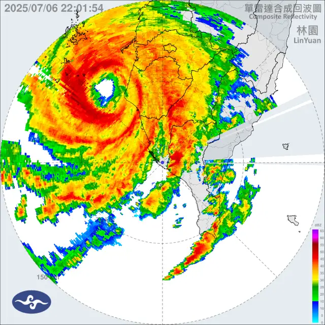
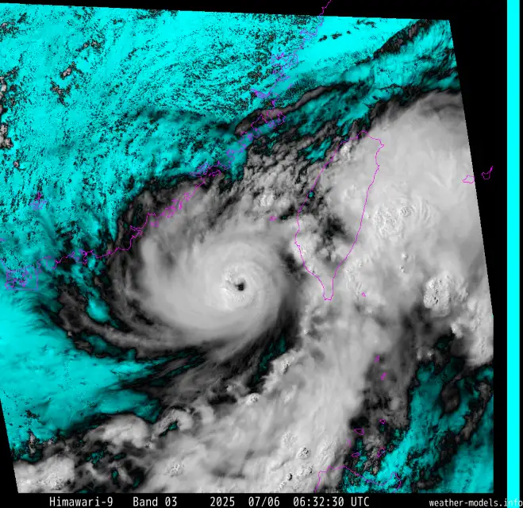
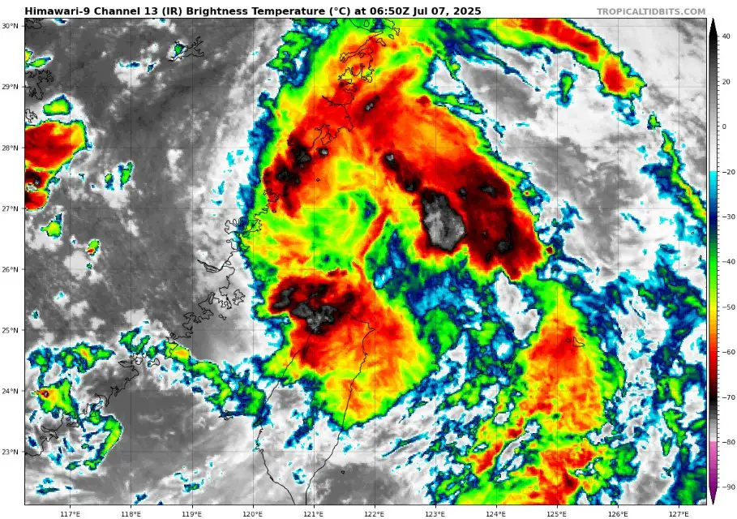
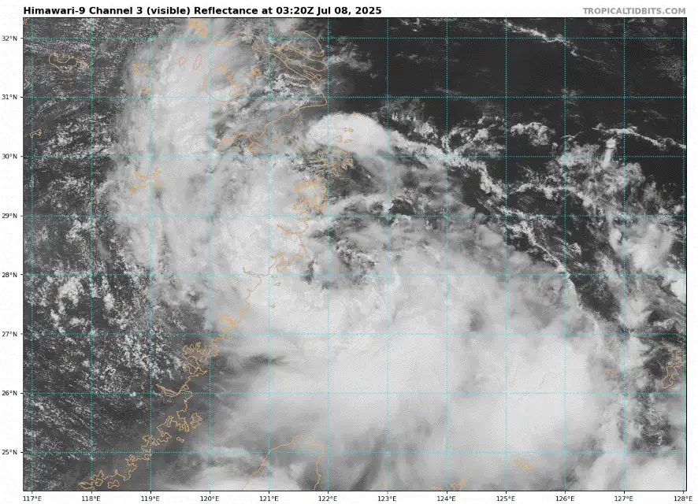
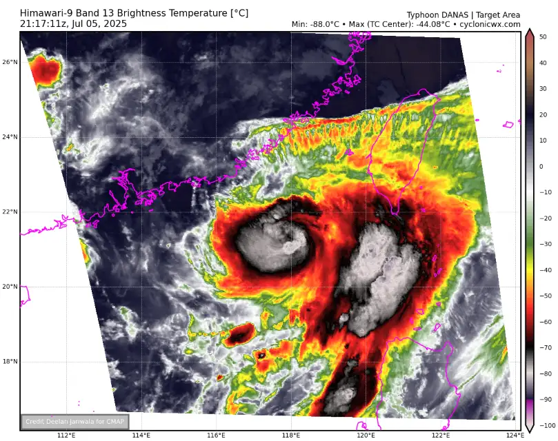

Originating from an extremely large disturbance in the Philippines sea during late June, Danas' predecessor tracked generally westward and entered the South China sea as a disorganized, large gyre.

|  |
| -------------------------------------------------------------------------------------------------------- |

The disturbance developed vigorous deep convection while establishing a decent outflow pattern, and by July 4th it had been classified by JMA and JTWC, receiving the name Danas. An ASCAT pass at this time showed ~30kt winds encircling the storm's center, although these winds would not fully wrap for a while.

|  |  |
| --------------------------------------------------------------------------------------------- | --------------------------------------------------------------------------------------------------------------------------------------------------------------- |

Danas would quickly consolidate and undergo rapid intensification, achieving typhoon status and even managing to clear a brief yet well defined eye. Rapid intensification ensued soon after the storm mixed out a well defined dry slot, which allowed it to take in the warm moist air more easily. The eye struggled to clear at first due to extremely powerful vortical hot towers, which wrapped around the storm's center and obscured the eye with cirrus clouds. Danas developed an extremely strong core on radar imagery taken from Taiwan.

|                  |                                                  |
| ------------------------------------------------------------------------------------------------------------------------------------------ | -------------------------------------------------------------------------------------------------------------------------------------------------------- |
|  |  |
|                                                                                                                                            |                                                                                                                                                          |

On July 6th the strong typhoon would make landfall in the central-western portion of Taiwan, marking the first typhoon to do so since Wayne in 1986. The storm made its impact known to local residents as unusually strong winds for a storm of its strength battered the island from an unusual direction. 

|  |  |
| ---------------------------------------------------------------------------------------------------------------------------- | ------------------------------------------------------------------------------------------------ |

The typhoon would quickly succumb against Taiwan’s harsh terrain and rapidly weaken into a broad and weak tropical storm. After emerging back into open waters, the typhoon would briefly recover strength and organization, once again becoming a tropical storm strength TC. The system would mark its final impact as it made landfall in China, soon after which Danas degraded into a remnant low overland.

|  |  |
| ----------------------------------------------------------------------------------------------------------------------------- | ---------------------------------------------------------------------------------------------------------------------------------------------------- |

#### Gallery of valuable data, imagery and extra stuff.

|  |  |
| ------------------------------------------------------------------------------------------- | ------------------------------------------------------------------------------------------- |
