Cyclone Vince originated from a large tropical gyre which formed ⁠Taliah (2025) on the eastern side and Vince on the western side. The disturbance, named 99S organized rather quickly due to ample moisture and fairly low shear, and was promptly named Vince.

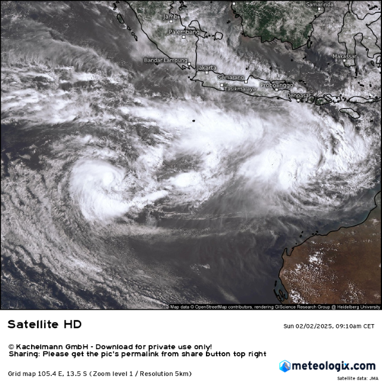

The storm organized into a hurricane equivalent cyclone very quickly, forming a core seen on microwave satellite imagery. Despite this, it did not manage to intensify quickly for about a day or two due to strong northeasterly shear. Non the less, outflow expanded radially and cold convection covered its center, signaling the approaching strengthening phase.

By the afternoon as shear lessened rapidly Vince got its act together. The CDO, previously shaped in a curved band began wrapping around the core up-shear, and VHTs fired within the western eyewall. Soon, the eye appeared on infrared satellite imagery. Vince had rapidly intensified into a category 3 equivalent cyclone, however, the intensification trend came to a halt as an EWRC became evident in microwave imagery. 

 | 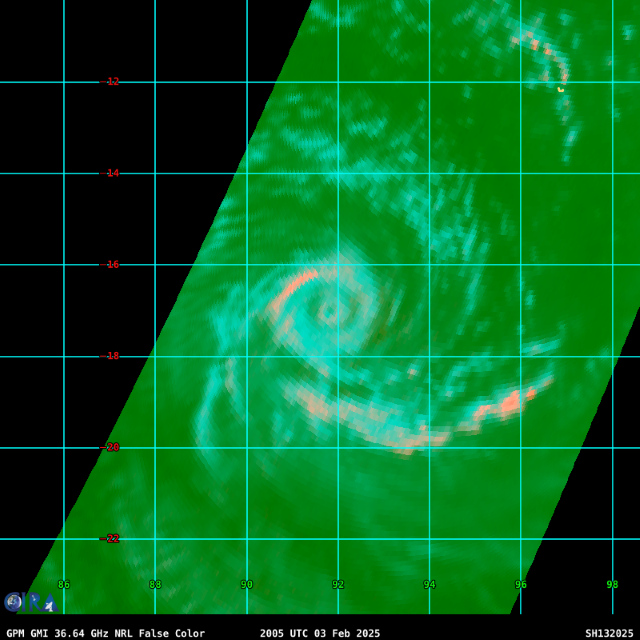 |
| ------------------------------------------------------------------------------------------------------------------------ | ----------------------------------------------------------------------------------------------------------------------------- |

Throughout February 4th the storm struggled with moderate northwesterly shear, as well as internal structural issues. This was evident on infrared satellite imagery as two half-rings of convection kept firing in pulses near the storm's center. 

Not much would change until the early morning hours of February 5th. Shear would drastically lessen and the eyewall replacement cycle would complete, letting Vince rapidly intensify once more, which it promptly did throughout the day. By 10:00 Zulu time the storm would have began clearing a small eye surrounded by deep convection, and the eye would stabilize the following day. 

|  | 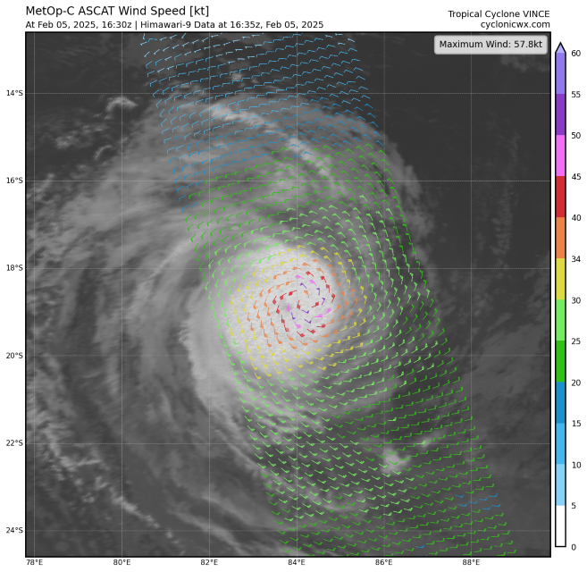 |
| ------------------------------------------------------------------------------------------------------------------------ | ----------------------------------------------------------------------------------------------------------------------------- |

By the following day the storm was well in the process of rapid intensification. The CDO cooled further and the eye stabilized after clearing attempts over the past 24 hours. Around mid-day on February 6th a satellite captured a microwave image of Vince's core, signaling the slow transition into an annular cyclone. Annular cyclones do not exhibit traditional TC structure, in that they do not poses rain bands, which in turn does not allow for easy development of secondary eyewalls. This, coupled with their highly axis-symmetric structure allows them to maintain intensity for longer periods of time. 

| 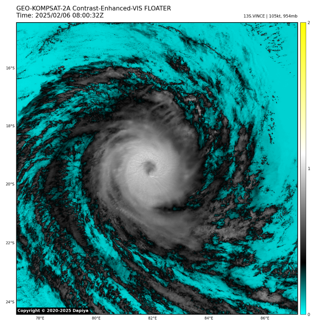 |                                                                 |
| ----------------------------------------------------------------- | ------------------------------------------------------------------------------------------------------------------------------------ |
| 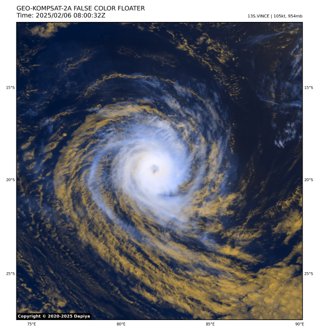         | 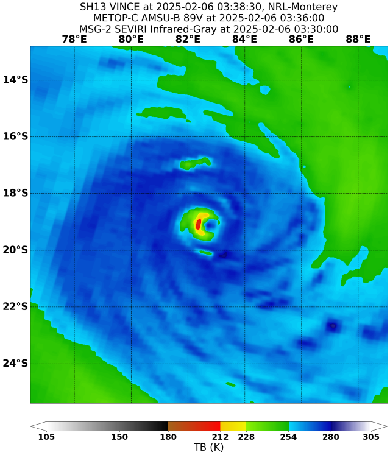 |

By the evening, Vince had intensified further to a powerful high-end category 4 equivalent cyclone. Advanced Dvorak Technique algorithms analyzed the storm to T6.9, on the border of category 5 intensity. Satellite imagery closely monitored Vince, showing an almost closed ring of -80C cloud tops, a characteristic only seen in the strongest of storms.

Despite it's second peak. for a brief period it's intensification would slow down for a moment. Due to lower sea surface temperatures, as well as an uptick in shear values the storm degraded for a few hours before marching on to it's highest peak. 

| 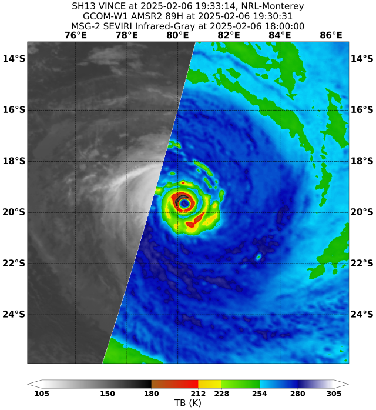 | 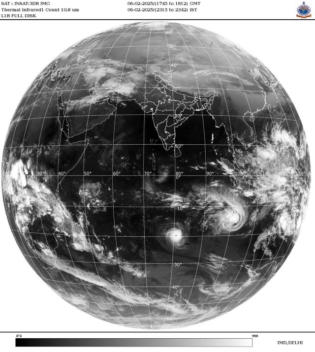 |
| --------------------------------------------------------------------------------------------------------------------------------------------------------- | ----------------------------------------------------------------------------------------------------------------- |
|                                                                                                                                                           |                                                                                                                   |

February 7th was the day that Vince peaked in intensity. Meteo France Reunion (MFR) designated the storm as a Very Intense Tropical Cyclone (VITC), the highest on the scale. Satellite presentation improved drastically, with the eye drying and stabilizing, as well as becoming more symmetric. Despite this, the Joint Typhoon Warning Center did not classify as a category 5 equivalent cyclone, possibly due to marginally warmer cloud top temperatures in the CDO. A SAR pass during this time produced readings of 135 knots, anomalously high for this satellite, which usually struggles with estimating high end storms.

Attached below is a collage of gifs showing Vince at its peak in infrared, as well as visual satellite imagery. All gifs sourced from cyclonicwx.com

|   |   |
| --------------------- | ------------------------ |
|  |  |

Vince's peak continued until the early hours of February 8th, during which another eyewall replacement cycle occurred. Despite its annular structure a rain band managed to wrap around Vince's eye, choking it out and beginning an EWRC. The cycle wrapped up fairly quickly, and soon enough the storm re-intensified, however not as severely as during its VITC peak. 

As per usual with EWRCs, the eye of Vince expanded, as well as its windfield, whilst the peak winds dropped by a few knots. Non the less, the storm remained a powerful category 4 equivalent cyclone as it began its southwesterly drift towards extratropical transition. 

Attached below is a collage of images taken around midday on February 9th. All images sourced from dapiya.top

| 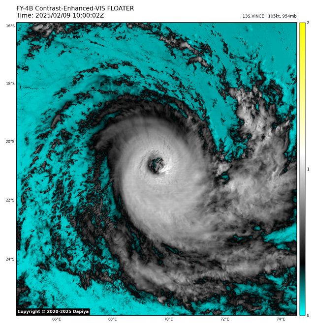    | 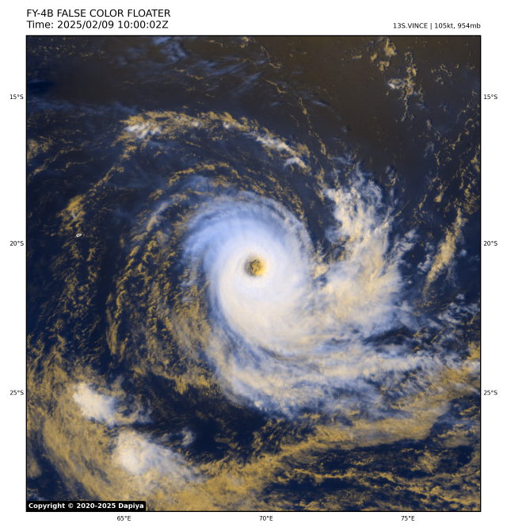 |
| ------------------------- | --------------------- |
| 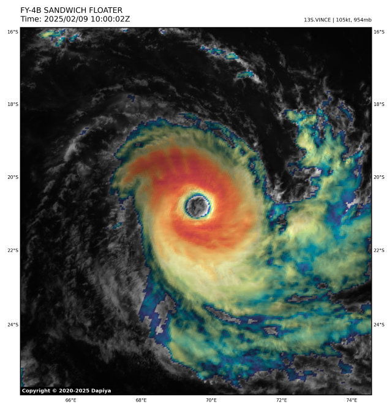 | 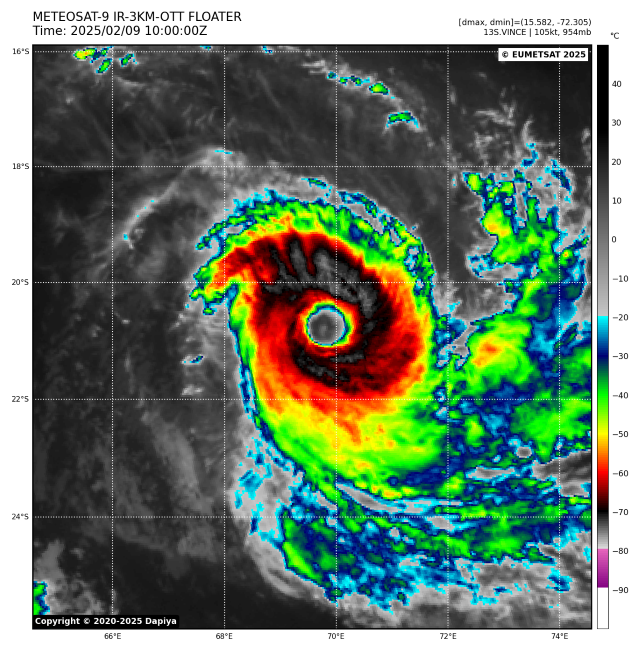 |

The storm's post EWRC peak lasted about 12 hours before its final weakening trend began. On February 10th, the eye slowly became more ragged as the CDO warmed and de-organised. The storm's core began bursting convection instead of firing a continuous ring of thunderstorms, a common sign of a storm's approaching demise. 
Moreover, Vince's outflow also began to produce cirrus plumes in bursts compared to it's previously well established anticyclonic cirrus shield. 

After a long trek across the southern Indian ocean Vince met its demise on February 11th. As shear picked up, sea surface temperatures dropped and outflow worsened the storm degraded into an extratropical cyclone. Soon thereafter Vince's non tropical remnant got scooped up by a nearby trough, marking its dissipation. 

Gallery of valuable data, imagery and extra stuff.

| 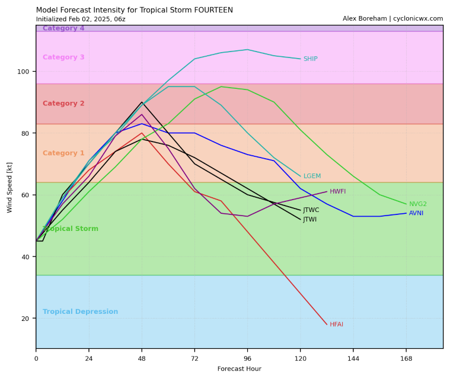 | 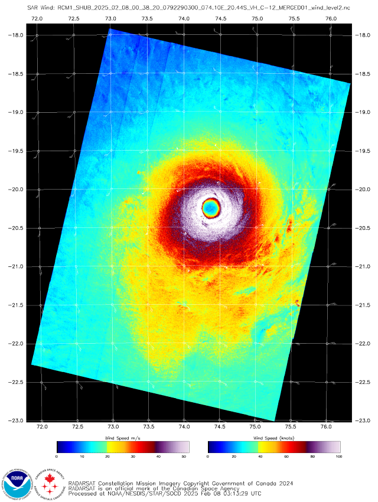 | 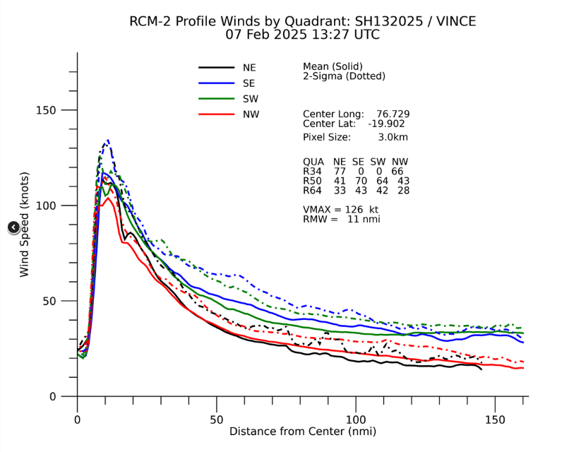               |
| -------------------------------------------------------------------------------------------------------------------------------- | --------------------------------------------------------------------------------------------------------- | ------------------------------------------------------------------------------------------------------------------------ |
| 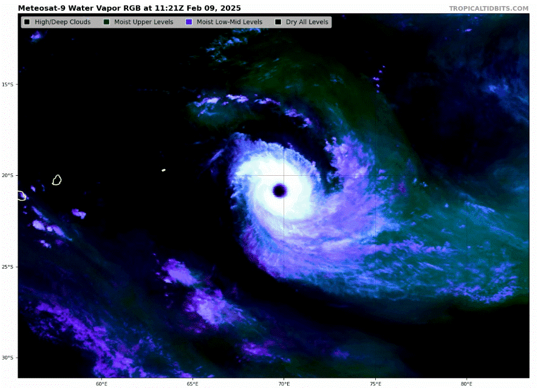                |             | 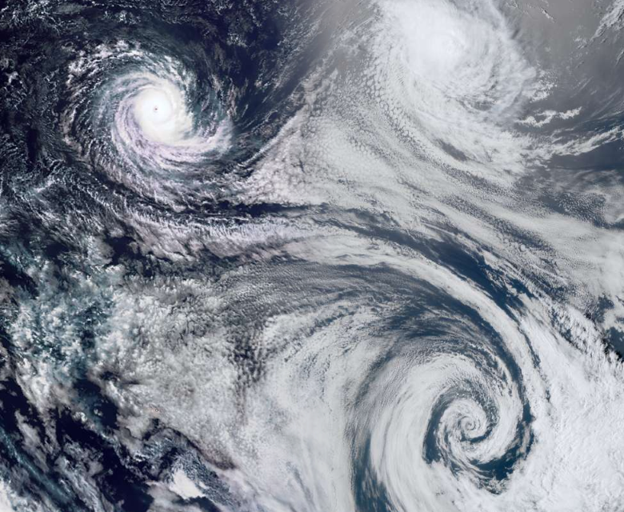 |
| 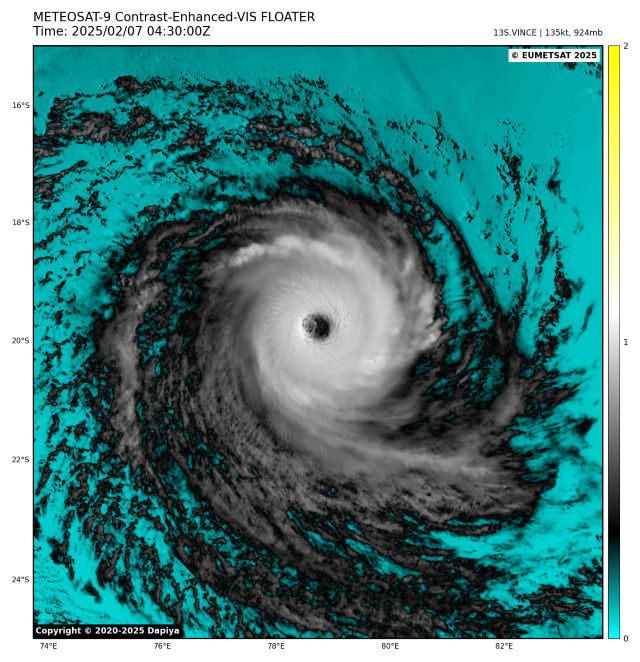                                                                 |          |                  |

