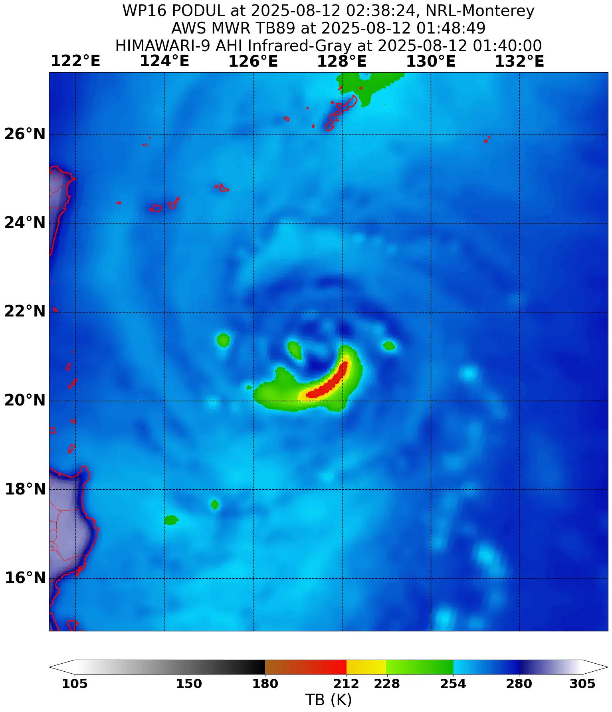
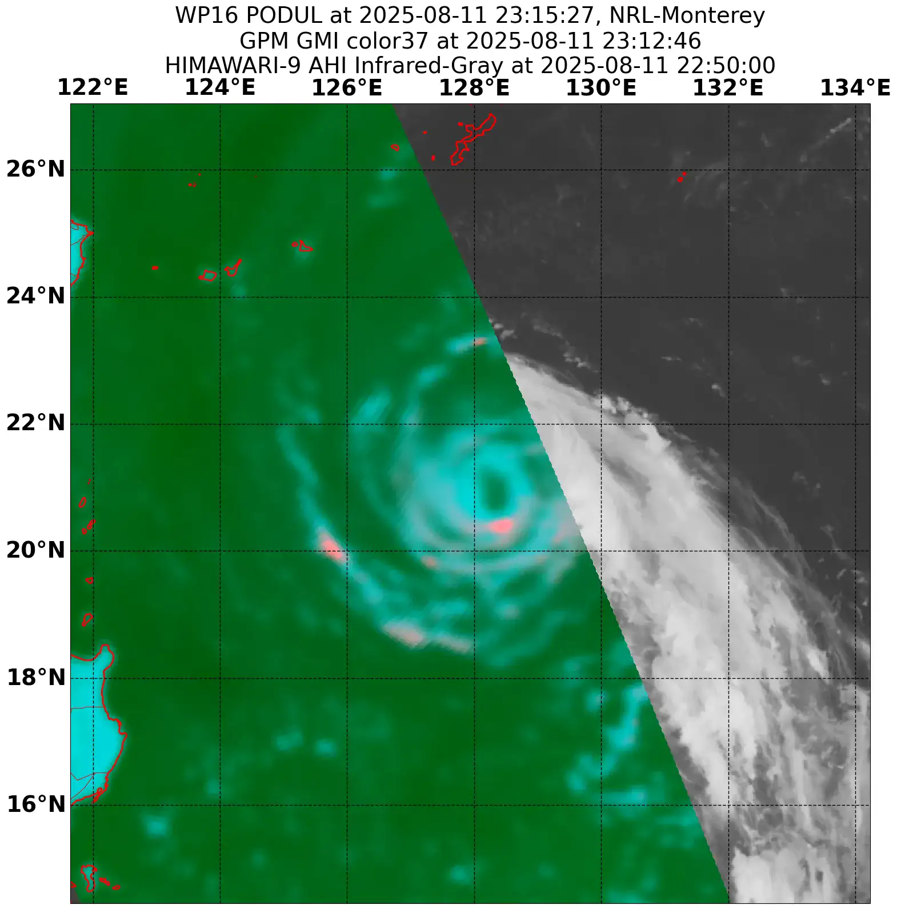
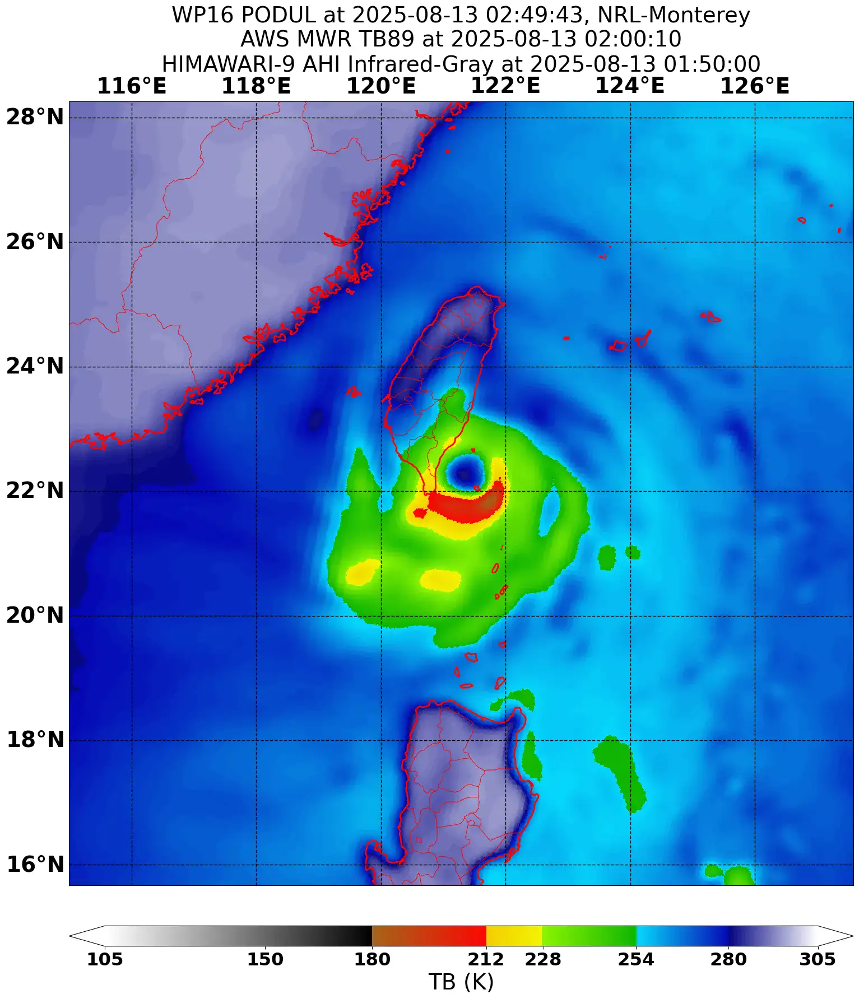

Podul has an interesting origin. The storm's parent disturbance formed from a cut off area of moisture from a warm conveyor belt of an extratropical cyclone in the far north Pacific. Originally, this disturbance produced two upper latitude disturbances in early August, however they did not amount to named storms. The remains of the two disturbances drifted southwestward - a very unusual location and direction for a western Pacific storm to originate from.

After consolidating into a tropical storm strength system, the cyclone became heavily sheared as dry air enveloped its low level center. An ASCAT pass taken late on August sixth showed the storm's core still somewhat asymmetric, as usual for a freshly formed cyclone.

|  |  |
| --------------------------------------------------------------------------------------------------------------- | ----------------------------------------------------------------------------------------------------------------------------- |

The storm organized quite rapidly, however shear from a ridge to its north and dry air kept it from intensifying more. Due to the storm weakening more than forecast, Podul moved further north, and thus - got sheared more as stronger flow from the ridge pushed on its CDO. Powerful convective bursts repeatedly fired around the cyclone's center, however they could not wrap around as northerly shear blasted the storm.

This cycle repeated for about 2-3 days, however despite this, the system managed to intensify somewhat, garnering a very atypical satellite appearance. Podul remained in this bursting, sheared state until the ridge moved farther north east, which in turn caused shear to lessen, and let Podul intensify steadily. 

|  |  |
| ------------------------------------------------------------------------------------------------------------------------------------------------ | --------------------------------------------------------------------------------------------------------------------------------------------------------------------------------------------------------------------------------- |

Once the ridge to Podul's north weakened, the storm was poised for a round of intensification. A bubble of moisture formed around the cyclone, cutting it off from the influx of dry air deep into its core. This fact, coupled with lessening shear as the ridge and upper level troughs moved farther away, let Podul intensify at a steady pace. Evident to this fact was a microwave image taken on August 11th, which showed a broad yet well defined core below Podul's CDO. 

|  |  |
| --------------------------------------------------------------------------------------------------- | ------------------------------------------------------------------------------------------------- |

As the storm set its sights on south central Taiwan, the intensification trend continued. An eye began to intermittently clear on visible and infrared satellite imagery as large VHTs fired near the storms center, briefly increasing subsidence in the eye. 

Even still, microwave imagery showed that Podul exhibited an open mid level core, likely due to dry air entrainment. Despite this, the cyclone slowly intensified until its peak intensity at landfall in Taiwan. Podul's core was quite strong in radar imagery, and an eye managed to briefly clear right before landfall, as well as a later microwave pass taken right before landfall showing a full ring eyewall, signaling that Podul had intensified. 

|                                                   |  |
| ---------------------------------------------------------------------------------------------------------------------------------------------- | ---------------------------------------------------------------------------------------------------------- |
|  |                       |
After re-emerging in the Strait of Taiwan the storm remained disorganized, only firing strong, stationary bursts on its southeastern flank. Soon thereafter, Podul made its final landfall in China and dissipated inland shortly after.

#### Gallery of valuable data, imagery and extra stuff.

|                                                                                                   |  |     |
| ------------------------------------------------------------------------------------------------------------------------------------------------------------------------------------------------------------- | ------------------------------------------------------------------------------------------------------------------------------------ | ----------------------------------------------------------------------------------------------------------------------- |
|                                                                                                              |                                 |                  |
|  |                                        |  |
