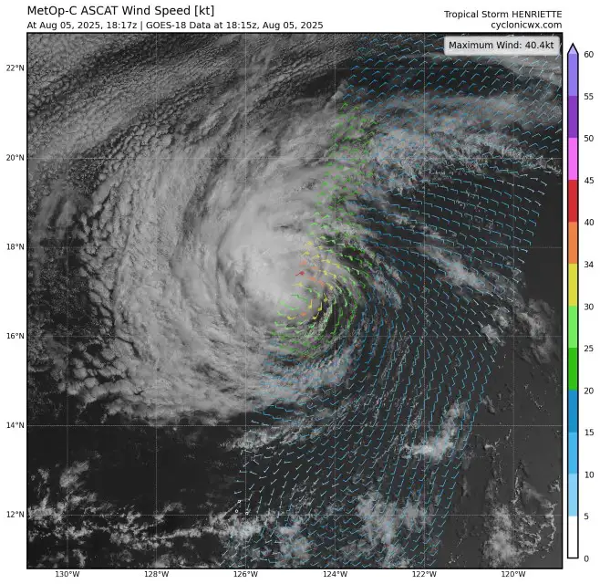
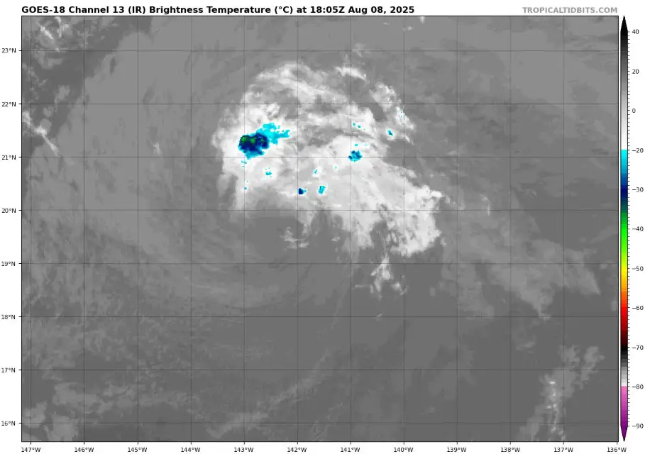
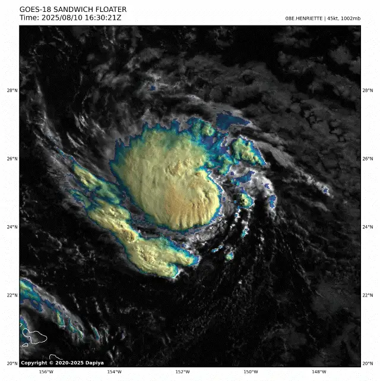
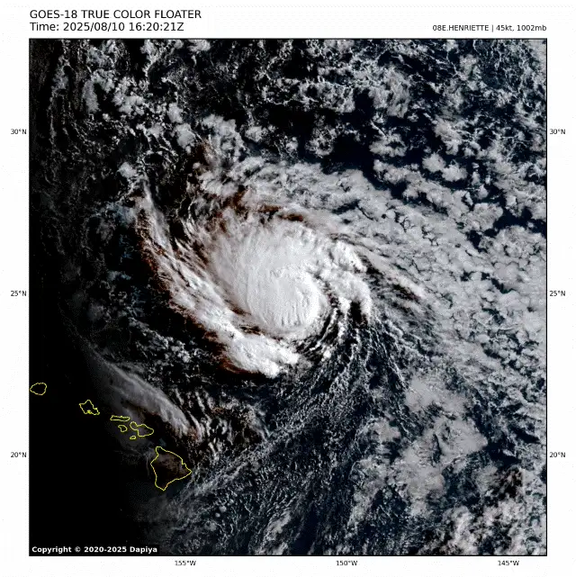
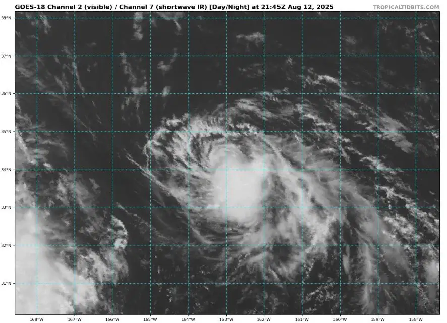
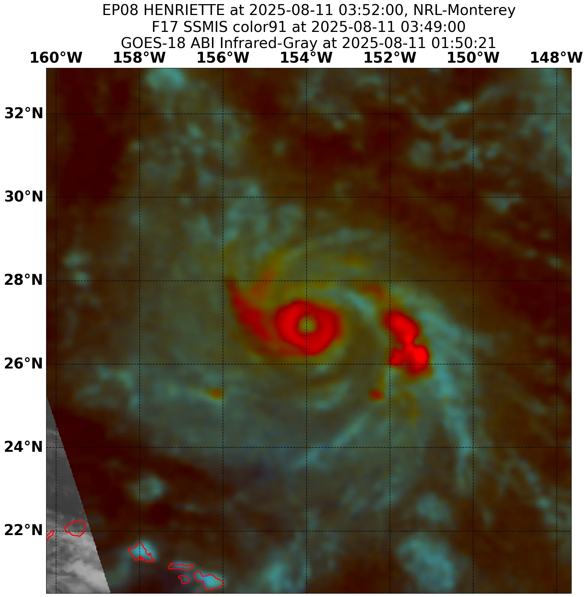
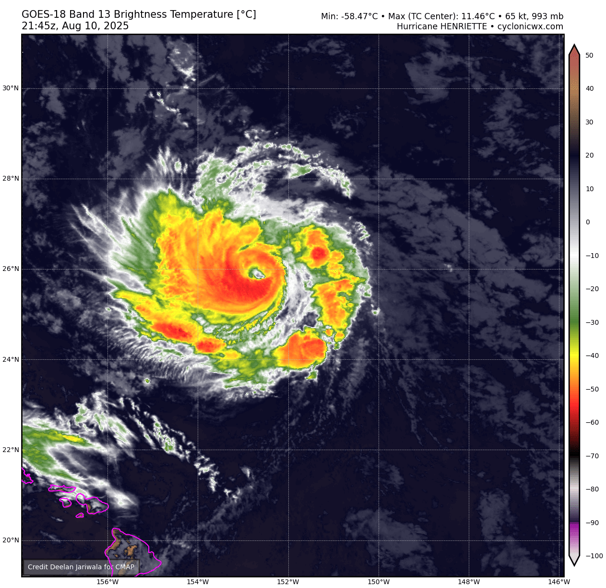
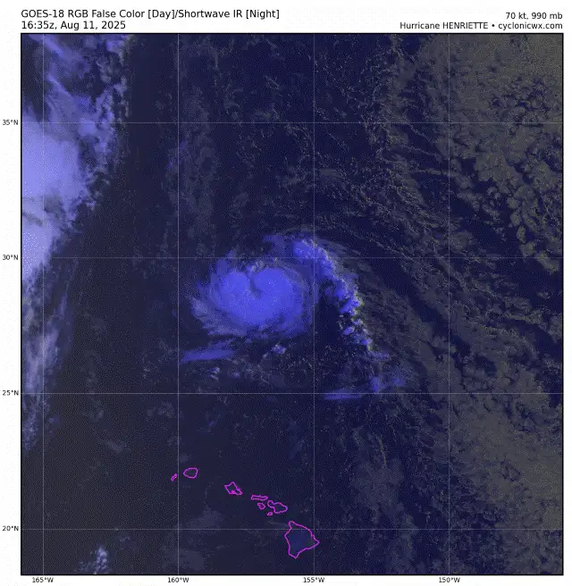
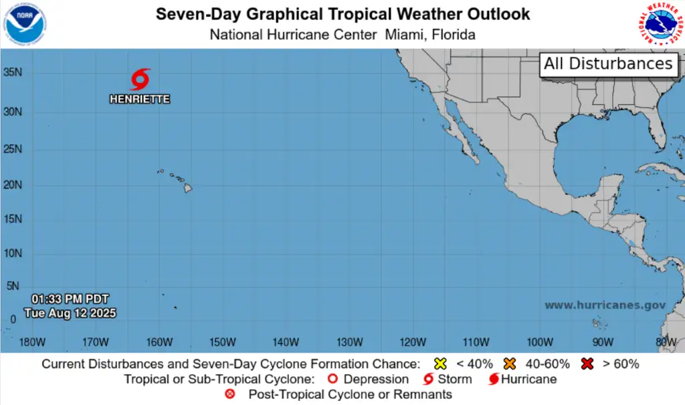

Henriette originated from a disturbance behind Hurricane Gil, slowly moving westward while remaining disorganized. By August 3rd, the system would begin showing notable organization, and by the next day, NHC would classify it as a tropical storm. Initially, Henriette had a ragged appearance, with a prominent band of deep convection to its west producing ~40kt winds. 

|  |
| -------------------------------------------------------------------------------------------------------------- |

Through the day, Henriette would slowly wrap convection around its center, thus organizing further, reaching its initial 45kt peak before running into cooler waters and beginning a slow weakening process. 

Over the next days Henriette would resemble the appearance of a classic dying Eastern Pacific tropical cyclone, with fragile CBs pulsating as it traversed the 26°C isotherm. The storm would end up degenerating into a gale force low as it entered the Central Pacific basin. 

Contrary to the conventional scenario, a quite particular environmental setup involving an ULL aided the remnants of Henriette, which restarted convective activity despite suboptimal sea surface temperatures, resulting in Henriette getting re-upgraded to a tropical cyclone. 

In its second life, the tropical storm found itself in much more permissible conditions, re-strengthening nicely as it moved over gradually warmer waters. Deep convection significantly increased, quickly building a CDO while gravity waves emanated from it's center. By August 10th, Henriette would meet RI criteria as it gained hurricane status northeast of Hawaii, becoming an anomalous, mesmerizing storm. 

|  |  |
| ---------------------------------------------------------------------------------------------------------------------------------------------------------------- | ------------------------------------------------------------------------------------ |

Henriette would spend around 42 hours as a hurricane, at first slowly weakening, but as shear sharply increased, Henriette would quickly decouple its low and mid level centers, and then proceed to degenerate a second and last time.

|  |
| ---------------------------------------------------------------------------------------------------------------------------------------------- |

## Gallery of valuable data, imagery and extra stuff

|  |  |
| ------------------------------------------------------------------------------------------------------------------------------------------------------------- | -------------------------------------------------------------------------------------------------------------------------------------------- |
|                                           |                                            |

