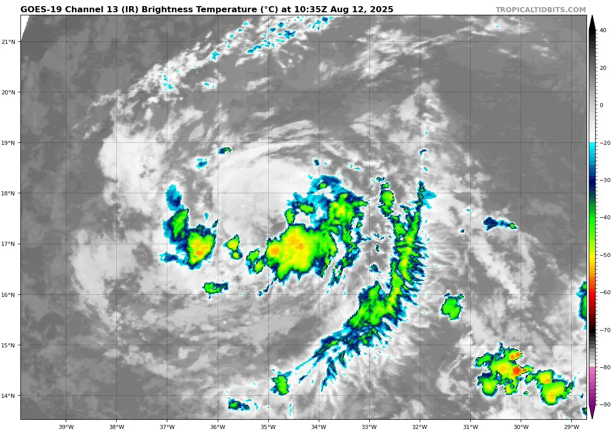

Category 5 Hurricane Erin was a powerful tropical cyclone which travelled the Atlantic in August 2025, thankfully, staying north of the Caribbean and east of the United States.

|    |
| ------------------------------------------------------------------------------------------------------- |

Erin originated from a tropical wave which emerged off the coast of Africa on August 8th. The wave moved northwestward and passed through Cabo Verde Islands, causing severe flooding and killing at least 9. Soon after that, it developed a closed circulation and attained gale-force winds, officially becoming Tropical Storm Erin on August 11th. The next day, however, most of its convection disappeared, leaving the storm's LLC exposed and weenies disappointed. Thankfully for the weenies, Erin soon managed to recover and continued westward in the MDR as a weak tropical storm.

|  |  |
| --------------------------------------------------------------------- | ---------------------------------------------------------------------------------------- |

As SSTs and OHC gradually increased, Erin reorganized and became a compact tropical storm. It traversed the tropical in this state for about 2 days, after which Erin began to intensify and became the season's first hurricane on August 15th.

|  |
| ---------------------------------------------------------------------------------------------------------------------------- |

The storm then proceeded to undergo explosive intensification, reaching major hurricane status and, finally, becoming a Category 5 hurricane. At peak intensity, Erin had 140kt winds, 915mb pressure and impressive satellite presentation with a clear pinhole eye. Erin's eye at peak was the driest that the North Atlantic basin had ever seen - a whopping -8.05C in water vapor imagery. Erin was forecast to intensify rapidly, yet in the end it intensified explosively, outrunning the highest model intensity guidance profiles.

|                                          |  |
| ------------------------------------------------------------------------------------------------------------------------------- | ----------------------------------------------------------------------------------------------------------------------------- |
|  |            |

It then began an EWRC and, at the same time, wind shear increased - this caused the hurricane to weaken to a Category 3 as it moved north of the Antilles. Having completed the EWRC, Erin managed to re-intensify with a now larger eye, despite persistent moderate wind shear. On August 18th at 03z, the NHC upgraded it back to Category 4. 

|  |  |
| ----------------------------------------------------------------------------------------------- | ------------------------------------------------------------------------------------------------ |
After reaching its secondary peak intensity at 120kt/933mb, Erin got sheared again and weakened to a low-end Category 2 hurricane, possessing an abysmal IR presentation, albeit keeping an unusually low pressure due to its pretty large size and PV+ anomaly. 

|  |  |
| ----------------------------------------------------------------------- | ----------------------------------------------------------------------------------------------------------------------------- |

However, as shear decreased and got better aligned with the storm motion vector, Erin was able to recover and become a high-end Category 2, moving generally northward as it passed east of the United States. In fact, it was forecast to strengthen into a major again but those forecasts did not verify. Even so, Erin looked absolutely beautiful on satellite imagery thanks to a dry air intrusion, and continued to grow in size. After the third peak, the storm started to slowly weaken as it turned northeastward to miss Atlantic Canada as well. It eventually transitioned into an extratropical cyclone on August 22nd and finished its eventful journey across the Atlantic as a powerful tropical cyclone.

|   |                                                                      |
| ----------------------------------------------------------------------------------------------------- | ------------------------------------------------------------------------------------------------------------------------------------------------------------------- |
|  |  |

During its lifespan, Hurricane Erin broke a couple records. Most notably, it had the driest eye ever recorded in the Atlantic (WV temperature of -8.05℃). It also had the fastest 24-hour intensification (based on pressure drop) of any recorded Atlantic hurricane before September. Moreover, Erin was the earliest Atlantic Category 5 hurricane outside of the Caribbean Sea and Gulf of Mexico, as well as the 3rd Atlantic Category 5 to never make landfall as a (sub)tropical cyclone (after Lorenzo 2019 and Lee 2023). Even without making landfall as a TC, Erin resulted in 10 fatalities - 9 in Cabo Verde and 1 in Dominican Republic.

|  |
| ------------------------------------------------------------------------------------------------------------------------------------------------------------------------- |

#### Gallery of valuable data, imagery and extra stuff.

|                                |  |  |
| ------------------------------------------------------------------------------------------------------------------------------------------------------ | --------------------------------------------------------------------------------------------------------------------------------- | --------------------------------------------------------------------------------------------------------------- |
|  |                    |     |

