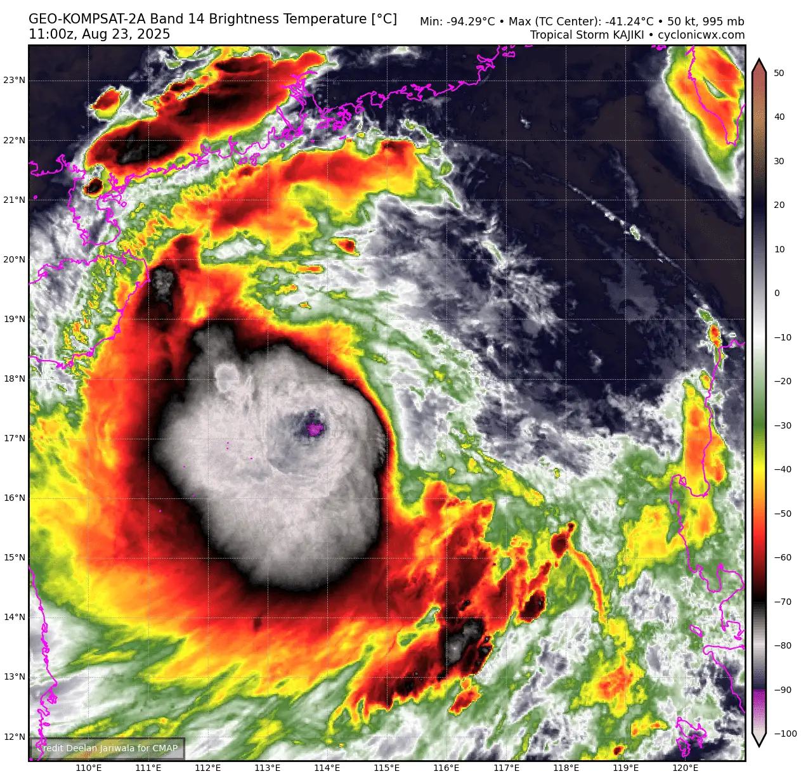
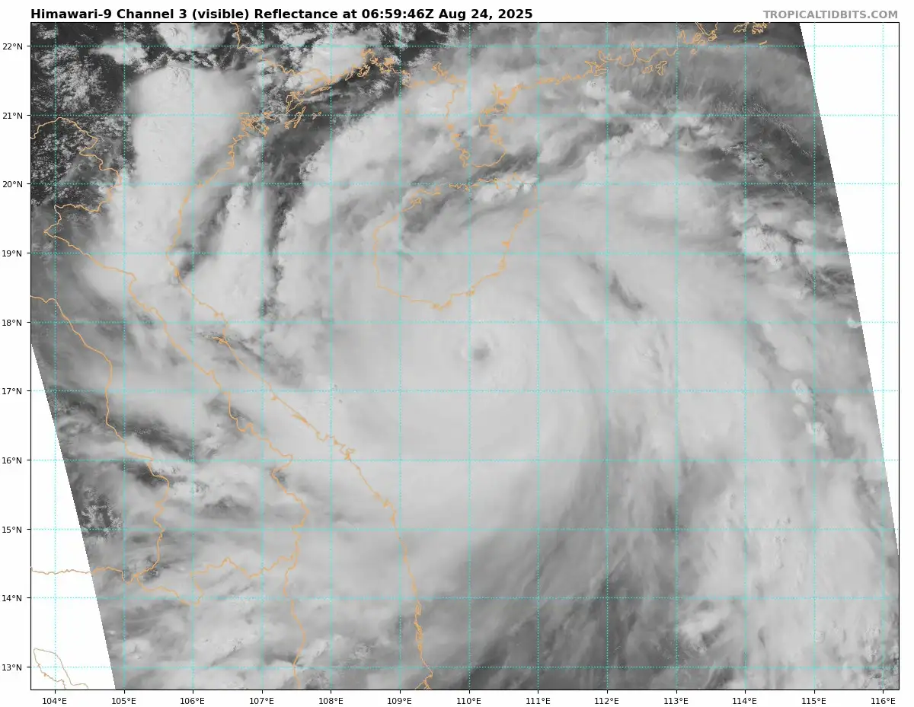
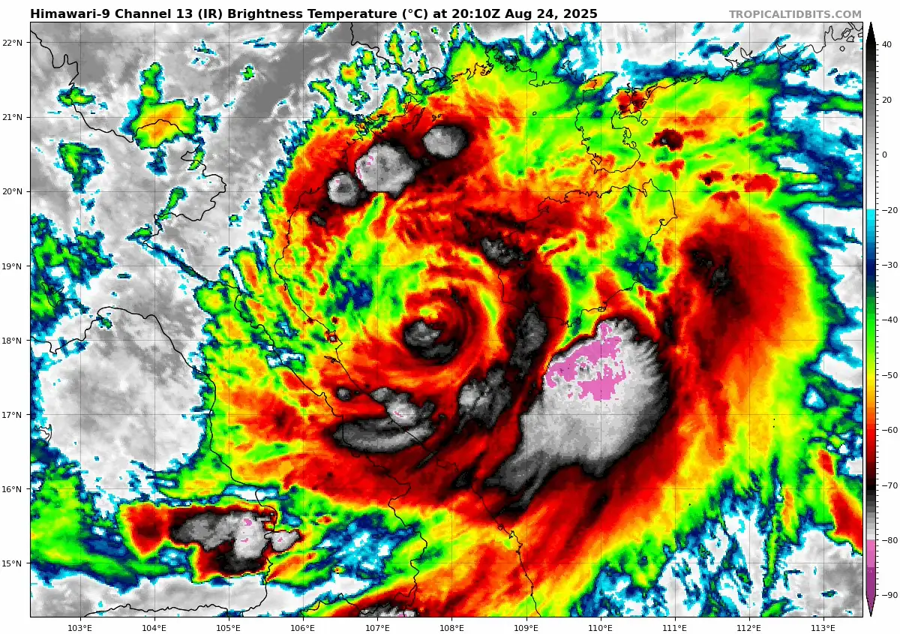
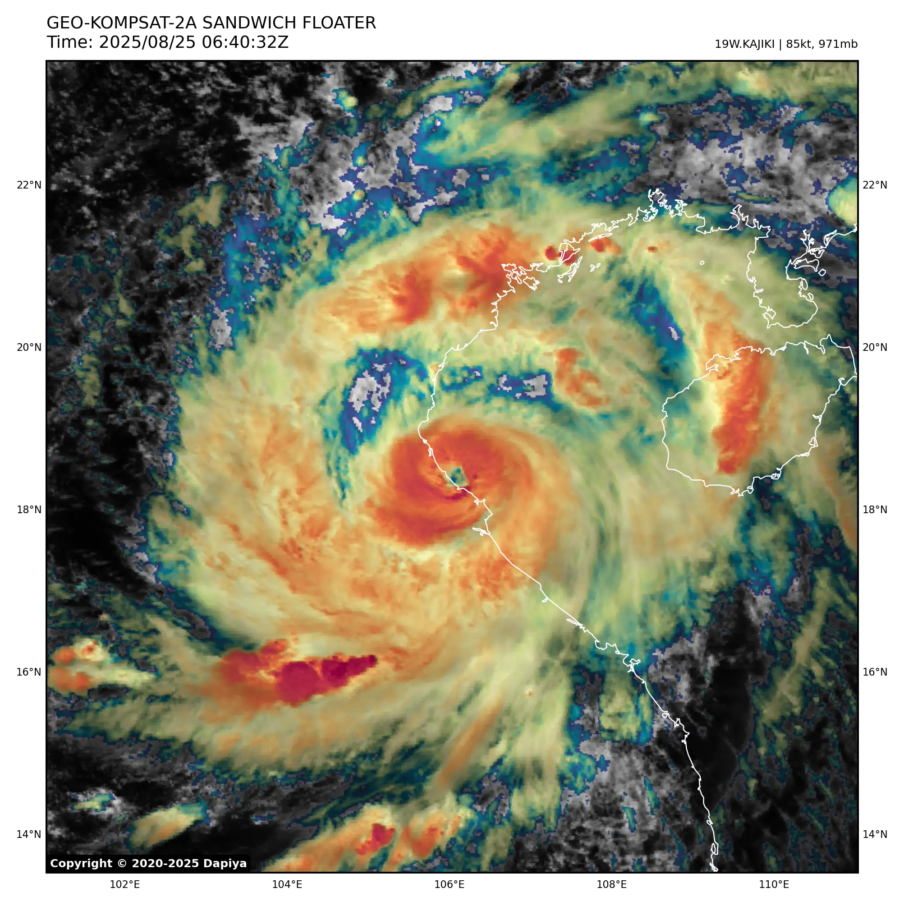
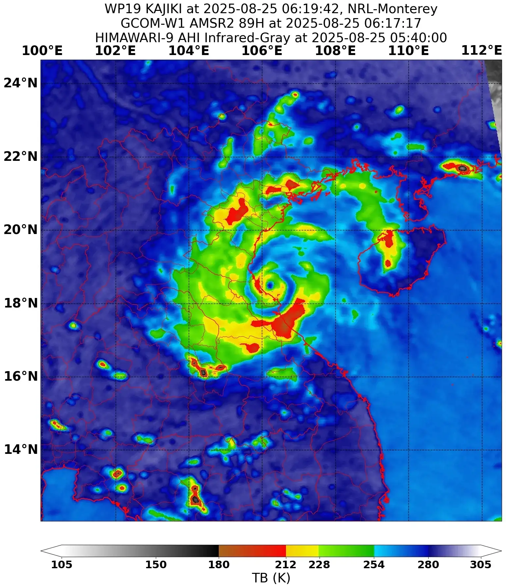
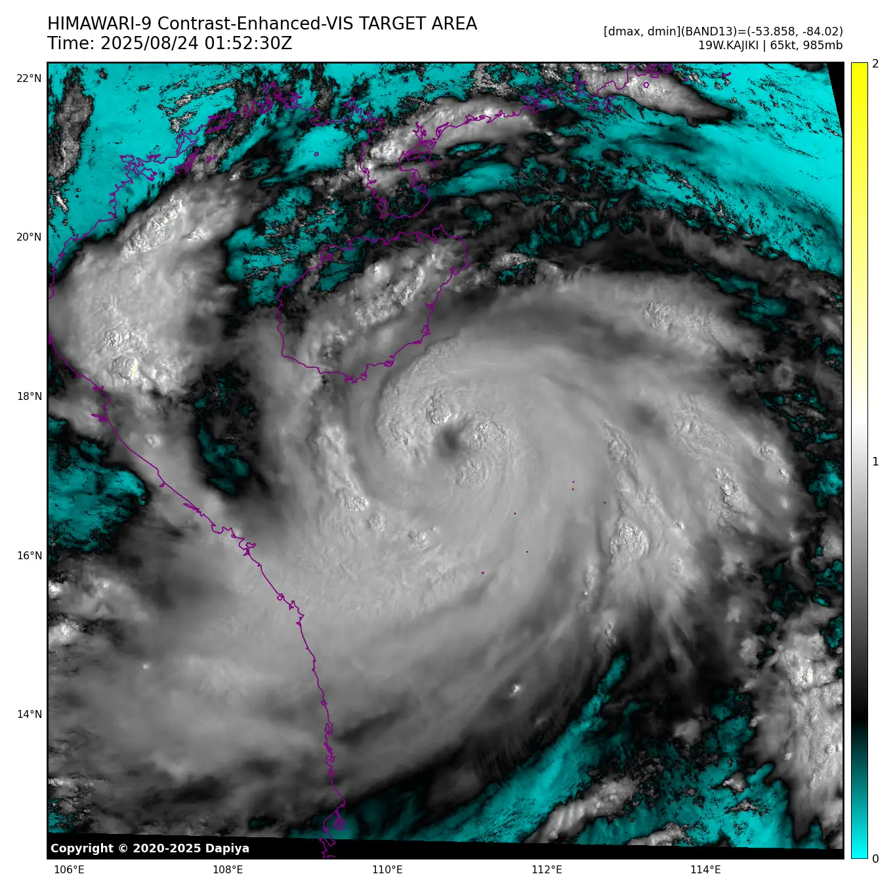
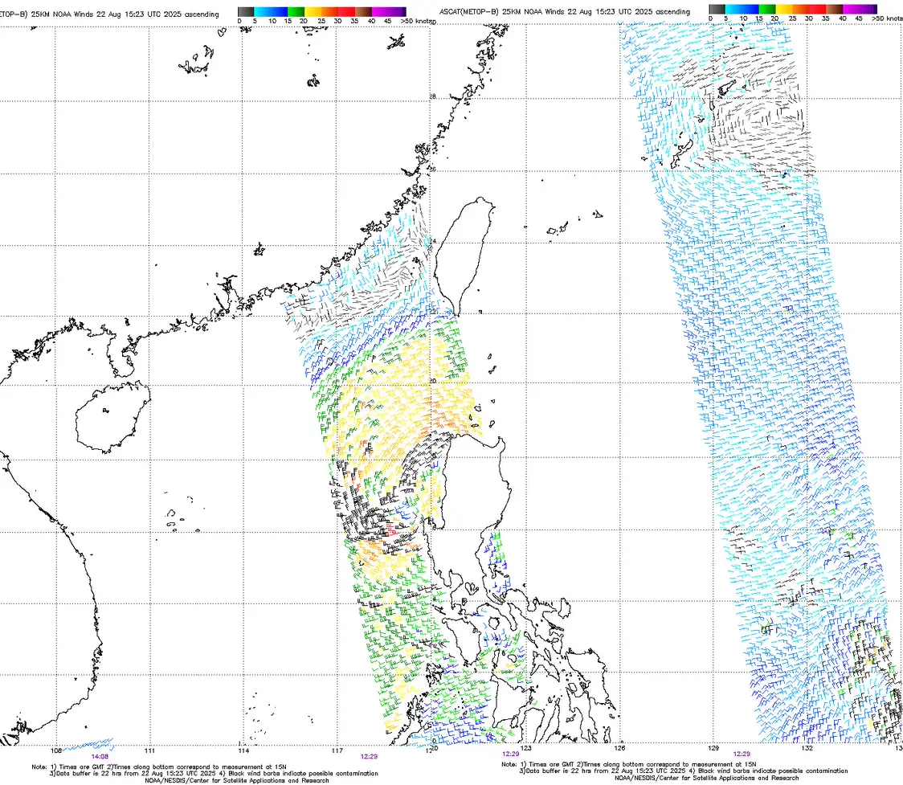
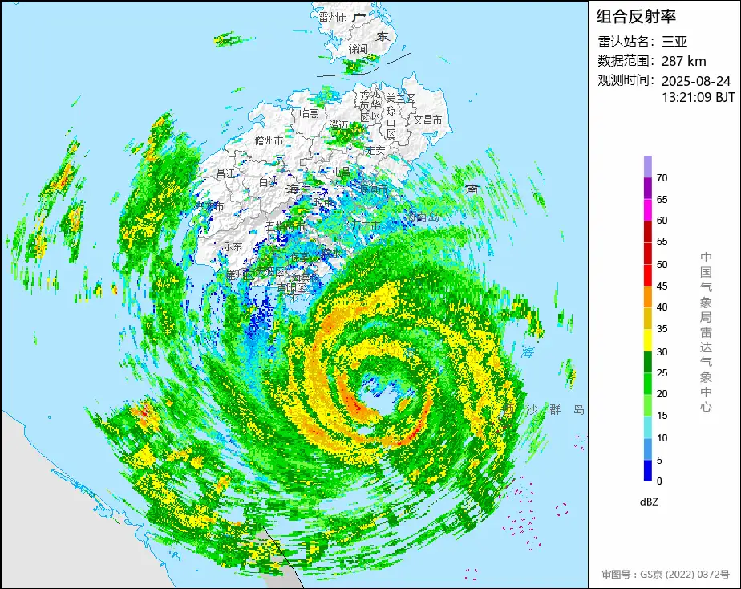

**Typhoon Kajiki** was a moderately strong (category 2) typhoon that impacted northern Vietnam and the Hainan peninsula in late august 2025. The storm originated from the back end of a large gyre, which also produced a weak tropical storm named "Lingling" near Japan. After crossing the northern Philippines, the storm began firing orographically induced convective bursts, which soon developed into a proper low level core with convective bursts reaching -95c, indicative of the explosive potential harbored by the warm (30c) sea surface temps below.

After firing two extremely large bursts the storm began to intensify more steadily, which was evident in a microwave image showing a banding mid and low level structure, poising the storm for a round of intensification. Early UTC time on august 24th the storm transitioned from firing large, disorganized bursts into more focused vortical hot towers which began rotating around a nascent eye. Soon thereafter, the eye appeared on visible and infrared imagery, and a steady intensification trend ensued, bringing Kajiki to high end category 2 status.

Despite this, the storm faced some issues with land proximity to the Hainan peninsula, which caused the central dense overcast to warm. Nevertheless, the storm managed to continue its strengthening trend, clearing an unusually warm eye. During this time an interesting mesoscale phenomena occurred, where upslope flow to the mountains in Hainan caused a stationary cirrus plume in Kajiki's northern eyewall. Despite this, soon after its peak the storm began a weakening trend due to land interaction, which lead to the CDO warming and the collapse of the eye.

Things did not get better for Kajiki up until landfall - the CDO remained disorganized and the eye filled temporarily, not to mention the ongoing eyewall replacement cycle and dry air entrainment. Despite these adversities, Kajiki managed to briefly clear an eye right before landfall, after which it rapidly dissipated in the mountainous terrain of Vietnam and Laos.

## Gallery of valuable data, imagery and extra stuff.

|         |  |               |
| ------------------------------------------------------------------------------------------------------------ | ---------------------------------------------------------------------------------------------------------------------- | --------------------------------------------------------------------------------------------------- |
|  |                                                           |  |
