Hurricane Lorena originally formed from a typical eastern Pacific tropical wave which progressed westward at a reasonable pace. The system's convective coverage increased quite quickly, and by September 2nd the storm was designated as tropical depression twelve (TD12).

TD12, soon to be named Lorena garnered some attention due to its somewhat unusual track. The system was forecast to move northwest at a rapid pace, followed by a sharp turn into Baja California Sur, and then the Mexican province of Sonora.

| 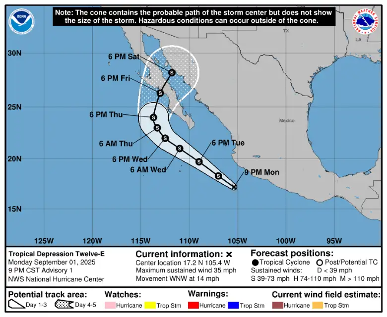 |   |
| -------------------------------------------------------------------------------------------- | ---------------------------------------------------------------------------------------------------------------- |

As the depression moved west-north-west, convective activity increased, and soon enough the cyclone was named Lorena. The storm quickly got its act together, forming a compact central dense overcast as microwave imagery revealed a core developing underneath. On top of that, an ASCAT pass from the afternoon of the 2nd showed that the system had organized its low level center into a tight circulation, in contrast to previous passes which exhibited structural weaknesses. 

Due to its unusual steering pattern, a lot of uncertainty remained as to where Lorena would end up a mere 3 days after its formation. Most model outputs which favored a stronger storm trended towards a recurve into Sonora, however a weaker storm would deviate westward and stay out to sea. 

| 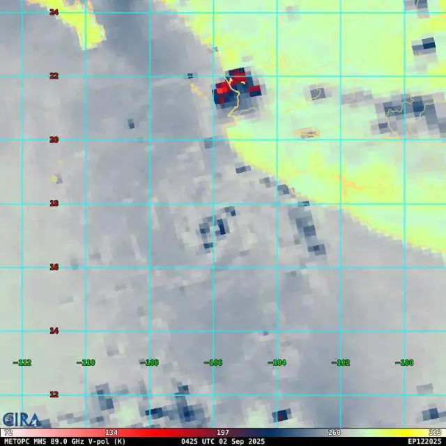          | 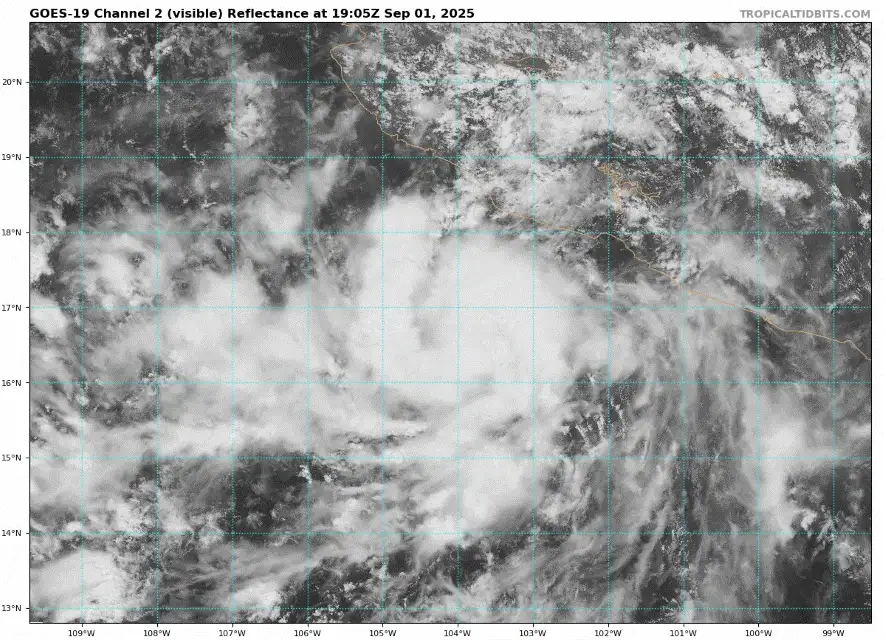                                                   |
| ------------------------------------------------------------------------------------------------------------------------------ | ----------------------------------------------------------------------------------------------------------------------------------------------------------------- |
| 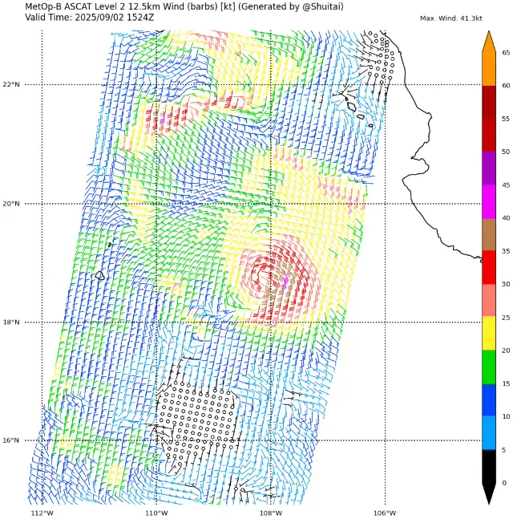 | 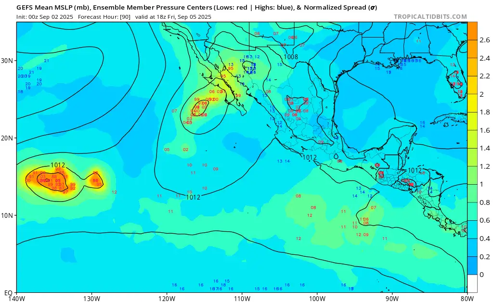 |

Satellite imagery on September 3rd showcased a quickly strengthening storm, with deep convection repeatedly bursting over its center. Multiple rounds of vortical hot towers encircled the storm's core, allowing for its rapid organization. Soon enough, around midday Lorena had strengthened into a category one hurricane on the Saffir Simpson wind scale.

Throughout the day, the CDO became tighter and VHTs rotated around a slightly visible
nascent eye seen on radar imagery. Despite its attempts at organization, the convective bursts covered the developing eye repeatedly throughout the day.

| 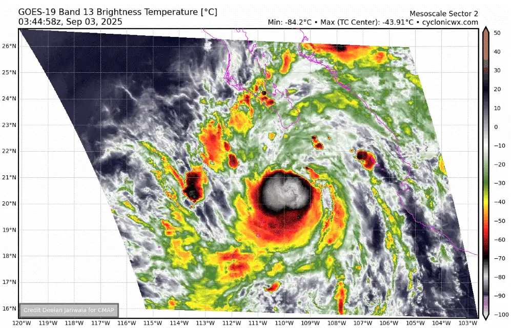        | 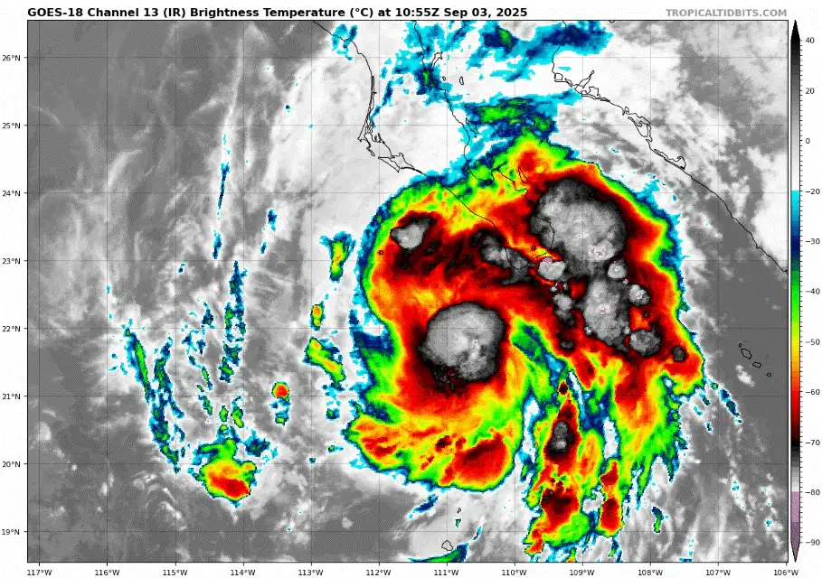      |
| ------------------------------------------------------------------------------------------------------- | ---------------------------------------------------------------------------------------------- |
| 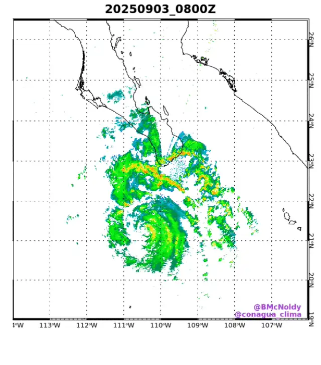 | 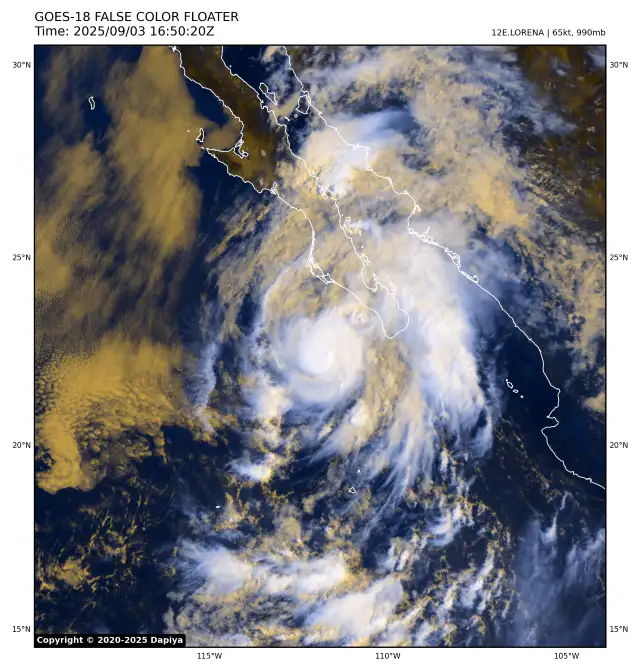 |

On September 3rd as Lorena was intensifying a reconnaissance aircraft investigated the storm. Recon found Lorena weaker than anticipated, with its eyewall open to the south west. 

Soon after recon left the storm, Lorena attempted a final round of intensification before running into cooler waters and stronger southwesterly wind shear.

| 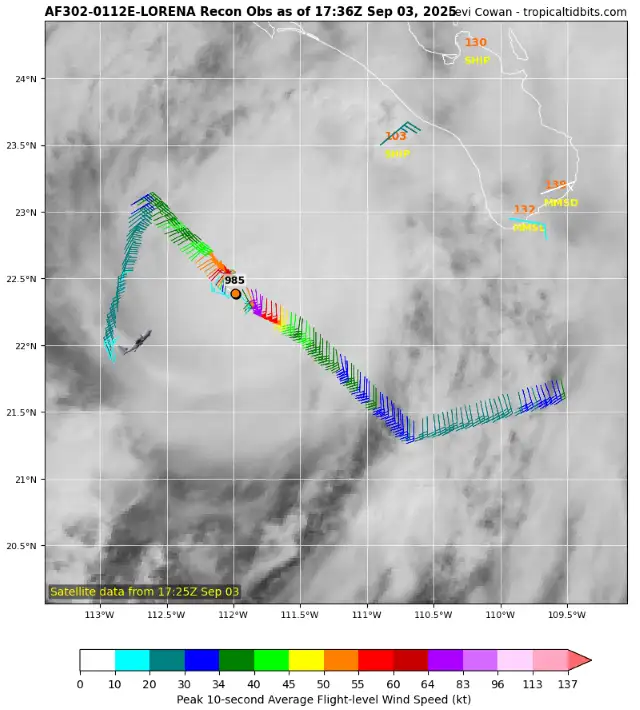 | 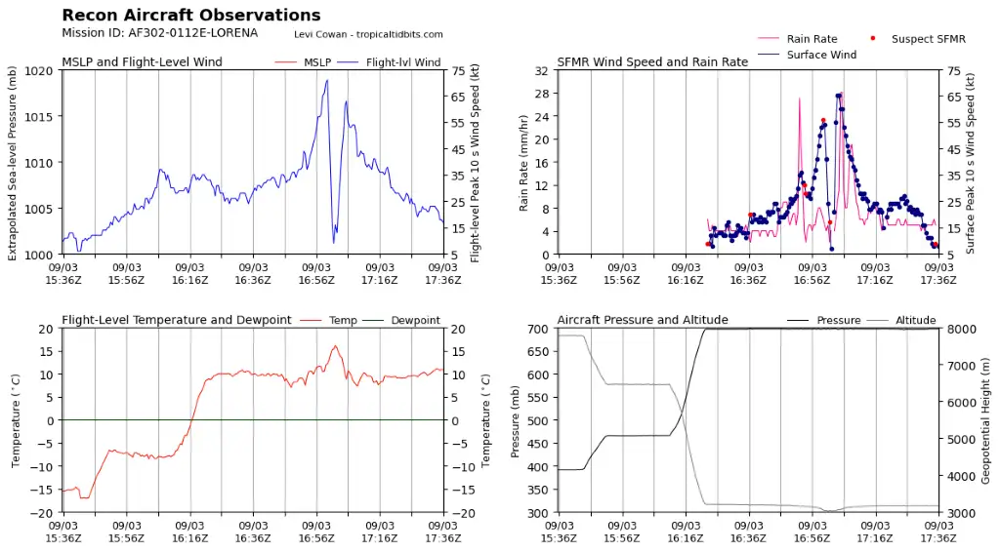                   |
| ---------------------------------------------------------------------------------------------------------------------------------------------- | ------------------------------------------------------------------------------------------------------------------------------- |
| 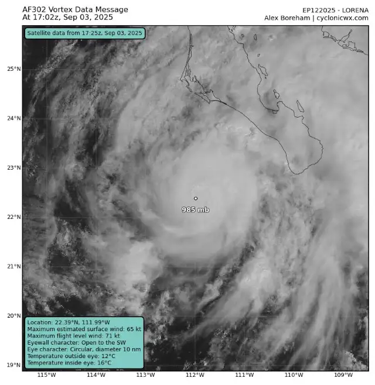                                          | 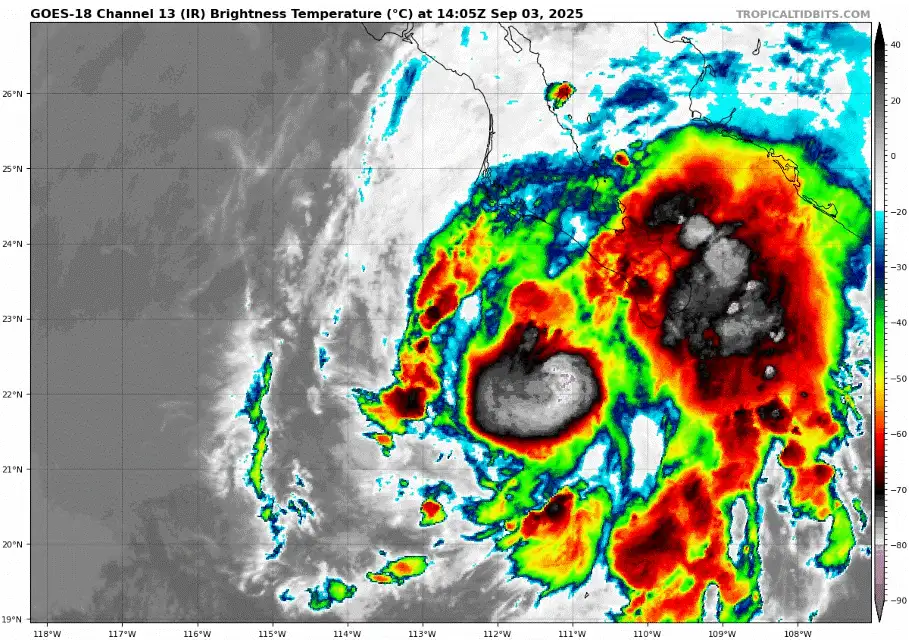 |

Soon enough however, due to the cyclone's fast forward motion, as well as cool waters with low oceanic heat content, the storm underwent rapid weakening. Convective activity over the storm's center drastically decreased, and became more disorganized. By midday on the 4th what was left of Lorena was a messy area of cloud cover and a ferocious low level center, now spinning naked without a central dense overcast.

Due to the cyclone weakening more rapidly than expected, the track shifted west, and thus the scenario of a recurve into Sonora did not verify. Lorena's remnant dissipated in the afternoon of September 5th. 

| 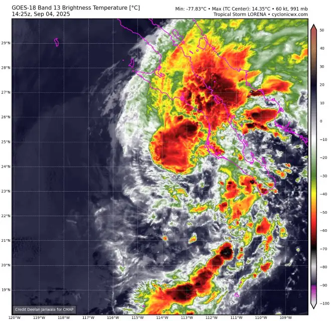 | 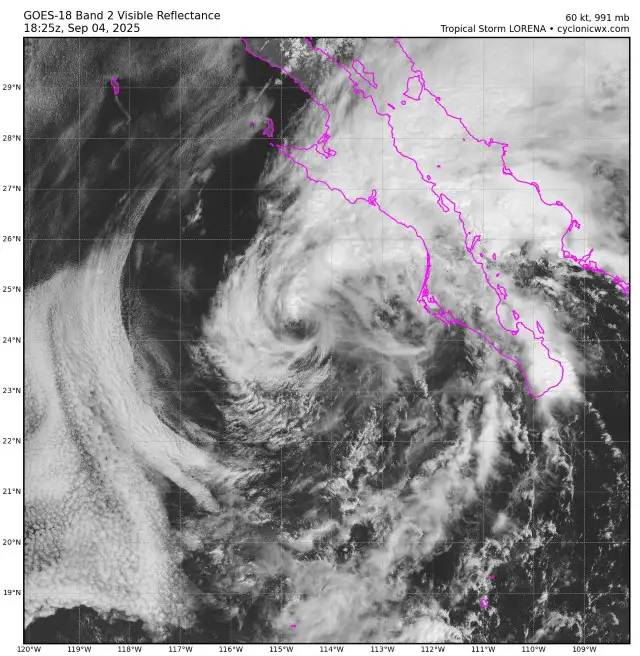 |
| ------------------------------------------------------------------------------- | -------------------------------------------------------------------------------------------------------------- |

#### Gallery of valuable data, imagery and extra stuff.

| 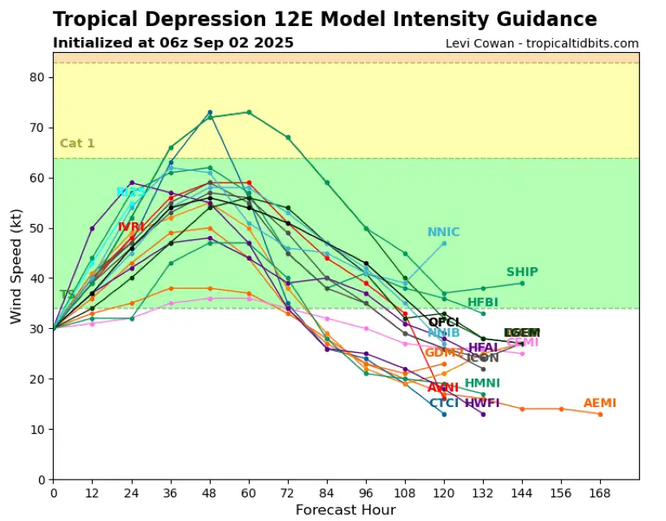       | 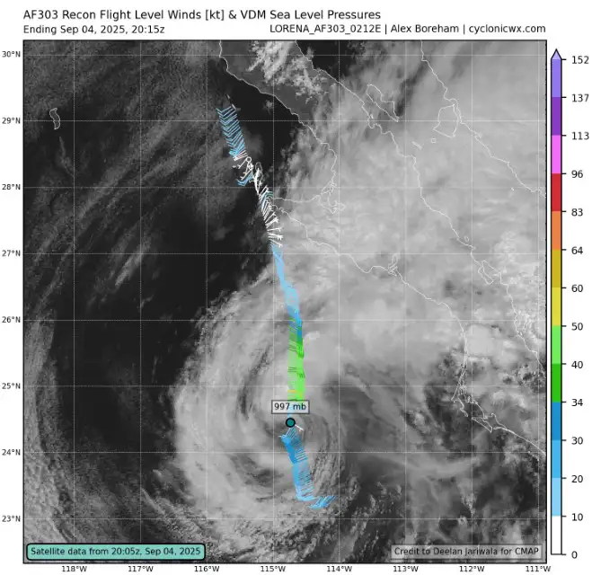                                                                |
| ------------------------------------------------------------------------------------------------------------------------------------- | --------------------------------------------------------------------------------------------------------------------------------------------------------- |
| 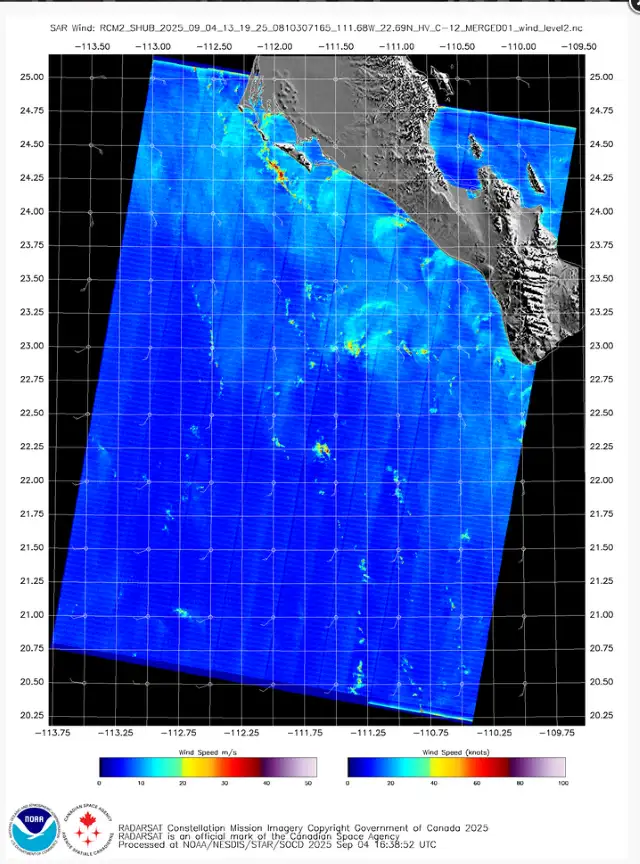 | 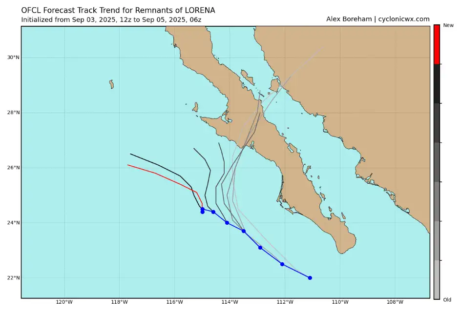 |

