#### Formation

Hurricane Milton has an extremely atypical origin. The system formed due to the merging of two separate areas of interest: firstly, a central American gyre moved off the coast of Latin America and drifter northward, originally garnering attention of the NHC for possible development in the Gulf of Mexico, however shear and thwarted this AOIs chances of development. Even still, this disturbance would bring ample moisture into the eastern GOM, shielding Milton from dry air entrainment from the east.

Second, a (at the time - in post season analysis this system would be brought to tropical storm strength) tropical depression crossing over from the eastern Pacific through Mexico into the Gulf would create an ample positive vorticity anomaly. 

These two disturbances ended up consolidating into a congealed system in the western GOM, which began firing deep convection, and quickly climbed the AOI risk formation chances.

| 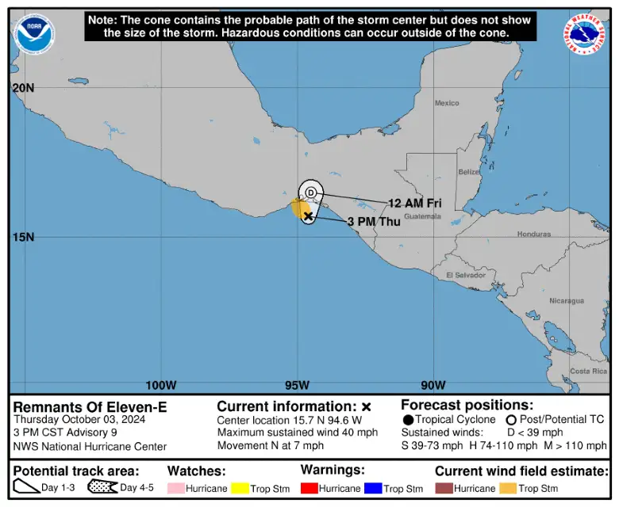 | 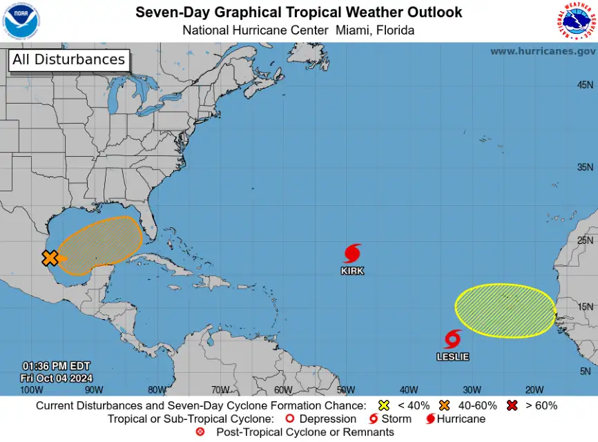 |  |
| ---------------------------------------------------------------------------------------------------------------------------------------------------------- | --------------------------------------------------------------------------------------------------------------------------------------------- | -------------------------------------------------------------------------------------------------------------------------------------------------------------------------------- |

After meandering near the Mexican coastline, Milton began firing consistent deep bursts of convection over a developing low level core. Originally, the cyclone's center became elongated, however this did not last for long as the CBs consolidated over the LLC, allowing it to tighten.

An ASCAT pass during mid day of the 5th of October showcased that the circulation had tightened and became more axis symmetric, whilst bearing winds around 35kt. Due to the scatterometer's under sampling bias, satellite appearance improving and radar data indicating that the system was consolidating, freshly designated TD13 had been named Milton during the 18z advisory on October 5th.

|  | 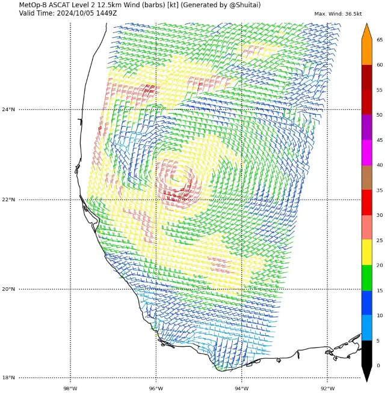 |  |
| -------------------------------------------------------------------------------------------------------------- | --------------------------------------------------------------------------------------------------------------------------------------------- | ---------------------------------------------------------------------------------------------------------------------------- |

Even the original forecasts for Milton before its explosive intensification were concerning. The first cone issued for Milton after its designation as a tropical storm brought the storm to solid hurricane status, including a brief major peak. The storm's intensity was a worry, however more alarming was the track, which would bring the hurricane into the heart of Tampa Bay - an incredibly surge prone population center.

Models initially struggled to correctly assess the cyclone's true intensity, which became evident when around mid day a reconnaissance aircraft flew into the storm to gather data, and found Milton much stronger than NWP models had thought.

Recon data revealed that the storm had strengthened into a weak hurricane with a pressure of 983mb and winds just above the category 1 threshold. At the same time microwave data showed a small, well defined low level core - perfect recipe for intensification.
 
| 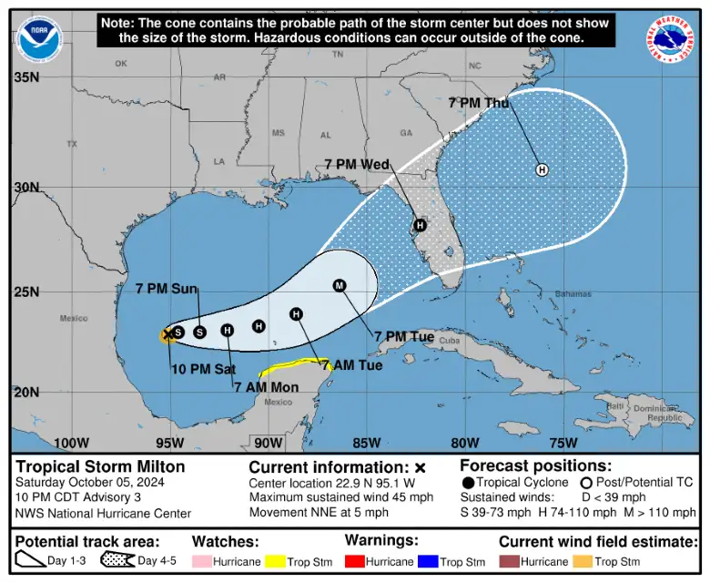 | 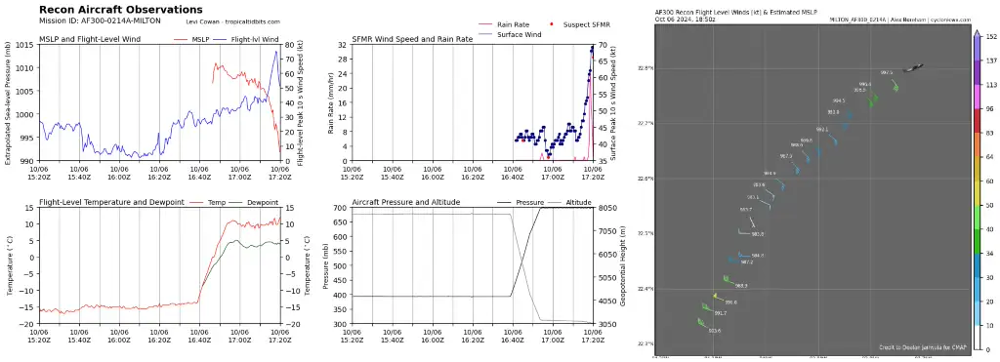 | 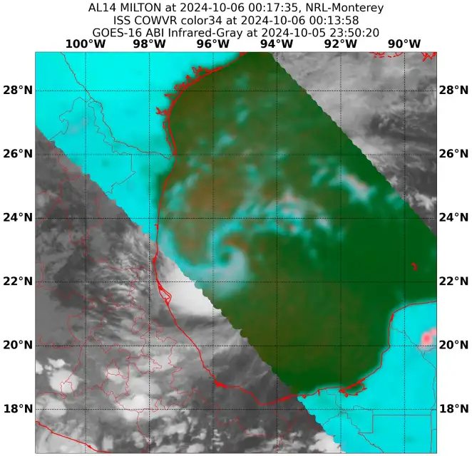 |
| ------------------------------------------------------------------------------------------------------------------------------------------------------- | -------------------------------------------------------------------------------------------------------------------------------------------------------------------------------------------------------------------------------------------------------- | --------------------------------------------------------------------------------------------------------------------------- |
#### Rapid Intensification And Frequent Recon Fixes

The intensification trend was not temporary, and it was evident Milton was deepening further. Satellite imagery showed that the hurricane was becoming increasingly more organized - convective bursts began wrapping around the core, and cloud top temperatures cooled in the CDO. 

A second recon plane investigated Milton on the evening of the 6th, confirming that the storm was deepening quickly. Pressure fell to around 980 millibars, however due to mixing winds remained steady around 70 knots. 

Seeing as Milton was beginning an evident round of rapid intensification, a state of emergency was issued for the entire southern portion of Florida in preparation for landfall.

| 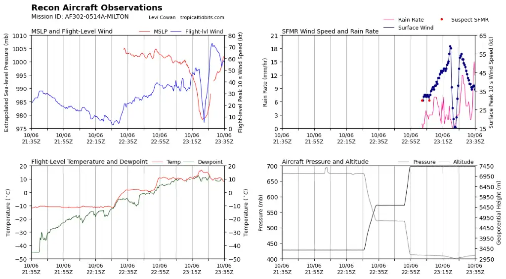 | 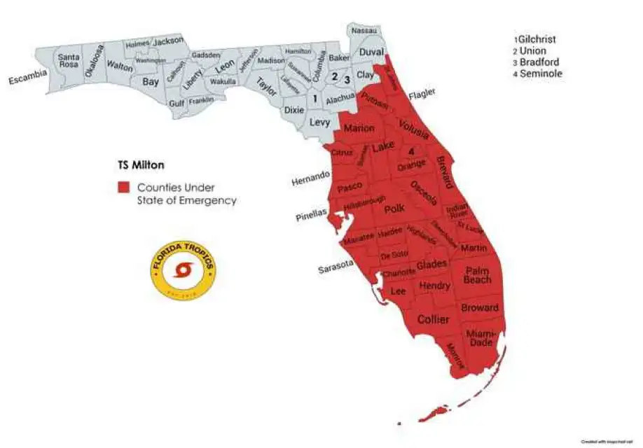 |
| ----------------------------------------------------------------------------------------------------------------------------------------------------------- | --------------------------------------------------------------------------------------------------------------------------------- |

By the time that the 7th had rolled around, Milton's rapid intensification was well underway. Two large bursts of convection had fired in the eastern and northern eyewall, curling quickly around the storm's center. 

It is hard to explain how explosively the hurricane had intensified - within 3 hours the CDO went from somewhat disorganized and messy, to a ring of -80C cloud tops around a nascent eye. Milton had began taking the extremely favorable environment around it to its maximum, strengthening in a record breaking fashion not often seen in the north Atlantic.

| 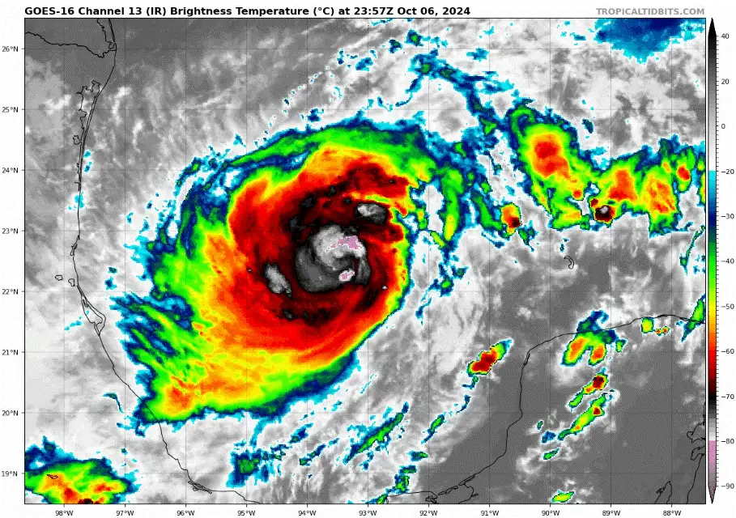 | 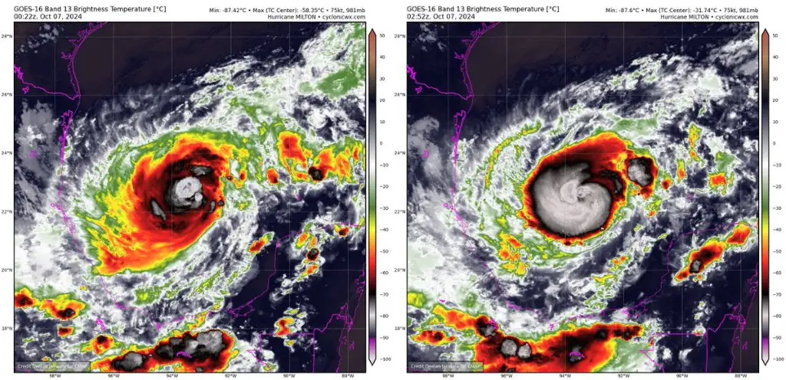 |
| -------------------------------------------------------------------------------------------------- | --------------------------------------------------------------------------------------------------------------------------- |

Soon enough, thanks to the incredible forces at play. Milton's eye began clearing, despite the CDO looking disorganized a mere 6 hours earlier. Vortical hot towers repeatedly fired around the eye, filling in any areas of warmer cloud tops that had remained. Worth noting is that the eye of Milton was unusually small - a pinhole had formed.

Recon once again sampled the storm, revealing that the hurricane had deepened 25 millibars in a mere 7 hours - one of the fastest drops in pressure recorded in the basin - and was dropping further. Milton's winds had not quite caught up to the pressure yet, as they need time to mix down through the eyewall. 

| 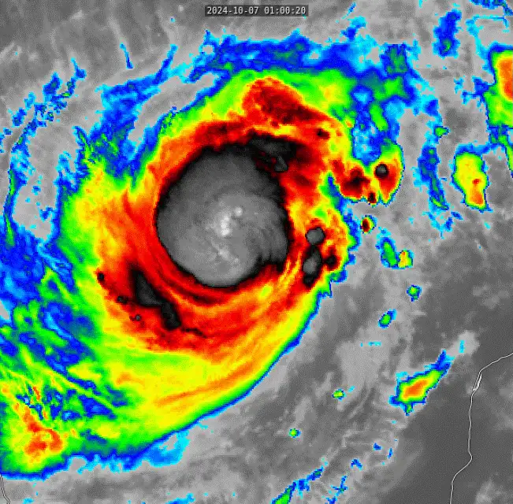 | 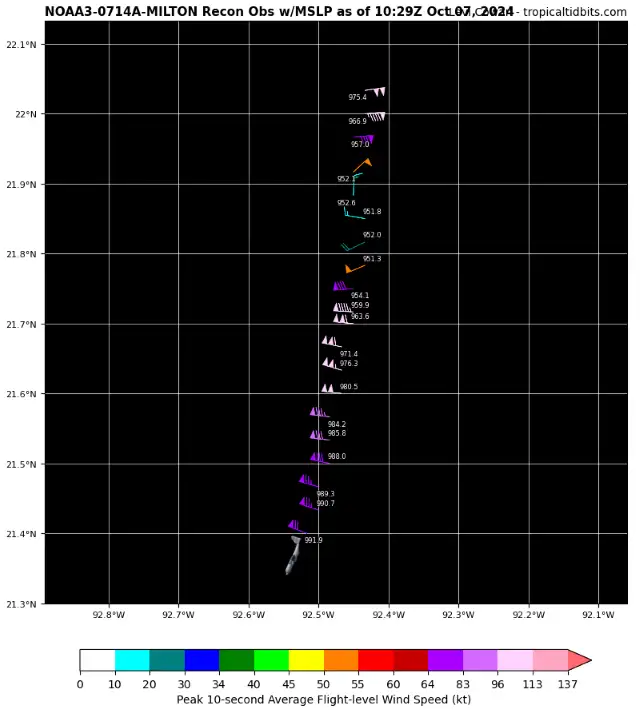 | 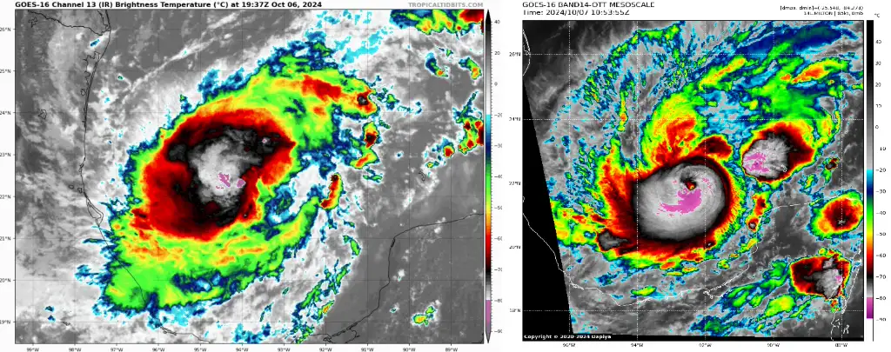 |
| ----------------------------------------------------------------------------------- | --------------------------------------------------------------------------------------------------------------------------------------------------------------------------------------------------------------------------- | ---------------------------------------------------------------------------------------------------------------------------------------------------------------------------------- |

Near noon on the 7th, Milton's eye had warmed to around -20C, and the warming trend was continuing. Convective activity did not decrease whatsoever, with VHTs continuing to fire in the eyewall, and cloud tops maintaining -80C in the southern portion of the storm. Despite this, some structural issues were evident. The CDO had remained somewhat asymmetric, bulging farther southward, whilst the northern portion remained thinner and more burst-y in nature.

Recon was still sampling the hurricane, and despite "issues" with its structure the storm was continuing its explosive intensification. Between 10:25z and 11:15z pressure had dropped an astonishing 9 millibars - to drop the professionalism for a moment, that is INCREDIBLE. In colloquial terms we use in the community - the storm was truly wejjing out.

Anyhow - as the plane was passing through the eye, it likely encountered a mesovortex, which harbored extremely localized winds of 135 knots at the surface. These readings are not indicative of the storm's true intensity as they are gusts and not sustained, however they showcased the extreme potential possessed by the cyclone.

| 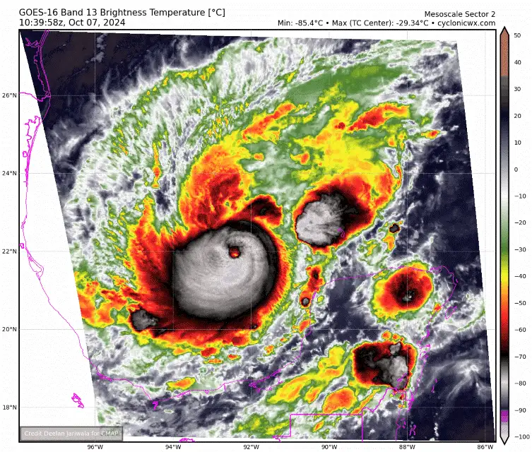 | 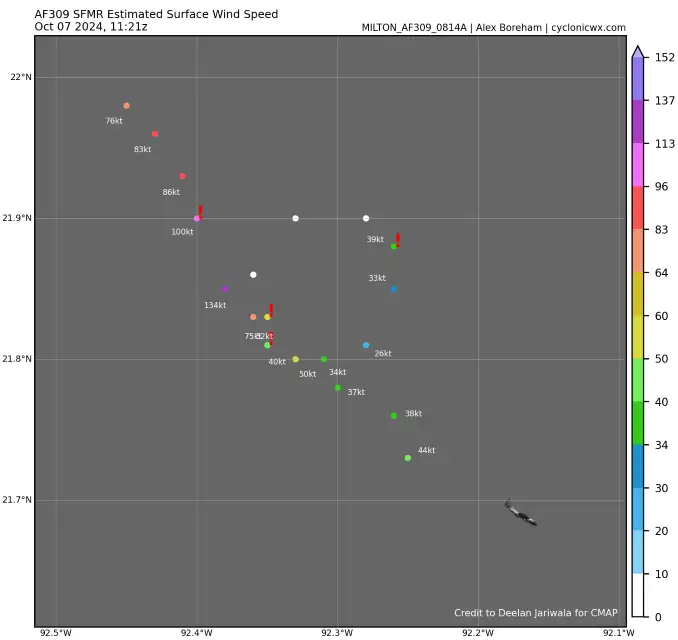 |
| ------------------------------------------------------------------------------------------------------------------------------------------------------ | ------------------------------------------------------------------------------------------------------------------------------------------------------------------------------------------------------------------- |

At the time of Milton's explosive intensification, multiple events occurred which only happen in upper echelon storms:

- Extreme eyewall lightning. Throughout its entire intensification phase, the hurricane had been producing copious amounts of lightning inside of its eyewall. The process by which this occurs is not well understood, however we know that this only occurs in cases of rapid intensification or rapid weakening
- Eyewall hail. Extreme upward forces in the eyewall allowed for the formation of hail in the western and northwestern portions of the eyewall, which was reported by reconnaissance aircraft flying through the storm.

Needless to say, Milton was entering an elite group of storms which mark themselves in the meteorological history books.

| 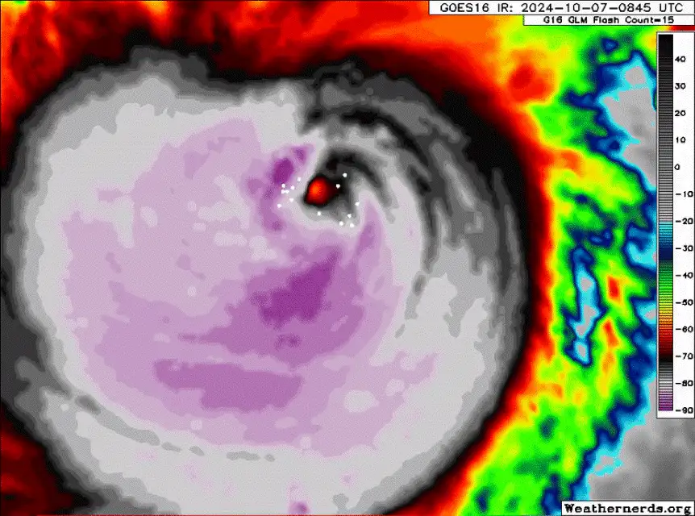 | 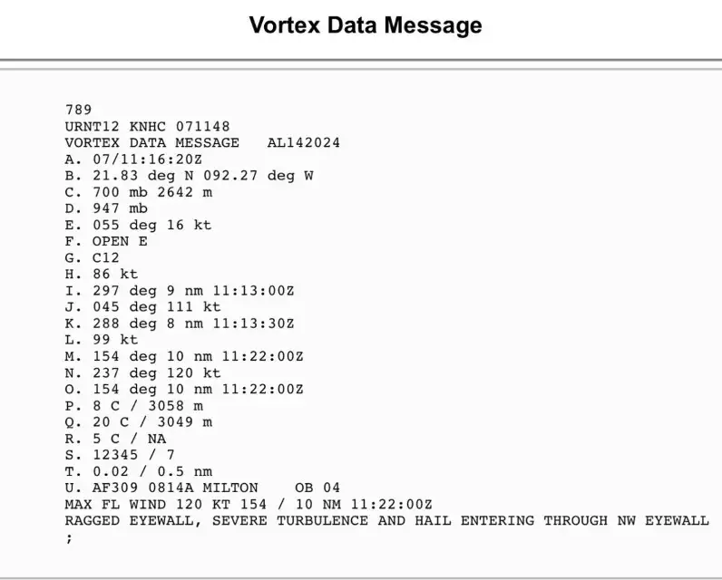 |
| ------------------------------------------------------------------------------------------------------------------------------------------------------------------------ | ------------------------------------------------------------------------------------------------------------------------------------------------------------------------------------------------------------------ |

By 12z on October 7th (yes, all of this happened in 12h hours!) recon had found that Milton was now at solid category 4 intensity on the Saffir Simpson Hurricane Wind Scale, and the national hurricane center promptly issued a special advisory, noting that the cyclone now harbored sustained winds of 130 knots and a pressure of 940 millibars.

| 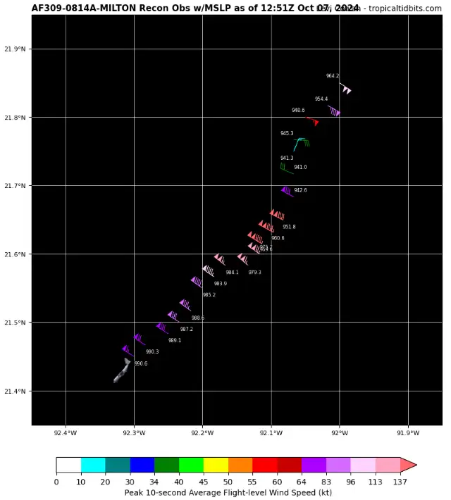 | 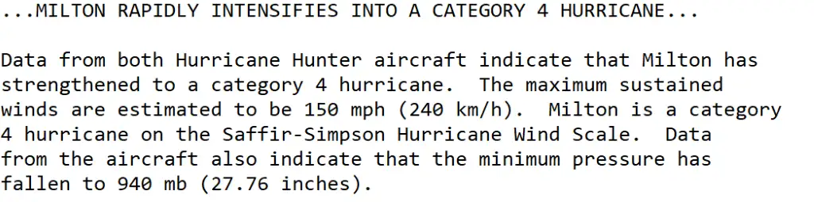 |
| --------------------------------------------------------------------------------------------------------------------------------------------------------------------- | --------------------------------------------------------------------------------------------------------------------------- |

What's more, is that the storm was still intensifying. Satellite appearance kept improving, and the aforementioned asymmetry had corrected itself in a mere 3 hours. The sun was now rising over the storm, revealing that the only reason the eye had not yet reached positive temperatures was due to cirrus trapped in the eye from previous bursts of convection. 

With storms as extreme as Milton, the main inhibitor stopping them from bombing out to Maximum Potential Intensity are usually eyewall replacement cycles. External factors weren't going to inhibit the hurricane in this case for a good 36-48 hours, so structural issues and replacement cycles, especially common with small cores such as Milton's. Microwave satellite imagery, as well as radar confirmed however that the storm was not in the process of undergoing one, at least in the short term, and thus poising it for more intensification. 

|  | 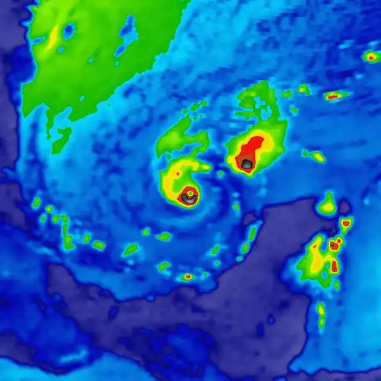 |
| ------------------------------------------------------------------------------------------------------------------------------- | ---------------------------------------------------------------------------------------------------------------------------------- |

The next few hours were more of the same: Eye clearing and warming, winds climbing and pressure dropping. We are starting to approach Milton's first peak. It's hard to describe in detail what the storm was doing at the time without repeating myself, since it really was just rapid intensification taken to the extreme.

| 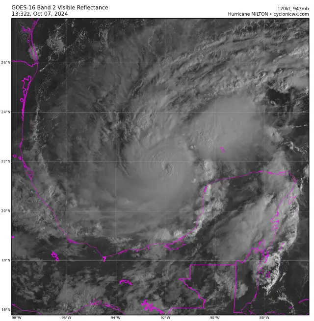 | 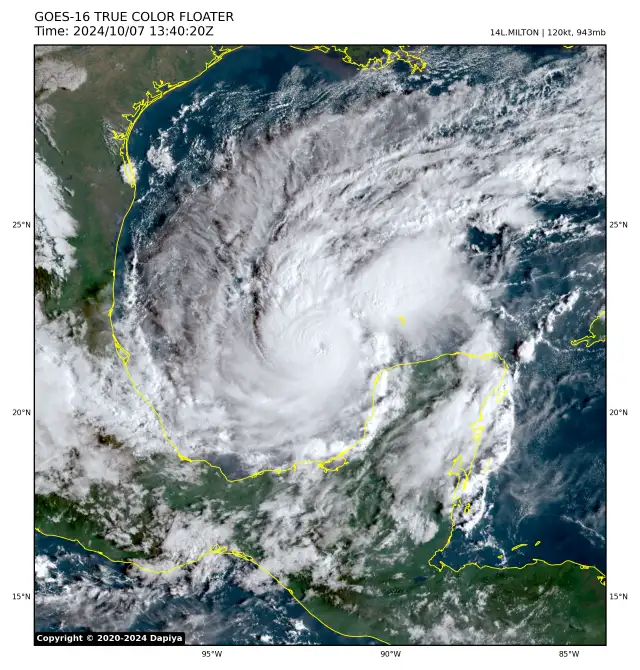 |
| -------------------------------------------------------------------- | ------------------------ |

By the evening, Milton had done it, and became a category 5 storm with a central pressure of 925 millibars. Recon was still in the storm and was now finding nearly 160kt flight level winds, indicating that the NHC estimate might have been slightly conservative, as such FL winds equate to roughly 145 knots at the surface. Moreover, a radiosonde dropped into the cyclone's eyewall reported wind gusts of an astonishing 184 knots - I don't think I need to describe how powerful of a force is required to produce such readings.

Although in the short term Milton had a good few hours of strengthening remaining, radar began to show the signs of a concentric eyewall forming around the main core. This, however, did not inhibit the storm until the outer eyewall fully closed, so the hurricane had the time to bomb out further for a good few hours.

Satellite appearance kept improving (I swear I've written this sentence a good 5 times - this storm's intensification was THAT incredible!) and cirrus finally mixed out from the eye, allowing it to creep into positive temps, whilst revealing the ocean surface beneath.

| 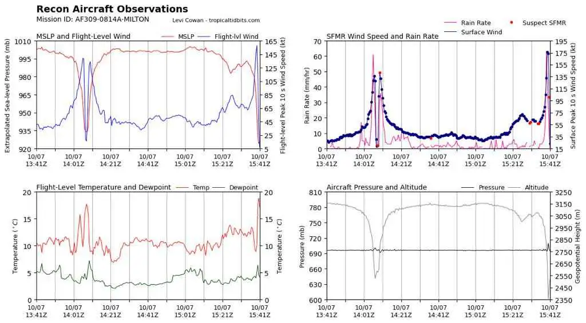 | 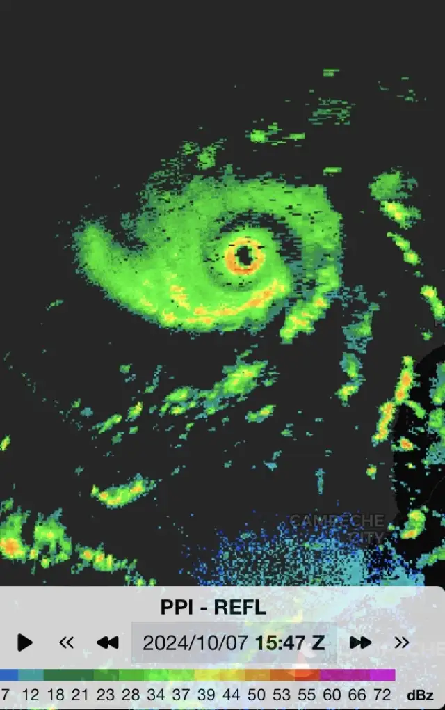 |
| --------------------------------------------------------------------------------------------------------------------------------------- | -------------------------------------------------------------------------------------------------------------------------------- |
| 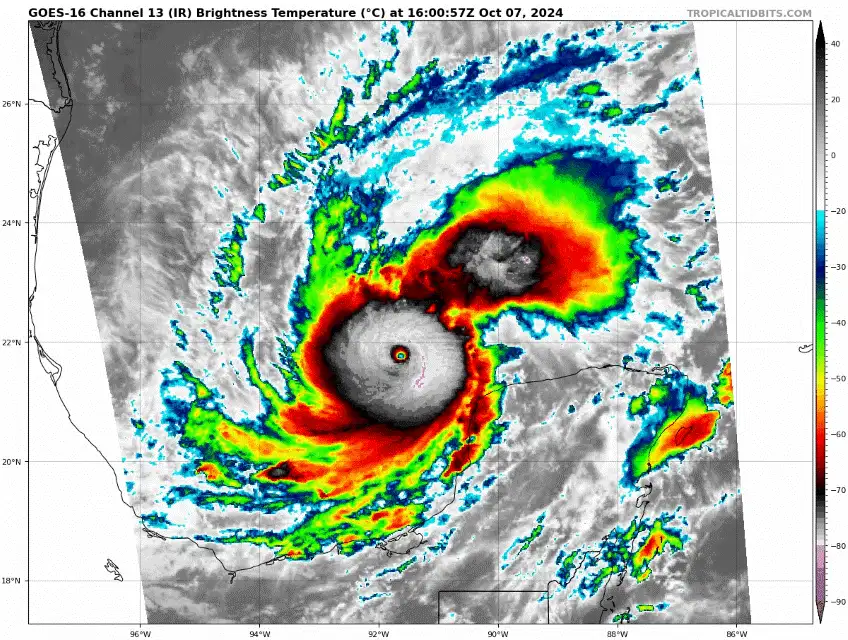                                                  | 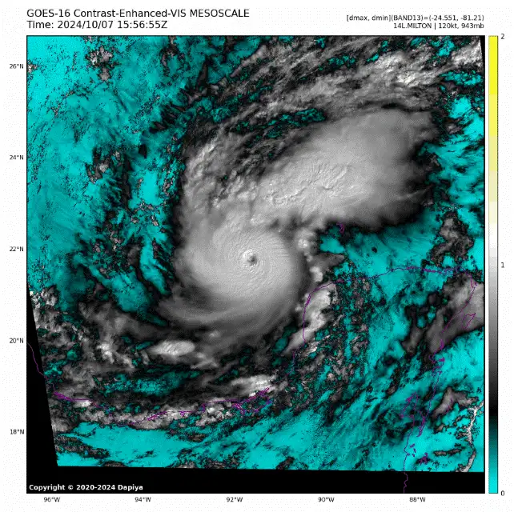                                       |
|                                                                                                                                         |                                                                                                                                  |

The next recon pass after the fix which lead to Milton's category 5 designation reported a pressure of 911 millibars extrapolated at the surface with a radiosonde. Compare that to the previous pass which recorded 925mb - a drop of 14 millibars in a mere hour or so. During this fix, Hurricane Hunters aircraft also noted flocks of birds trapped within the eye, unable to land on the ocean below or fly out through the ferocious eyewall.

Sadly, the next few hours were going to be without frequent recon passes, as the next fix was over 4 hours away. Non the less, satellite appearance was absolutely astonishing at this time, with the eye warming to over 10 degrees Celsius and a solid ring of -80C cloud top temperatures. Advanced Dvorak technique (ADT) algorithms analyzed the storm to have reached a value of T7.5 at this time - truly the upper echelon of any Atlantic hurricane.

A mere 24 hours earlier, Milton was a disorganized tropical storm which had freshly formed a CDO - at the same time on October 7th, Milton was a category 5 system with a stable, warming eye and cooling CDO.

| 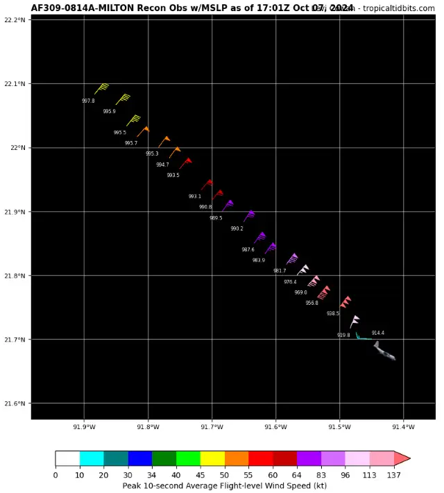 | 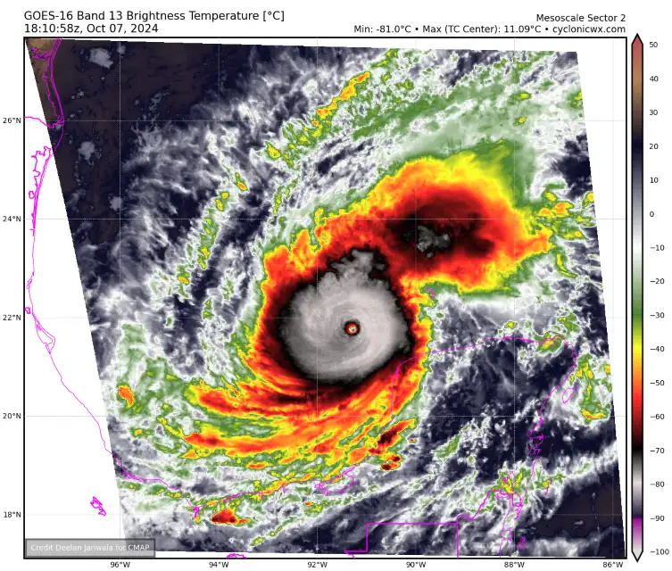                                                                |
| --------------------------------------------------------------------------------------------------------------------------------------------------------------------------- | ----------------------------------------------------------------------------------------------------------------------------------------------- |
|                                                                | 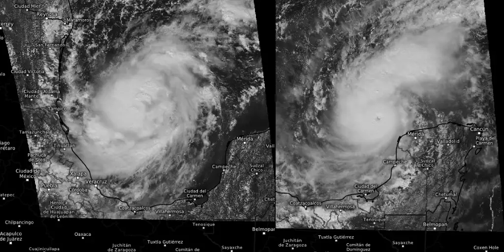 |
|                                                                                                                                                                             |                                                                                                                                                 |
#### Peak Intensity - 895 Millibars

While waiting for the next recon pass we had to rely on satellite estimation to see how strong the storm had gotten. What did satellite imagery show at this time?

- 24 degree Celsius eye
- -27C water vapor temperature (likely underestimated due to the eye's miniscule size)
- Almost solid ring of -80C temps in the entire CDO
- Textbook dual channel outflow 
- Clear view down to the ocean with mesovorticies rotating around the eye
- Constant lightning activity in the eyewall

Needless to say, Milton was a beast. 

|              | 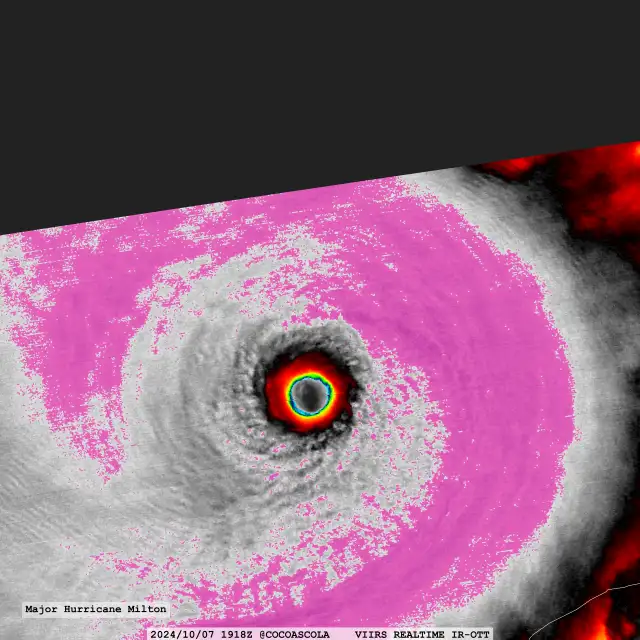 |
| ----------------------------------------------------------------------------- | ------------------------------------------------------------------------------------------------ |
| 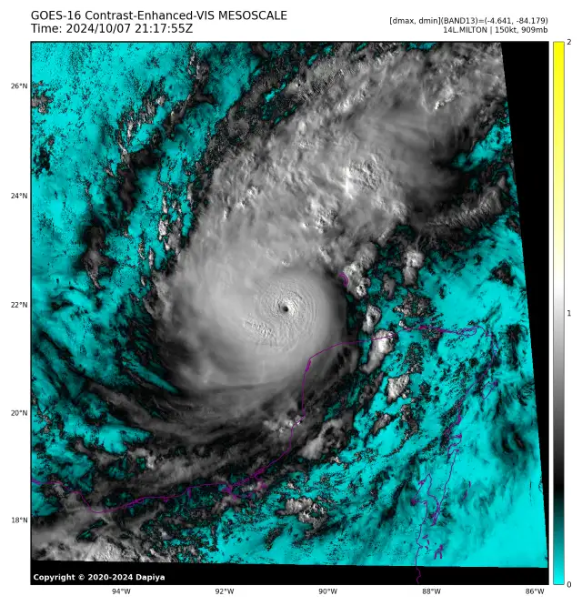 | 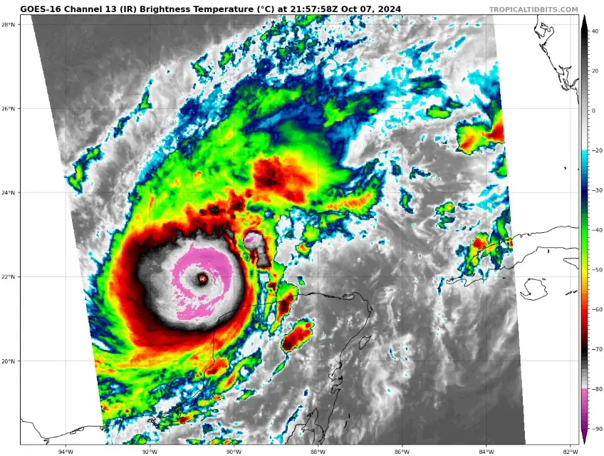    |
|                                                                               |                                                                                                  |

Finally after a good few hours without recon data, the Hurricane Hunters NOAA plane entered the storm's core. Despite missing the eye by a smidge, the estimated mean sea level pressure fell to an absolutely astonishing 895 millibars, becoming the 4th most intense north Atlantic hurricane on record, tied with Rita of 2005. 

The aircraft recorded flight level winds of ~163 knots, which translates to about 150 knots surface level traditionally. However, due to the storms extreme intensity, as well as record breaking low pressure the winds were likely closer to flight level, as the eyewall's intensity was uniform throughout, and the NHC estimate was placed at 155 knots, tied with 4 other storms as the 3rd fastest windspeeds in the north Atlantic, only thwarted by Allen (165kt), and Dorian/Labor Day/Gilbert/Wilma (160kt)

|  | 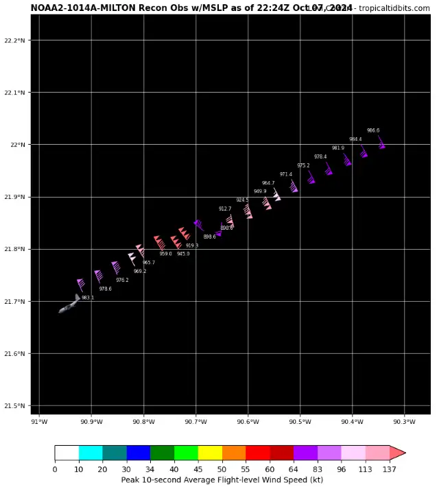                                                         |
| ----------------------------------------------------------------------------------------------------------------------------------------- | -------------------------------------------------------------------------------------------------------------------------------------- |
| 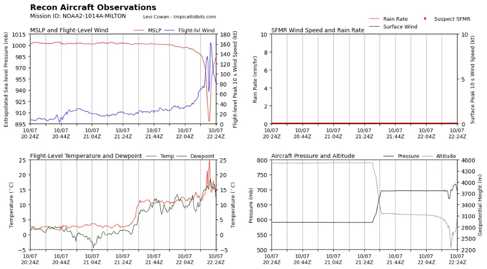       | 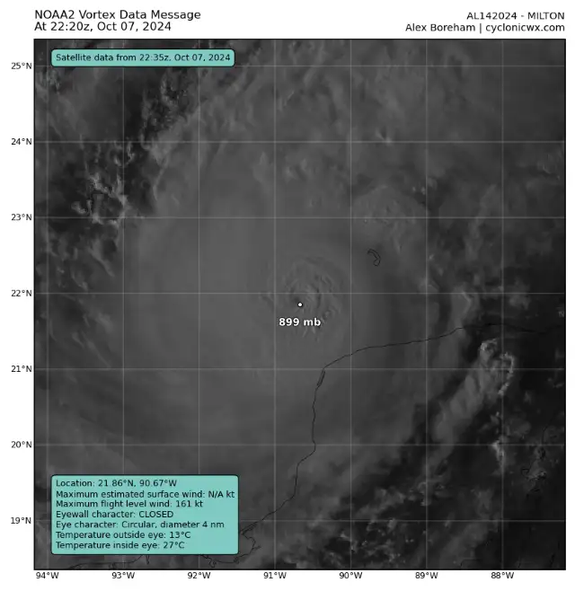 |
|                                                                                                                                           |                                                                                                                                        |

Very soon after the sub 900 millibar reading, satellite appearance degraded somewhat, and the next pass showed pressure near 900, and winds slightly down. What's more important however, is that recon noted a secondary eyewall around Milton's tiny eye - an eyewall replacement cycle had began. 

Radar imagery also confirmed this, as a small ring had formed surrounding the inner core. A vortex data message from the Hurricane Hunters aircraft second fix noted a double closed ring structure. Milton had peaked, and a brief weakening phase was now underway.

| 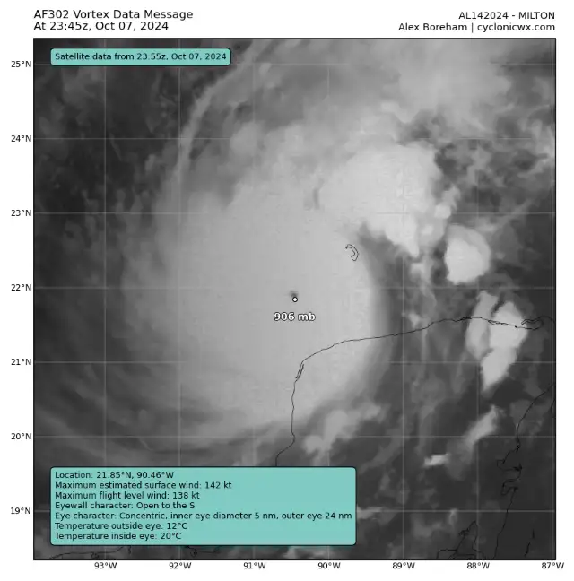 | 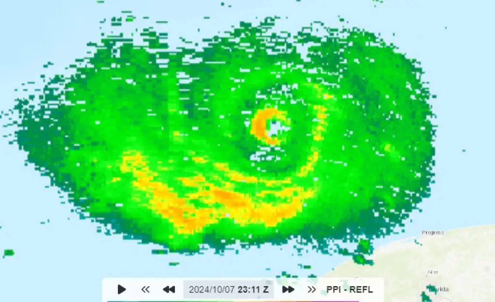 |
| -------------------------------------------------------------------------------------------------------------------------- | ------------------------------------------------------------------------------------- |

#### Eyewall Replacement Cycle

During the morning of the 8th (Yes, all of that happened on the 7th. Happy birthday Hayden!) the eye began exhibiting trochoidal wobbling, slowly cooled and filled with cirrus, eventually disappearing into the CDO. The EWRC was well underway.

Recon passes through the storm at this time showed the pressure rising quite quickly, going from 906 to 927 millibars in a few hours. Despite this, the CDO was solidly in the -80C range and rotating extremely quickly. Milton was still a solid category 4 storm, however not the record breaking beast it was a few hours prior.

Satellite infrared imagery taken around the time of the 927mb reading showed that the inner eye was rapidly dissipating. Soon, Milton would be able to re-intensify once more as the outer eyewall took over.

| 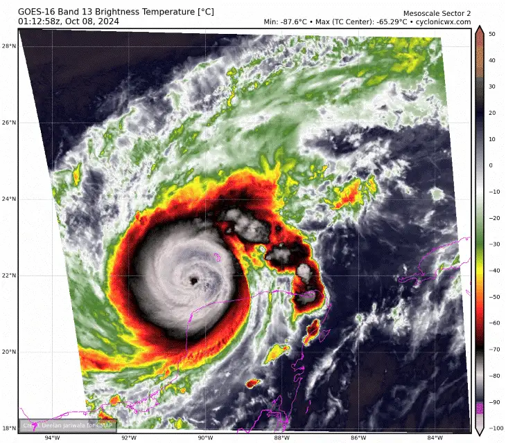                          | 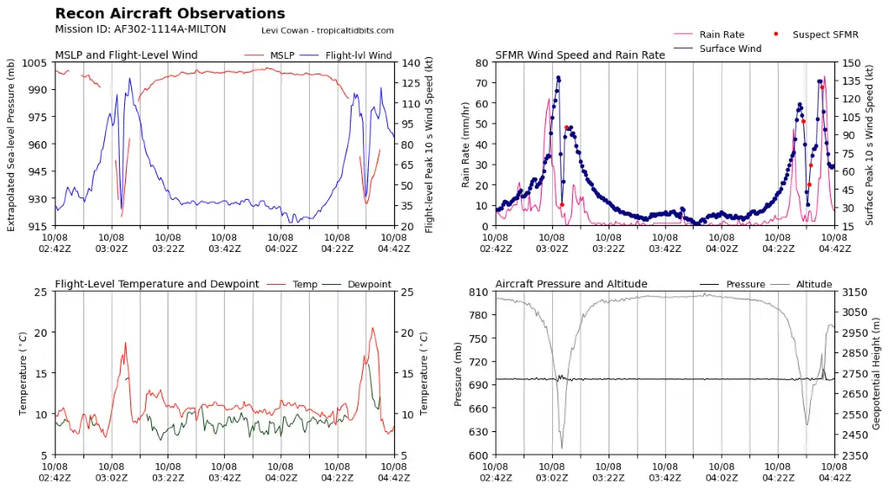 |
| -------------------------------------------------------------------------------------------------------------------------- | ---------------------------------------------------------------------------------------------------------------------------------------------------------------- |
| 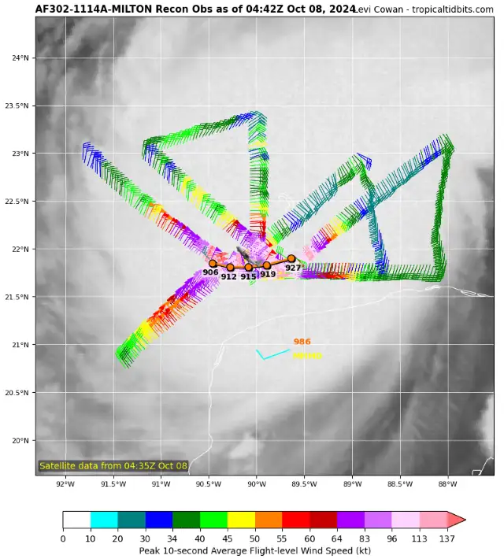 | 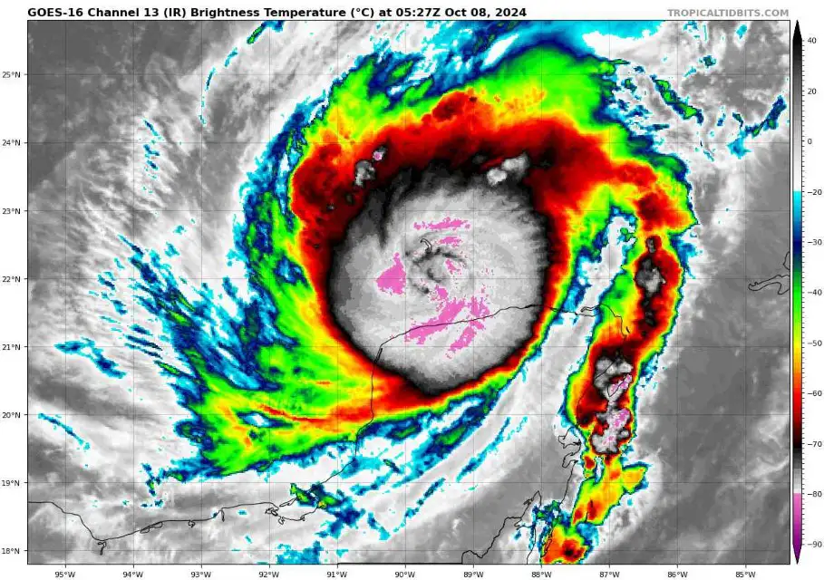                                                            |
|                                                                                                                            |                                                                                                                                                                  |

By mid day on the 8th, the EWRC would conclude - extremely quickly, likely due to the tiny size of the inner, now dissipated eyewall. The eye would once again reappear on satellite imagery and begin to warm.

Worth noting is that as mentioned prior, Milton was producing ample eyewall lightning. This process briefly paused as the outer eyewall became dominant, and electric activity moved to the outer ring as it contracted.

|  | 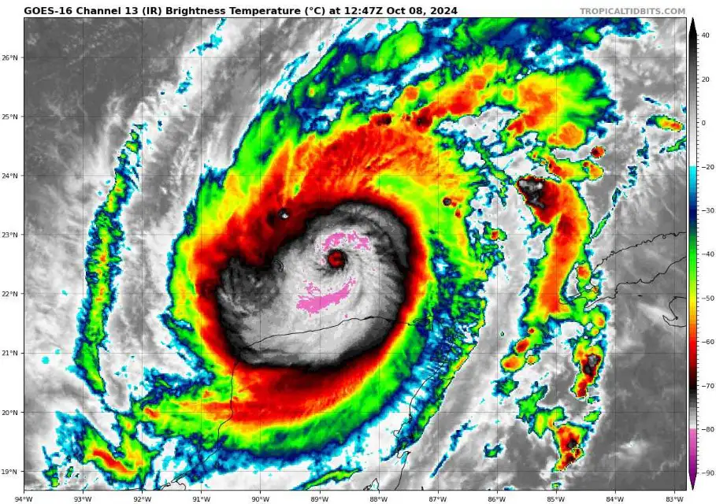 |
| --------------------------------------------------------------------------------------------------------------------------------------------------------------------------------------------------------------------------------------------------------------- | --------------------------------------------------------------------------- |

For the next 5 or so hours the storm would struggle with internal structure issues in the eyewall, not being able to properly close and strengthen. Pressure remained steady at 930 millibars with winds of around 125 knots - still a solid category 4 storm.

As the evening drew closer, the eyewall finally organized and the CDO expanded, becoming more axissymmetric. Milton was bound for its second category 5 peak. 

| 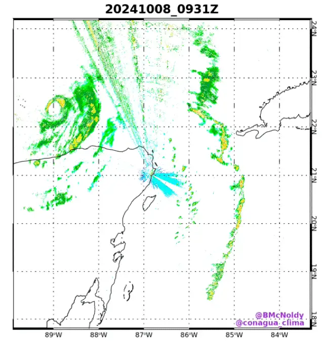 |  |
| ------------------------------------------------------------------------------- | ------------------------------------------------------------------------------------------------------------------------ |

#### Second Peak

After wrapping up its eyewall replacement cycle, Milton bombed out once more. Pressure fell from 930 millibars to an astonishing 902 millibars, and winds increased from 120 knots FL to 160 knots FL in 6 hours. (145kt sfc)

Satellite appearance improved drastically, with the CDO becoming increasingly more symmetric and cool, averaging around -80C throughout. The eye warmed to nearly 20C and became a perfect circle once again - Milton was on its second peak, which was nearly as powerful as the first. 

| 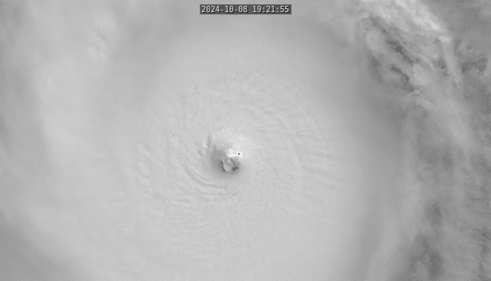       | 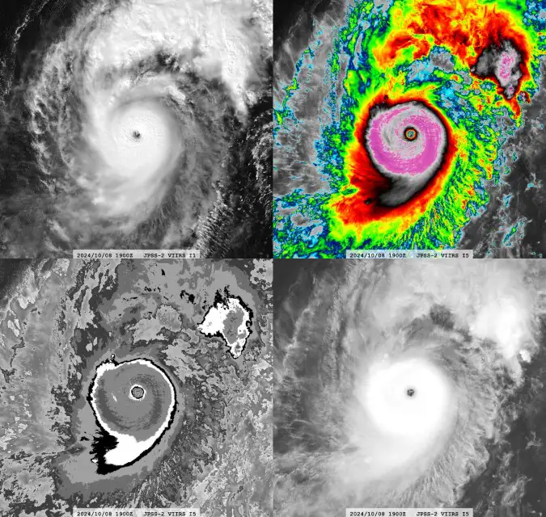              |
| ---------------------------------------------------------------------------------------------------------------- | ----------------------------------------------------------------------------------------------- |
| 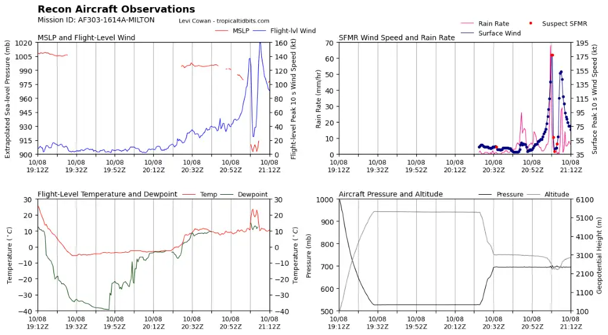 | 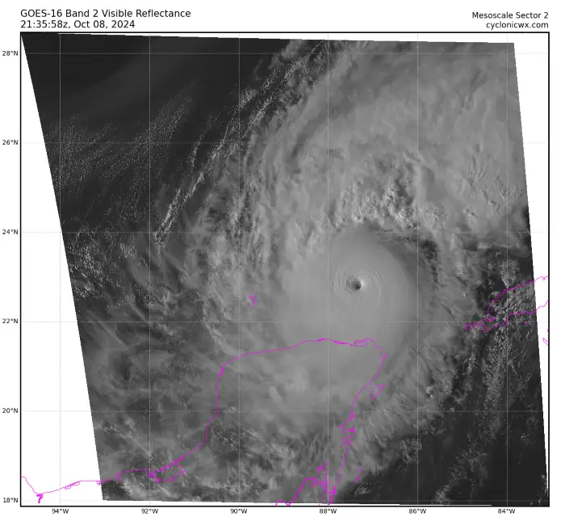 |
|                                                                                                                  |                                                                                                 |

After peaking at 902 millibars, Milton maintained intensity as shear slowly began to pick up and upwelling of cooler waters reduced oceanic heat content below. Still, the storm was an extremely powerful 145 knot category 5 storm, which now put Florida in its sights.

On the morning and noon of the 9th the storm had improved even further in satellite appearance, however this did not translate to deepening. The pressure had began to slowly rise while winds maintained at 145kt/155kt FL. Milton's 2nd peak had passed and its final weakening would now begin. 

| 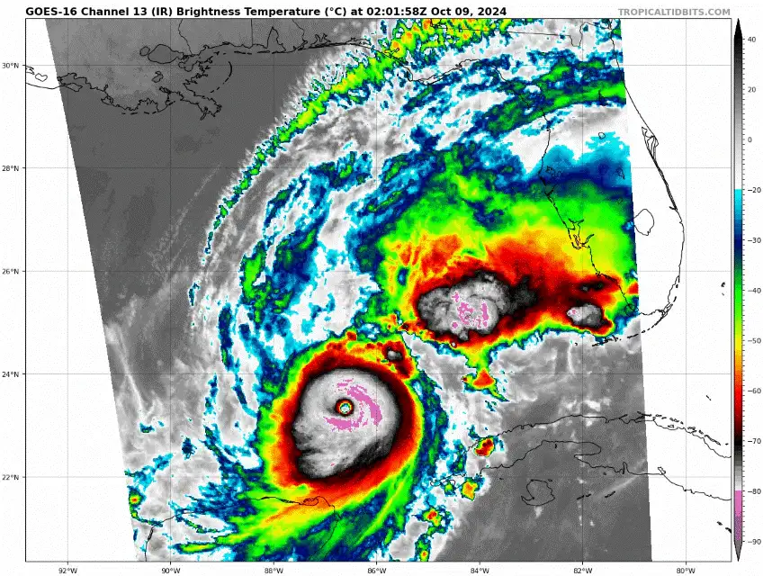 | 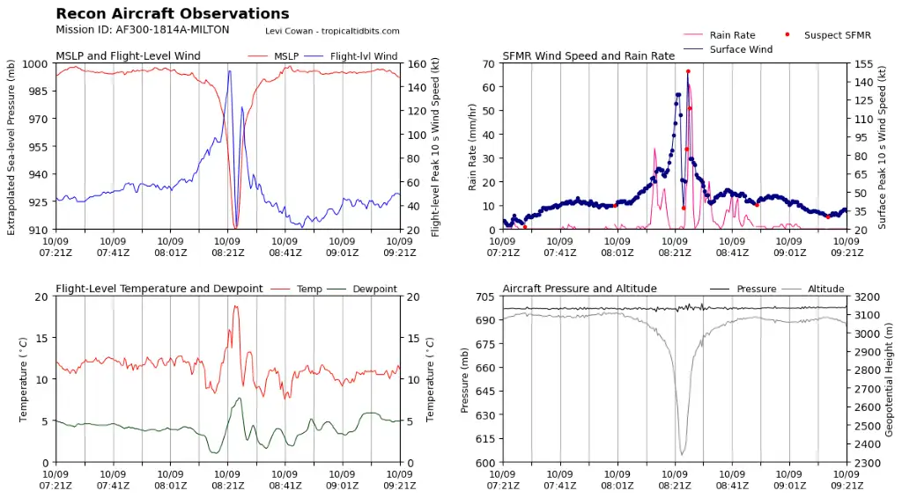 |
| ----------------------------------------------------------------------------------------------------------------------------------- | ------------------------------------------------------------------------------ |

#### Weakening, Tornado Outbreak and Landfall

Whilst Milton was nearing Florida, wind shear values increased significantly. This lead to the cyclone becoming asymmetric and its eye to close up, becoming entrained in the CDO. On top of that, dry air from the CONUS began to wrap in and around the storm. These two environmental factors combined caused Milton to rapidly weaken, albeit still remaining a major as per reconnaissance flights.

Although the dry air caused Milton to weaken to a category 3 storm by landfall, it lead the way for a highly unusual process to take place inside of the storm's core. As the dry air became entrained in the core from the south, the cyclonically rotating eyewall would encounter a drastic gradient of moisture, which in turn caused it to quickly evaporate and sink at rapid pace, producing atypically violent wind gusts - similarly to a sting jet in an extratropical cyclone. The process of sting jet like features in TCs is a studied phenomena, albeit very rare, with the last such case occurring in 2019 with hurricane Humberto. 

The aforementioned sting jet like feature and the pre-existing waves produced by Milton at its second peak lead to very high storm surge values along the western Florida coastline, with locations south of Tampa Bay experiencing up to 10 feet of storm surge.

|  |  | 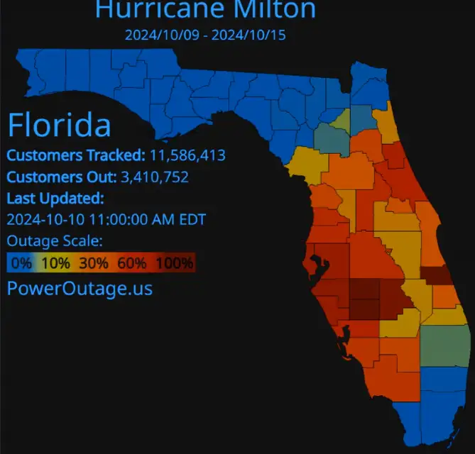 |
| ------------------------------------------------------------------------------------------- | --------------------------------------------------------------------------------------------------------------------------------------------------------------------------------------- | ------------------------------------------------------------------------------------------------------ |

As Milton kept slowly weakening, its outer bands reached the Florida peninsula. Due to a rare combination of clearings in the clouds, mid level dry air and extreme storm relative helicity thanks to the storm's intensity, a record breaking tornado outbreak occurred in southeastern Florida.

45 tornadoes touched down in total during the event, with the strongest of which being a 155mph upper end EF3 near the town of Fort Pierce, FL. The tornadoes were unusually photogenic thanks to the aforementioned dry air, which allowed them to exist without being rain-wrapped. 

Shockingly, one of the tornadoes - the Clewiston tornado, tracked for an incredible 70.6 miles - one of the longest path lengths ever observed from a tropical cyclone related tornado. 

A more detailed analysis of this event can be found in the link below, done by Tray from Convective Chronicles on YouTube. We highly recommend you check it out!

Link: https://youtu.be/0xgxfafYM6w?si=ob_6f9sPEFB_7IQ5

| 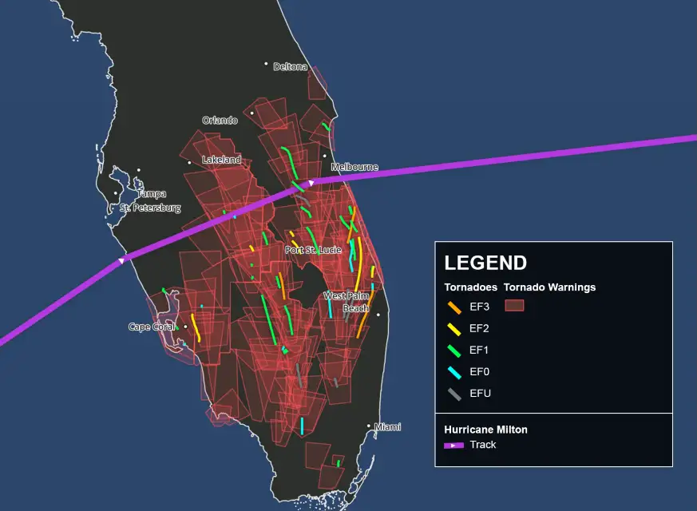 | 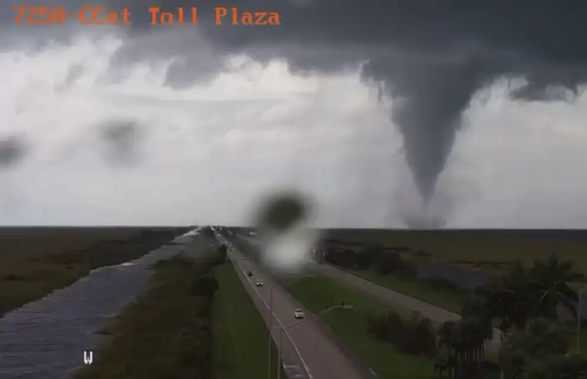 | 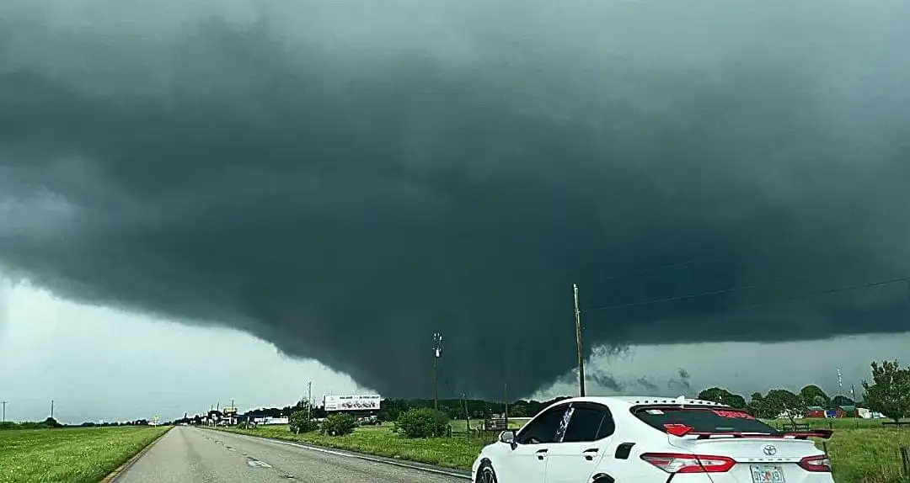 |
| --------------------------------------------------------------------------------------------------------------- | --------------------------------------------------------------------------------------------------- | --------------------------------------------------------------------------------- |

Milton managed to sustain category 1 intensity throughout its passage of the Florida peninsula, however the increased values of wind shear and dry air ended up causing irreparable damage to the storm's core, and soon after crossing into open waters Milton would dissipate on October 12th after its extratropical transition.

|  |
| -------------------------------------------------------------------------------------------- |

Tidbit: Thanks to the dry air quickly enveloping the storm from its western and southern flanks, on the evening of October 10th-11th the sky cleared, allowing for residents of Florida to observe the second strongest geomagnetic storm of solar cycle 2025. This created extremely eerie photographs of stunning auroras over the freshly produced surge and wind damage, such as the one attached below.

|  |
| ------------------------------------------------------------------------------------------------------ |

Finally, to wrap up this beast of an article, enjoy a satellite image time-lapse of Milton's life through the gulf. 

|  |
| ------------------------------------------------------------------------------------------------------------------------------------------------------------------------------- |

#### Gallery of Valuable Data, Imagery and Extra Stuff.

| 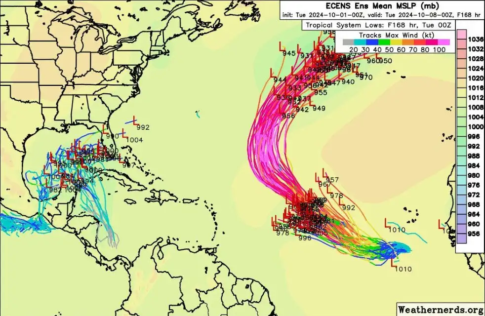 | 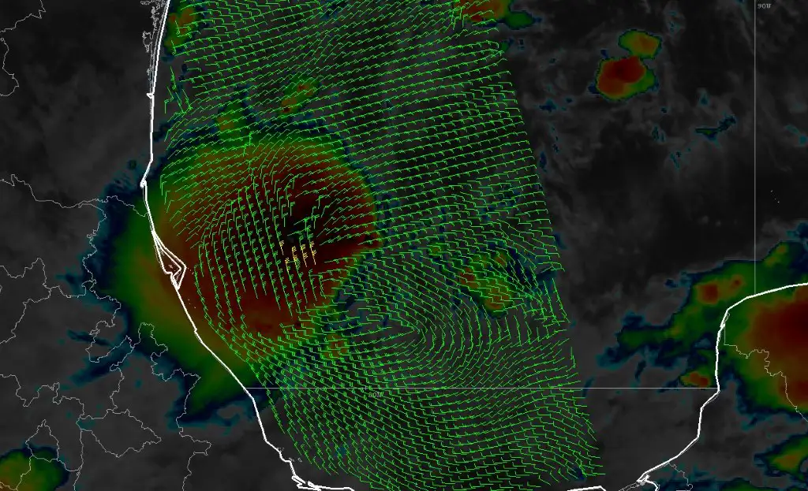                                                                                                                | 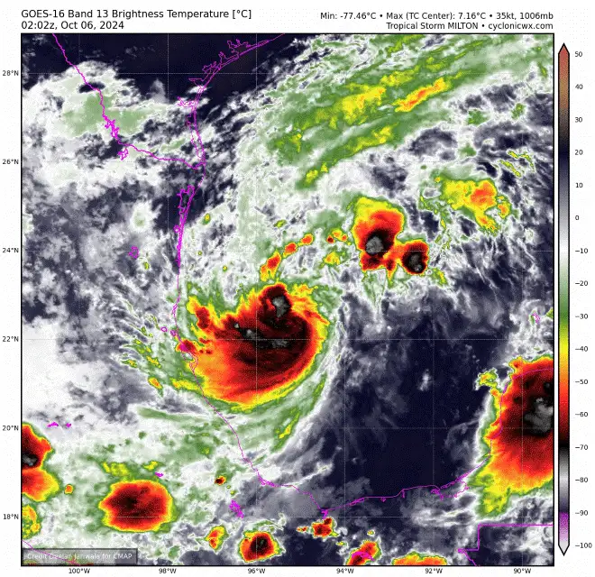                                                                       |
| ---------------------------------------------------------------------------------------------------------------------------------------------------------------------------------------------------------- | -------------------------------------------------------------------------------------------------------------------------------------------------------------------------------------------------- | -------------------------------------------------------------------------------------------------------------------------------------------------------- |
| 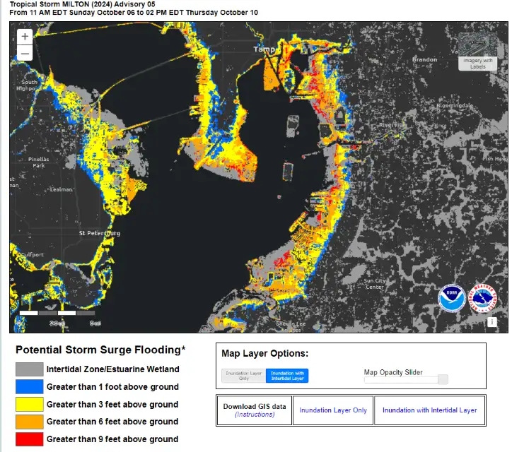                                                                                             | 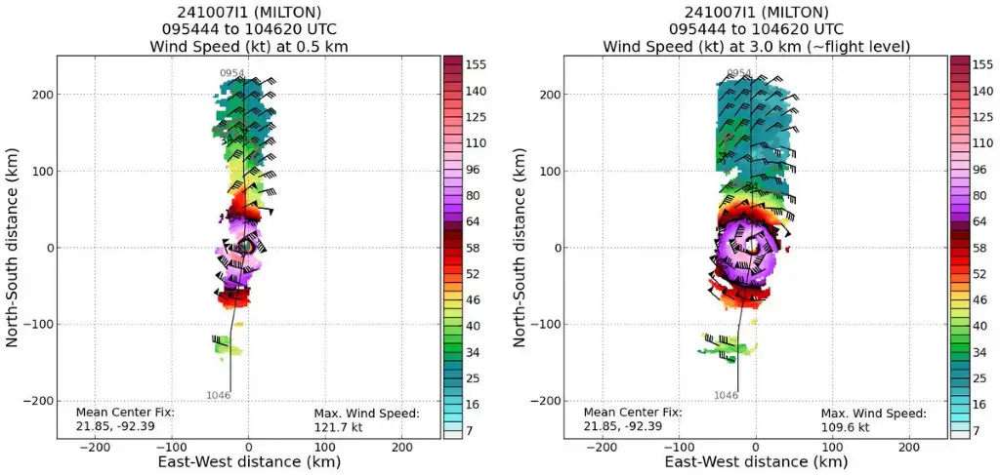 | 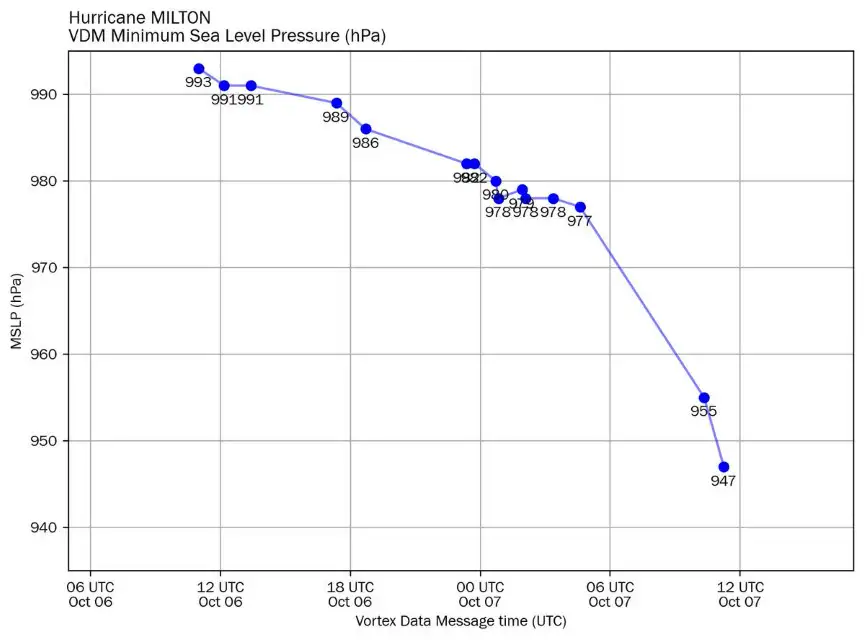                                       |
| 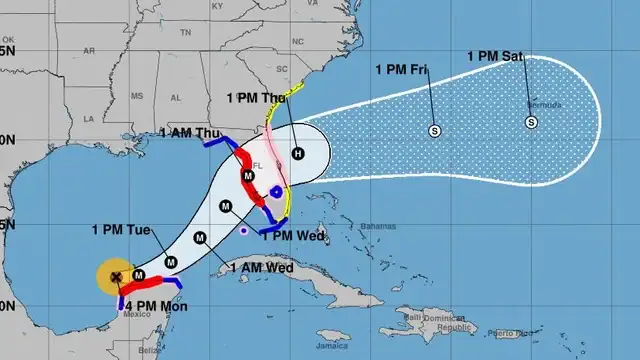                                                                                                                         | 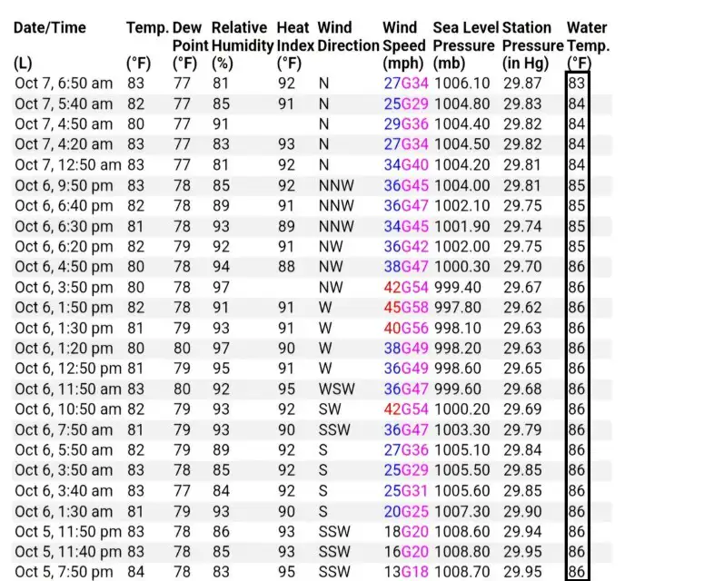                                                                                                    | 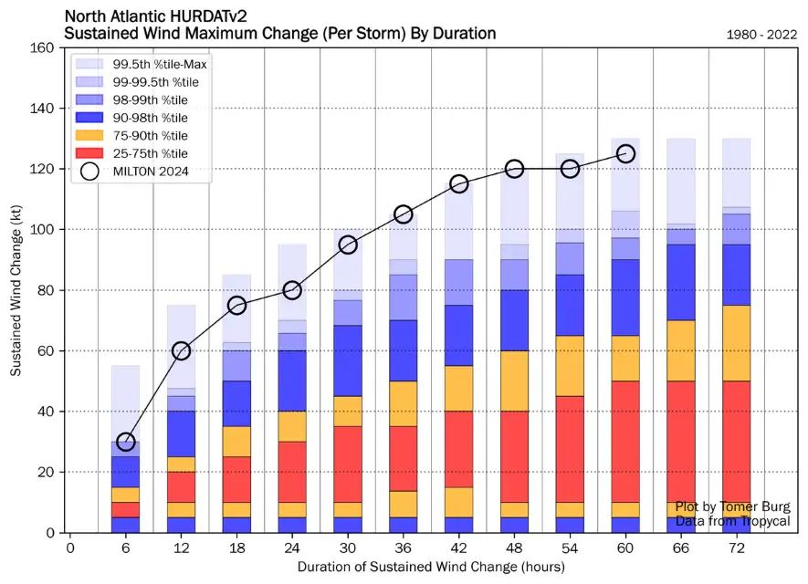 |
|                                                                                                                                             |                                                                                              | 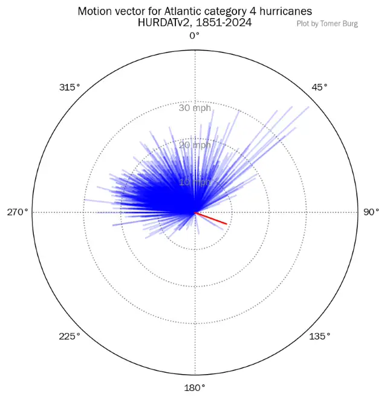     |
|                                                                                                                                                                                                            |                                                                                                                                                                                                    |                                                                                                                                                          |

