#### Origin And Model Data

**Typhoon Ragasa**'s origin is quite typical for an autumnal Super Typhoon. The typhoon traces its formation to the massive tropical gyre which produced tropical storm Mitag earlier in the month, and lead to typhoon Bualoi later in the month. Due to a large ridge to the north, all three storms ended up crossing the South China Sea. 

| 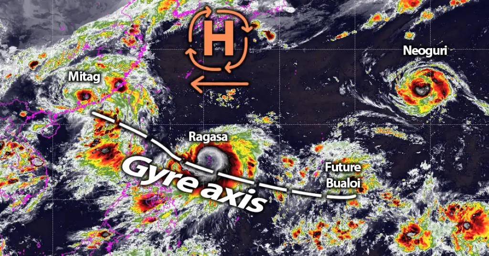 |
| ------------------------------------------------------------------------------------------------------------------------------------------------------------------------------------------------- |

As Ragasa was the central system in the gyre, as well as it being the largest, it was going to be the most resilient to shear, as well as mostly shielded from it due to its outflow. Original model forecasts for Ragasa were extremely bullish - some of the strongest initialization I have personally seen. Especially the HWRF model went crazy with this system, pretty much forecasting a repeat of Mangkhut - SIM IR was eerily similar to the infamous HWRF run which had the typhoon so strong it went off the scale on 850mb winds.

The HAFS model was also extremely intense, with wind speeds reaching up to 165 knots sustained. Needless to say, we knew we were in for tracking an extremely powerful system.

| 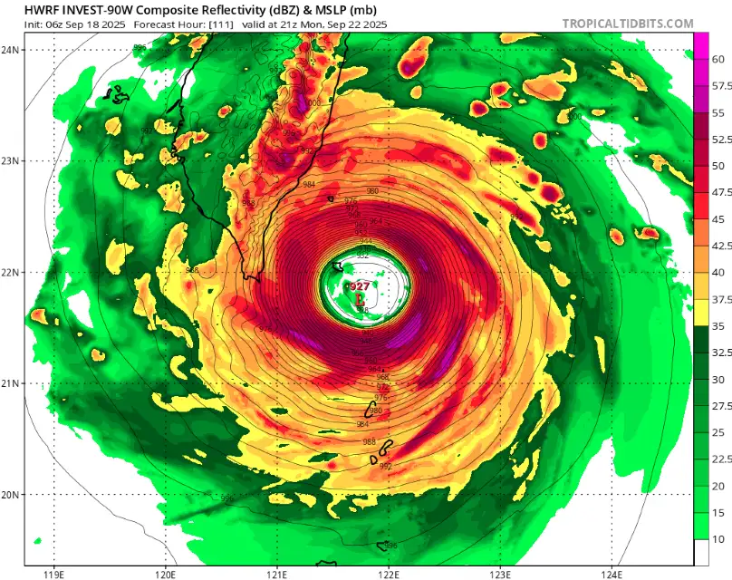 | 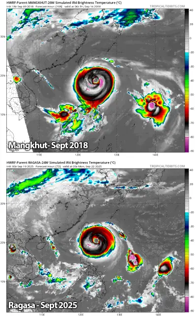 | 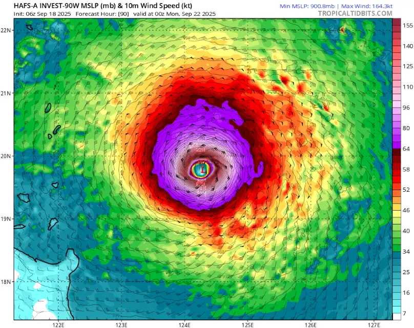 |
| ----------------------------------------------------------------------------- | ---------------------------------------------------------------------------------------------------------- | -------------------------------------------------------------------------------------- |

#### Formation And Early Life

Ragasa received its name on the 18th of September. Originally, the storm was highly sheared from the north, leaving its low level center (LLC) half exposed, while the extremely cold convective bursts it was producing remained shackled to the southern portion of the system. 

An ASCAT pass early on the 18th showed that the vortex had developed a closed LLC, however it remained severely lopsided due to the aforementioned shear. Convective activity was violent in its upward motion as cloud tops cooled to sub -90C, at times even -95C. 

Such cloud tops are fairly common in disorganized, freshly formed TCs in the western Pacific due to the higher tropopause (which allows storms to reach taller vertical heights) as well as anomalous OHC values near the Philippine island chain.

| 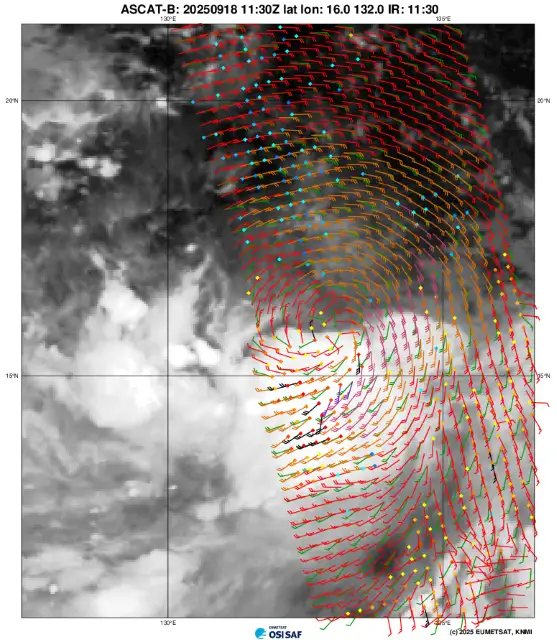 | 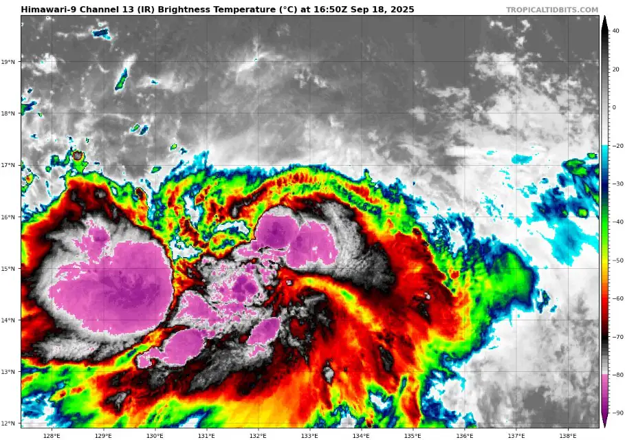 | 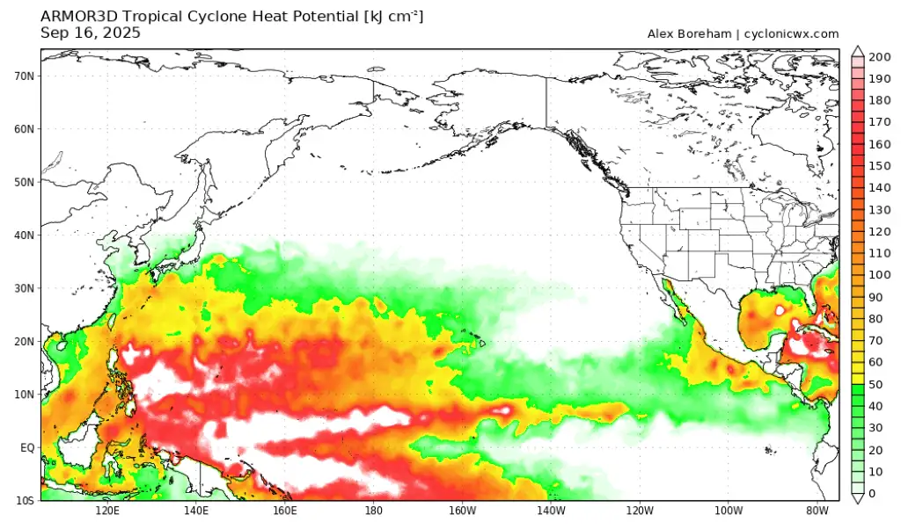 |
| ------------------------------------------------------------------------------------------------------------------------------------------------------------ | ------------------------------------------------------------------------------------ | ---------------------------------------------------------------------------------------------------------------------- |

Early on the 19th the convective bursts organized somewhat into a uniform CCC (central cold cover), colloquially called a superblob. In such CCCs, convection is localized under one central channel, allowing for extremely cold cloud tops as the storm's energy is focused in one spot.

Microwave data supported this, as one banded area confined to the south eastern side of the vortex was producing anomalously high readings in a low level microwave pass, indicative of very strong upward motion. 

| 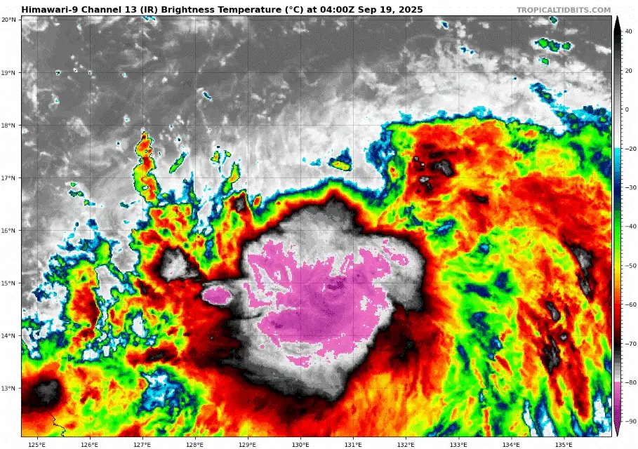       | 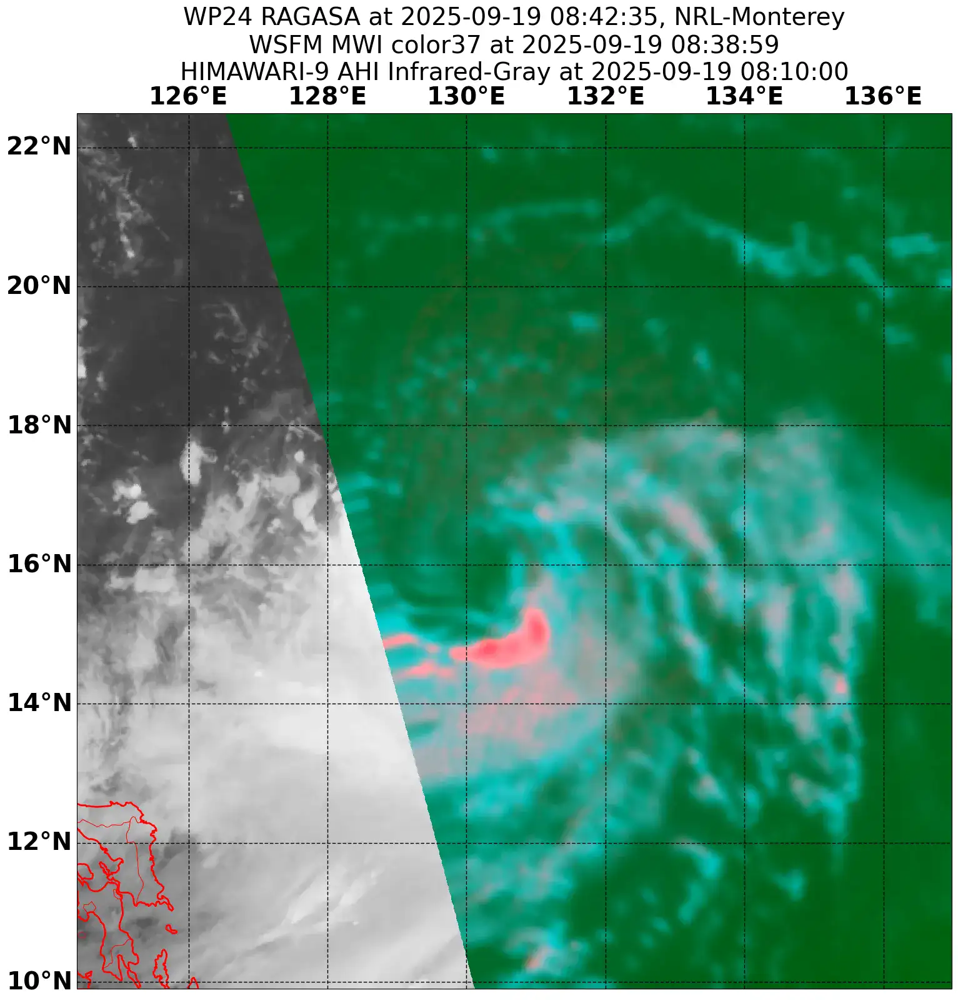 |
| ------------------------------------------------------------------------------------------ | ---------------------------------------------------------------------------------------------------------------------------------------------------- |
| 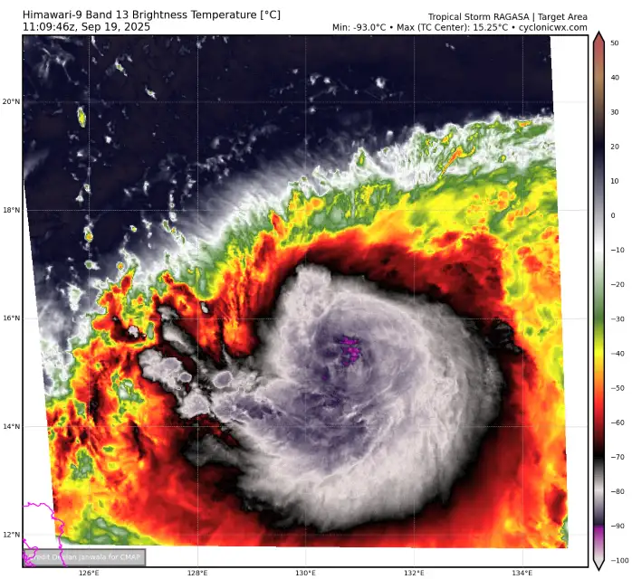 |                                                  |
|                                                                                            |                                                                                                                                                      |

Later in the day, Ragasa's CCC began moving farther northward, as well as curling around the LLC of the storm. As the CCC wrapped around its eastern and northern quadrants, the typhoon experienced a convective collapse, in which the CDO rapidly warmed as sinking motion overtook the rising air.

Ragasa was in the process of "shrimping out", a colloquial term we use in the community to describe the shape of a storm that is about to rapidly intensify as convective bursts begin wrapping tightly around the core. 

Another argument in favor of Ragasa beginning a period of RI (rapid intensification) was the radially propagating outflow, which was especially evident north of the CDO. Transverse cirrus bands, a feature related to conditional symmetric instability release - a process which occurs under light wind shear in the upper troposphere - began forming on the cirrus shield's northern flank. They are characterized by spike-like appendages of cirrus clouds that emanate away from a storm's CDO.

| 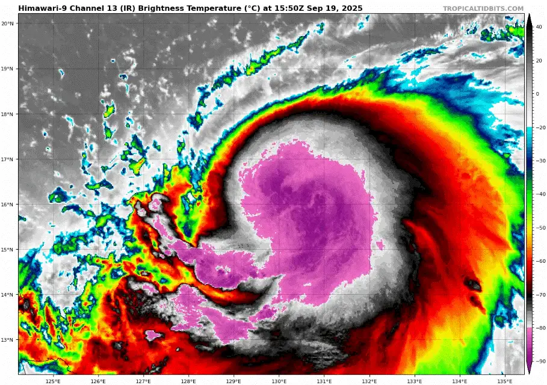                                                                                                                          | 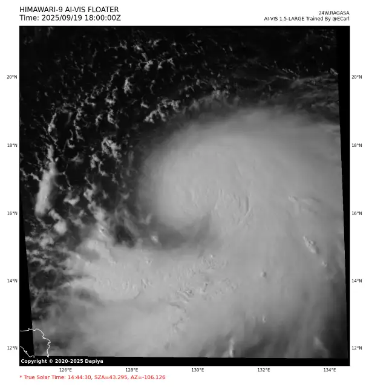                                                                                                                              |
| ------------------------------------------------------------------------------------------------------------------------------------------------------------------------------------------------------------ | ---------------------------------------------------------------------------------------------------------------------------------------------------------------------------------------------------------------- |
| 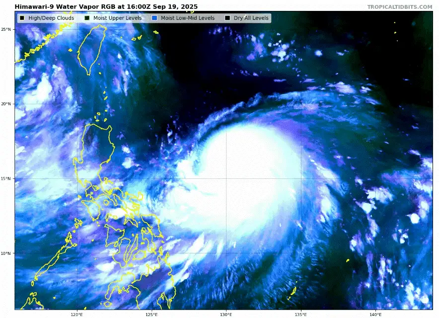 | 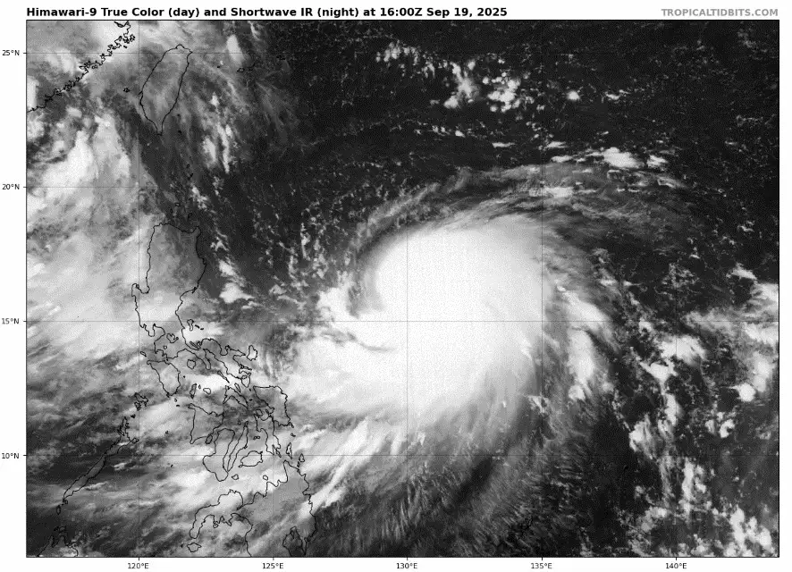 |
|                                                                                                                                                                                                              |                                                                                                                                                                                                                  |

After the convective collapse, Ragasa reorganized swiftly, firing bursts which would quickly curve around the low level core. These VHTs would then rapidly increase subsidence in the eye region, which in turn lead to the creation of a nascent eye.

This nascent eye feature soon turned into a full blown eye; due to the convective collapse late on the 19th the storm likely reorganized its LLC, leading to the formation of a tight eyewall. This would have a noticeable impact on the storm in the coming days, as due to the storm's large size and ample moisture in the surroundings, many EWRCs would occur, as a concentric banding feature has an easier time forming the smaller the original core is.

A microwave pass taken right as the typhoon began firing VHTs showed a well defined low level core, which indeed was on the smaller side. Ragasa was getting primed to explode in intensity.

| 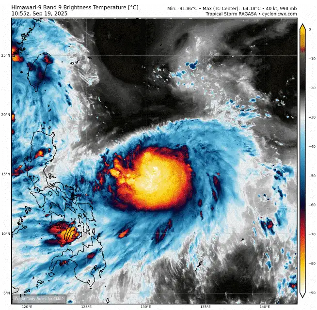 | 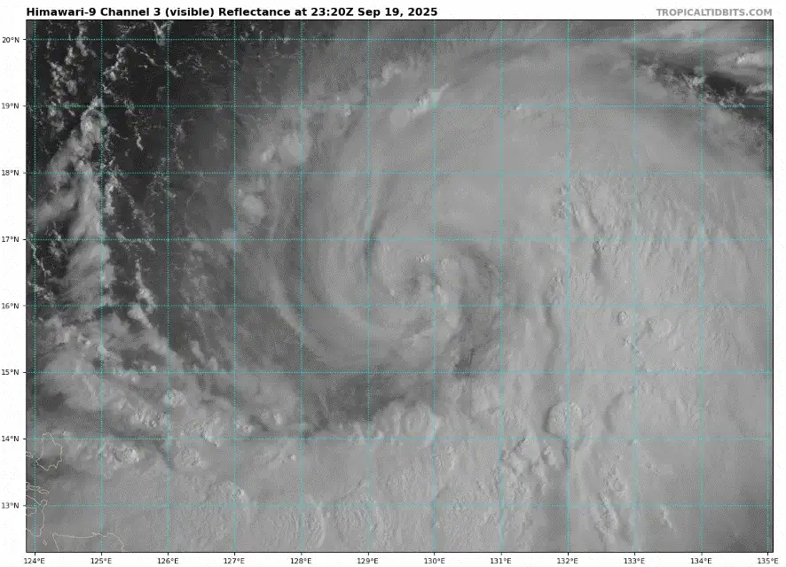                                                 |
| ------------------------------------------------------------------------------------------------------------------------------------------------- | ------------------------------------------------------------------------------------------------------------------------------------------ |
| 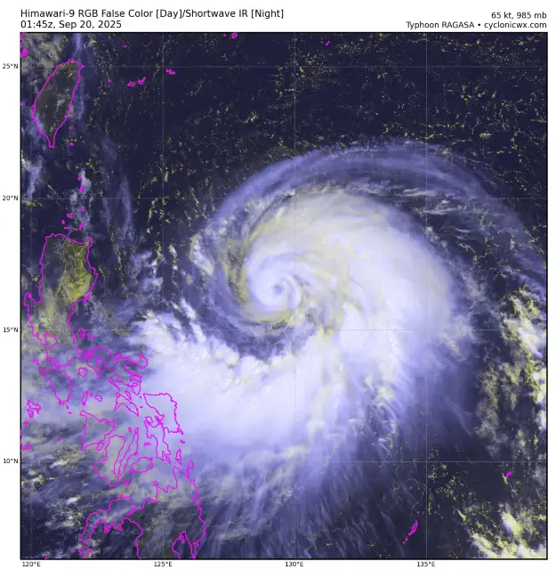                                                                               | 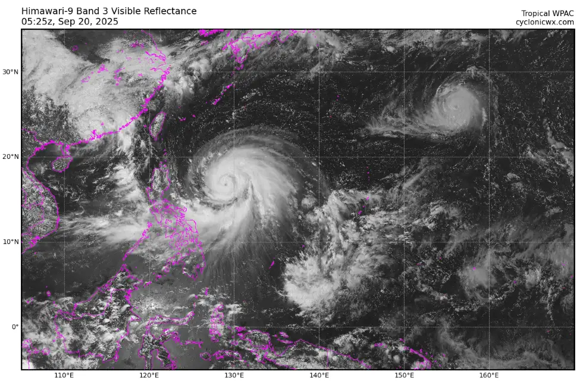 |
|                                                                                                                                                   |                                                                                                                                            |

Ragasa was now beginning to rapidly intensify, but more importantly, entering a cycle of repeatedly producing VHTs with none of them actually anchoring down and becoming dominant. While the eye managed to clear, it was not particularly stable or dry - this was indicative of the system not being that well organized - yet.

While many, many VHTs fired, one of them was particularly interesting as it managed to fully wrap around the forming eye, enveloping it fully before waning and allowing for the next VHT to take the lead.

Outflow was, as expected, still continuing to expand, with the cirrus shield now reaching a truly gargantuan size. Ragasa was in the upper echelon of tropical cyclones in terms of area covered.

| 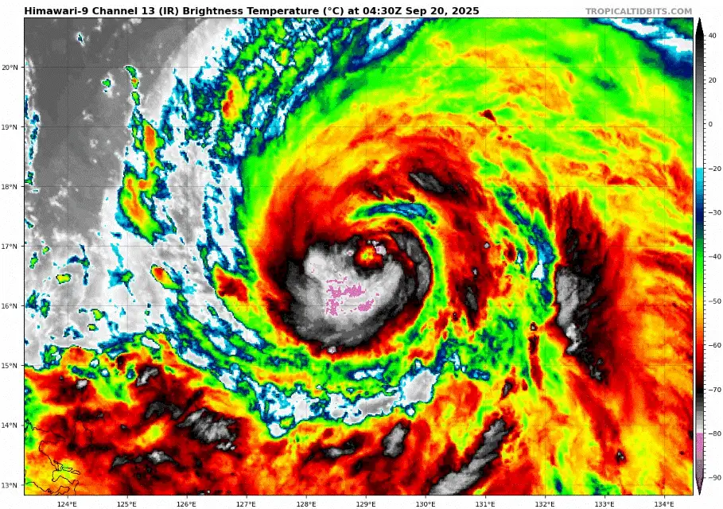 | 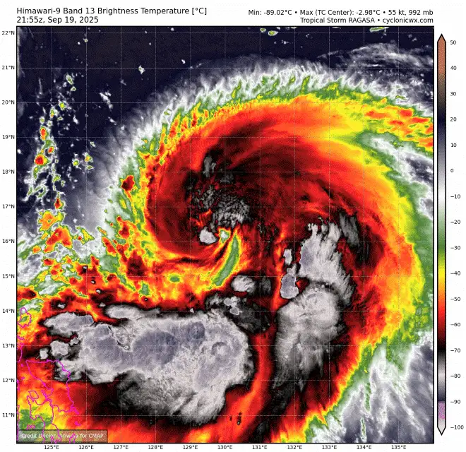 |
| ------------------------------------------------------------------------------------------------- | ------------------------------------------------------------------------------------------------------------------------------------ |
| 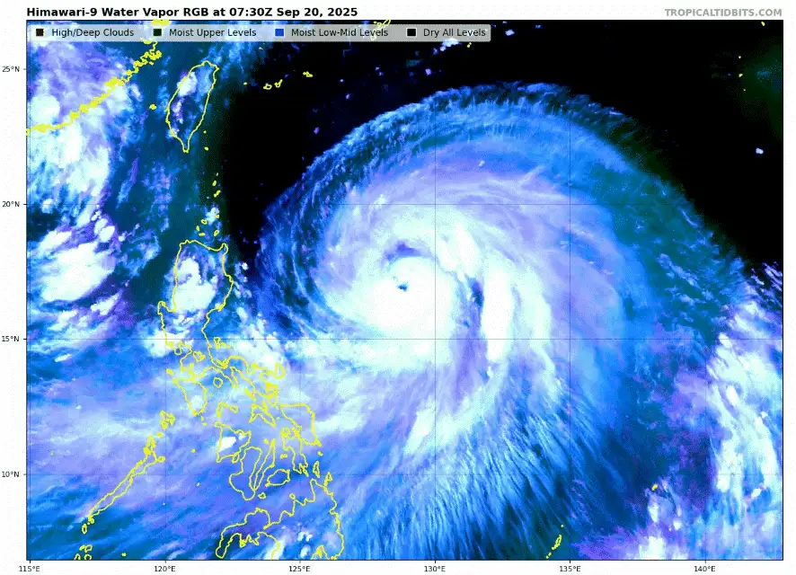   | 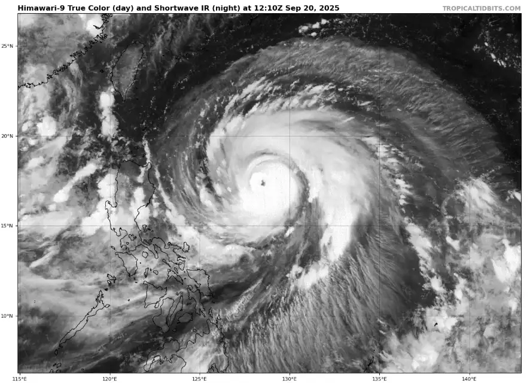                                                         |
|                                                                                                   |                                                                                                                                      |

#### Rapid Intensification

The eye finally stabilized after around 12h of constant VHT attempts, to be precise around 20z on the 20th of September. The CDO, whilst remaining lopsided, cooled substantially and finally expanded to the northern quadrant, allowing for the storm to become more axis-symmetric

At the same time, SATCON analysis of the storm indicated that the typhoon had crossed the T6.0 threshold - the Dvorak point at which a storm is delineated as a category 4 equivalent typhoon, and so JTWC upgraded Ragasa to a 115kt category 4 storm in their 18z advisory.

| 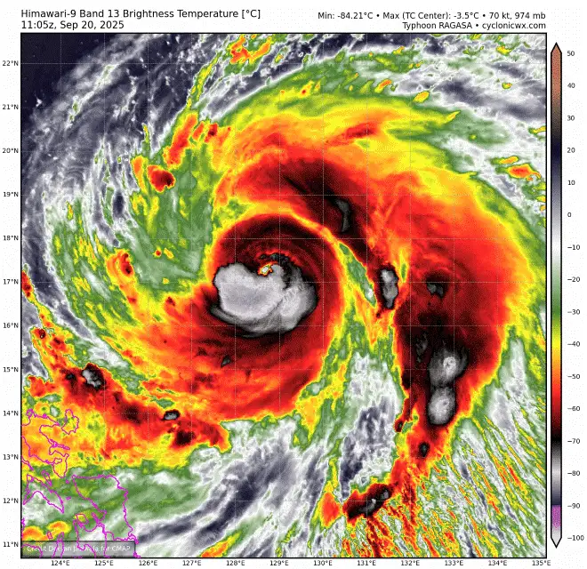                                                                                              | 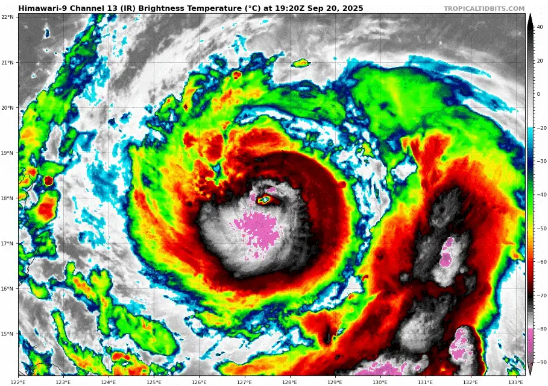 |
| ------------------------------------------------------------------------------------------------------------------------------------------------------------------------------- | --------------------------------------------------------------------------------------------------------- |
| 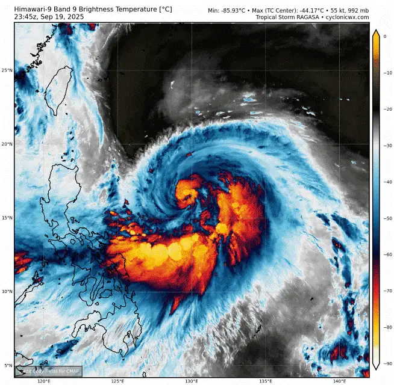 | 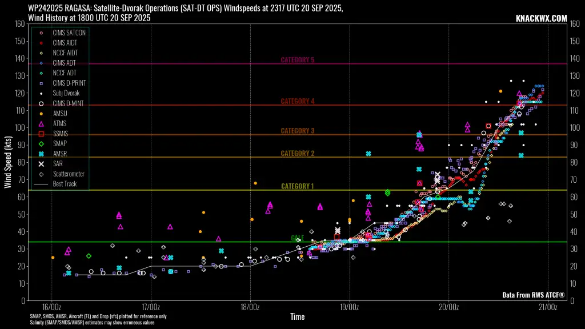                         |
|                                                                                                                                                                                 |                                                                                                           |

Turning the calendar page into the 21st of September, Ragasa's structure only improved. CDO expanded steadily northward, symmetrizing as it did so. The eye also became warmer, as well as more stable. At one point, the typhoon's eye reached a whopping 20.9C temperature - the warmest throughout its entire lifecycle, whilst being dry enough to reach -19.22C water vapor temperature

Considering all of this, JTWC upgraded Ragasa to a category 5 equivalent super typhoon around midnight of the 20th/21st. This made Ragasa the first C5 storm in the western Pacific in 2025.

Interestingly enough, the typhoon's eye was quite small. Typically, a category 5 super typhoon having a small eye would be no surprise, however due to how large Ragasa was, it is quite shocking that it managed to develop such a small core. Non the less, this would soon change....

| 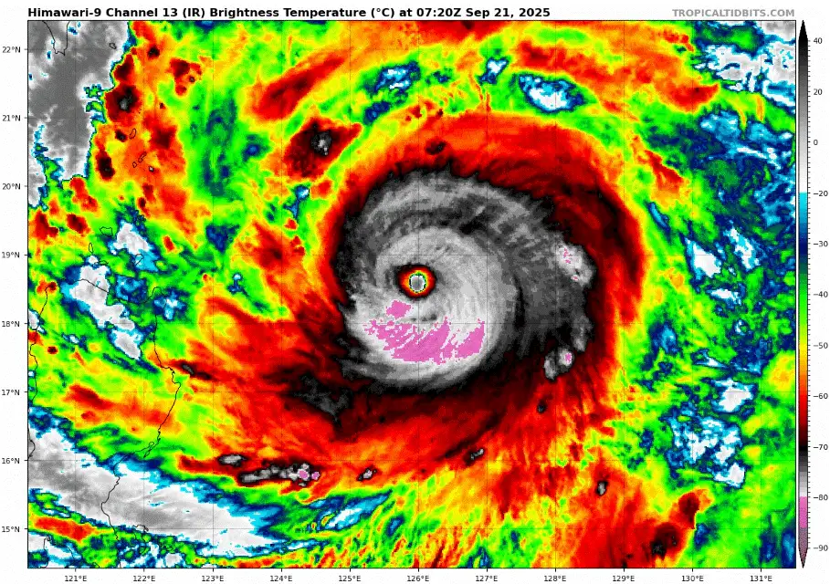              | 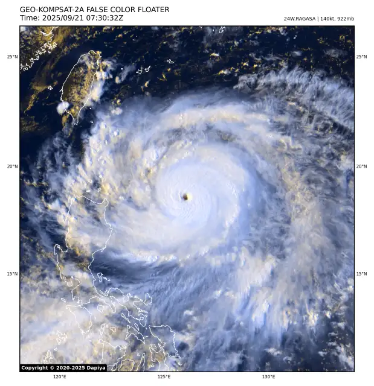                                                      | 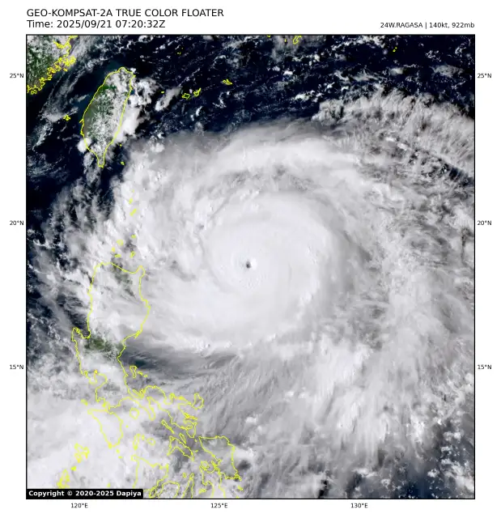           |
| --------------------------------------------------------------------------------------------------- | ------------------------------------------------------------------------------------------------------------------------ | ----------------------------------------------------------------------- |
|  | 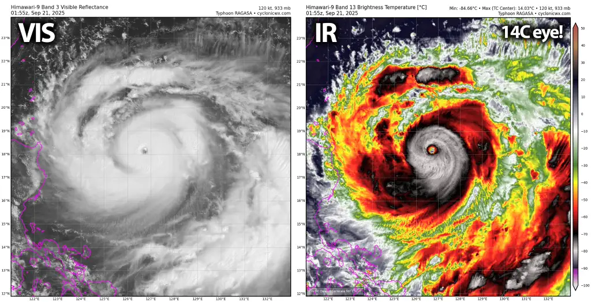 | 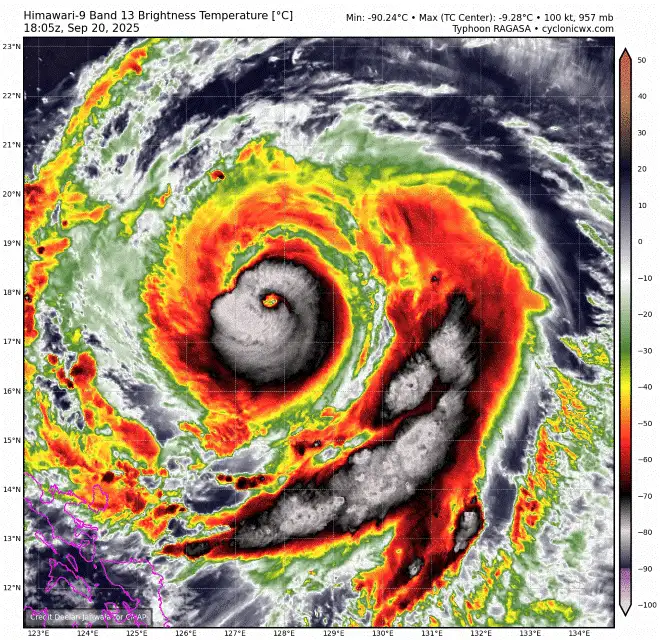 |
|                                                                                                     |                                                                                                                          |                                                                         |

At the time of Ragasa's peak at its pinhole eye stage, a drifting buoy that managed to get right into the eye of the storm reported a central MSLP of a shocking 900.3 millibars!

Right around the time this measurement was taken, JTWC upgraded the typhoon to 145kt/911mb, over 10 millibars higher than what this buoy reported. If this reading is accurate, it is the lowest ever recorded pressure by a buoy, as well as making Ragasa a contender for <900mb status. 

Thanks to @doomhaMwx on twitter for making this information public! 

| 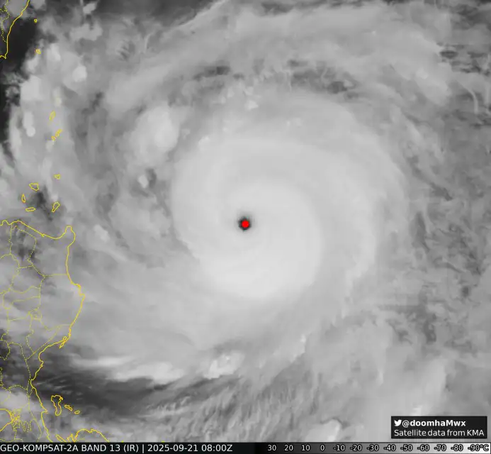 | 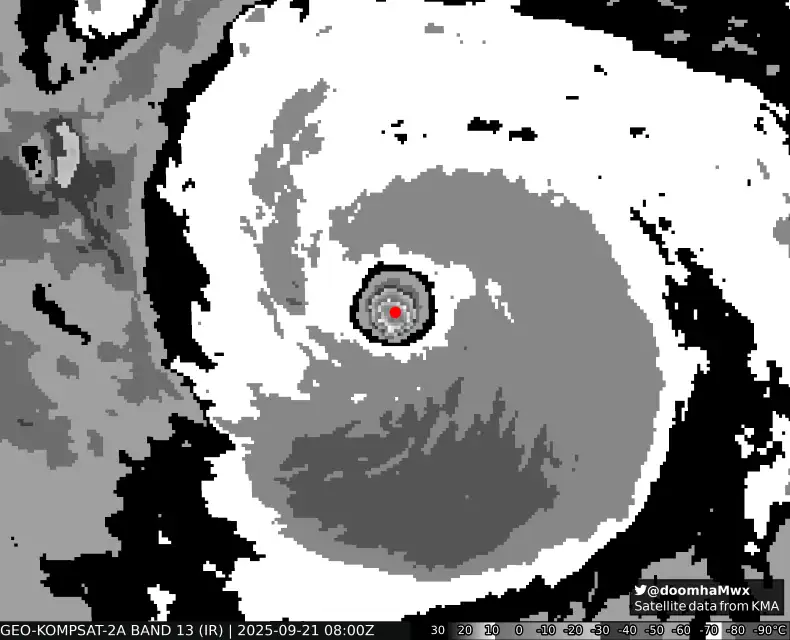 | 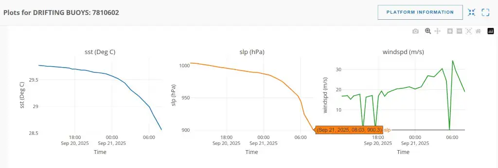 |
| -------------------------------------------------------------------------------------------------------------- | -------------------------------------------------------------------------------- | ---------------------------------------------------------------------- |

#### First Eyewall Replacement Cycle

After Ragasa attained category 5 status, a satellite sampled the storm, producing a microwave image of its core. What it showed is that the typhoon had a very EWRC prone structure - no surprise considering how small the eye was compared to how large the entire system was. The structure in question refers to almost concentric banding around the vigorous inner eyewall, which due to great conditions for an EWRC (large CDO, ample moisture and low shear) could quickly close and choke off the inner eyewall.

The CDO began to warm around the eye, producing a larger gradient in its vicinity, wobbles could be observed and eventually a moat began forming on infrared imagery around the eye, rotating cyclonically in the eyewall - all of these phenomena being tell tale signs of an ongoing EWRC.

| 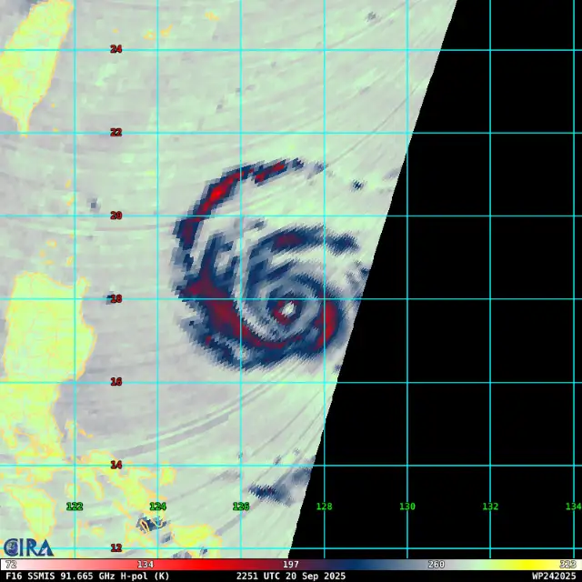  | 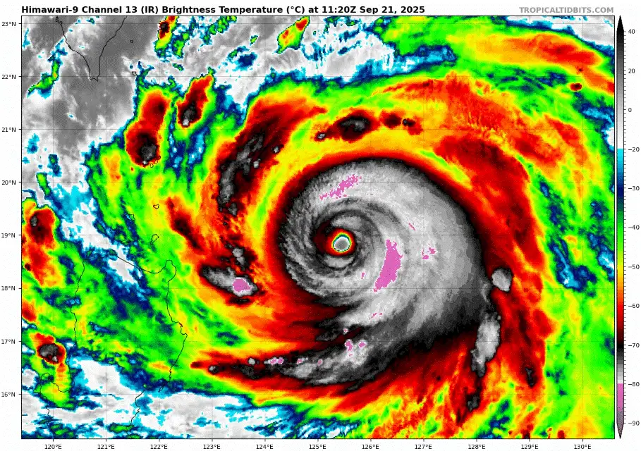  |
| ------------------------------------------------------------------------------------------------------------------------- | ------------------------------------------------------------------------------------------------ |
| 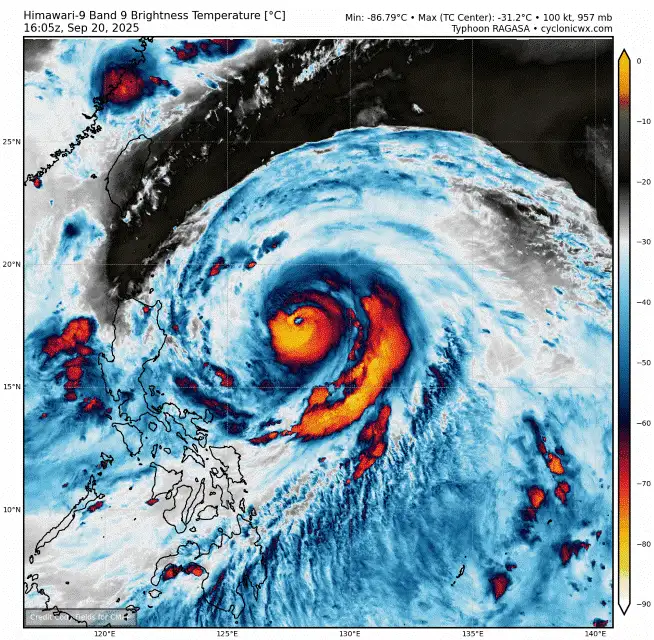 | 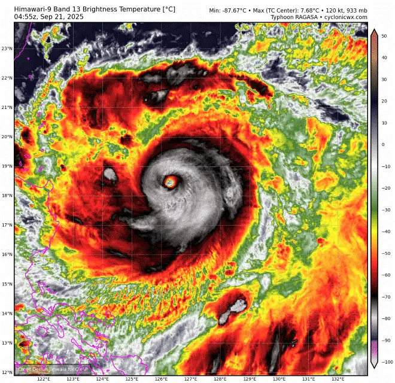 |
|                                                                                                                           |                                                                                                  |

Ragasa's first eyewall replacement cycle was one of the swiftest in the business. The eye quickly expanded as the CDO barely warmed, in fact becoming even more organized than prior to the EWRC. The thick ring of -80C to -85C cloud top temperatures enveloped the rapidly reforming eye, setting stage for one of the most gorgeous tropical cyclones this year. 

During the EWRC. there were talks in the community whether this event was a merger or a classic EWRC. Merger EWRCs occur when the concentric banding forms close enough to the inner eyewall to merge with it instead of occluding the inner feature, and are among the rarest TC phenomena observed. Much of this discussion was due to how smooth this process was, as mergers usually do not impede a storm's intensification, as well as a recent merger just days prior in Hurricane Gabrielle, which induced a recency bias in the minds of the weather community. However this was not a merger, just a very, very smooth EWRC.

Another thing worthy of note is just how warm and dry the eye of Ragasa got at this time, reaching values of -15C water vapor temp and around 19C infrared temp - truly upper echelon features of the eye.

| 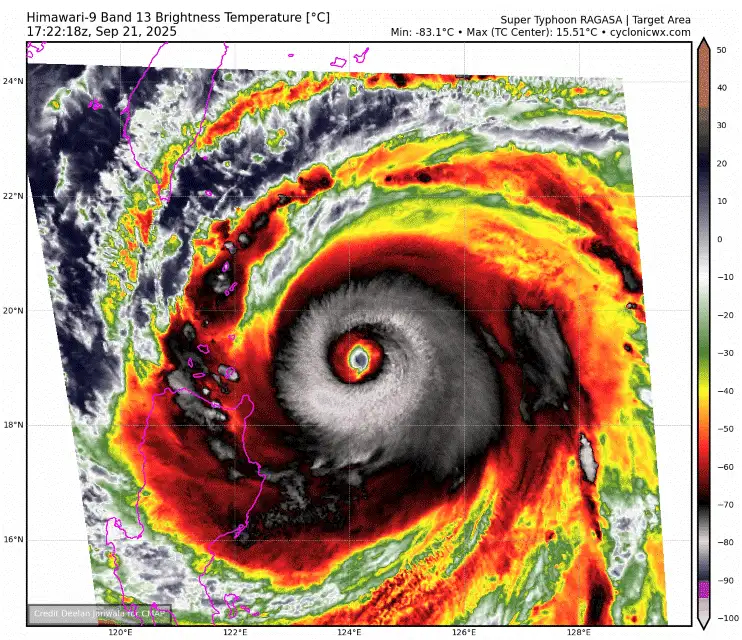                 | 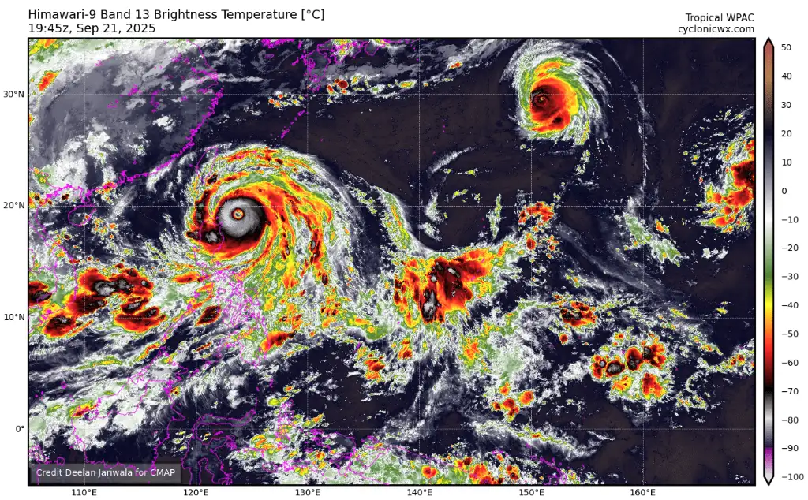 |
| ---------------------------------------------------------------------------------------------------- | ------------------------------------------------------------------------------------------------------------------------------------------------------------------------------------------------------------------- |
| 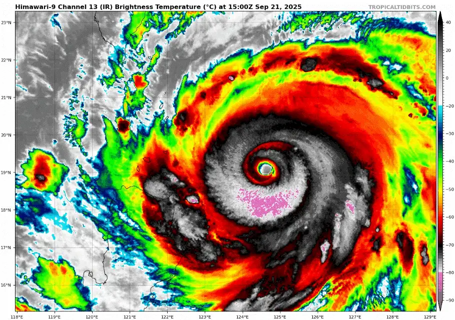 | 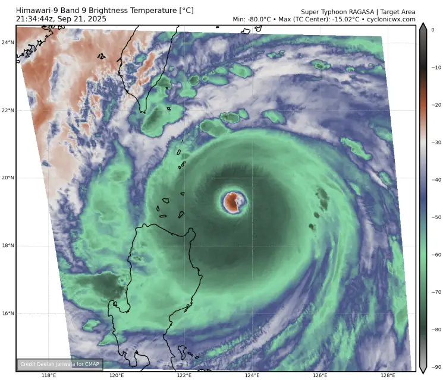                                                                                                                                      |
|                                                                                                      |                                                                                                                                                                                                                     |

#### Peak Intensity and Landfall

As the sun began to rise over the storm (late on the 21st in UTC time), it became evident just how extremely powerful Ragasa had become. The CDO had uniformly cooled to around -85C, a feat rarely achieved in the world of tropical cyclones. The eye was extremely dry, at points going down to -12C water vapor temperature and up to 21C infrared temperature. These values are extremely rarely achieved by any TCs worldwide. The typhoon was well and truly entering peak intensity, and with it striking an absolutely gorgeous look. 

| 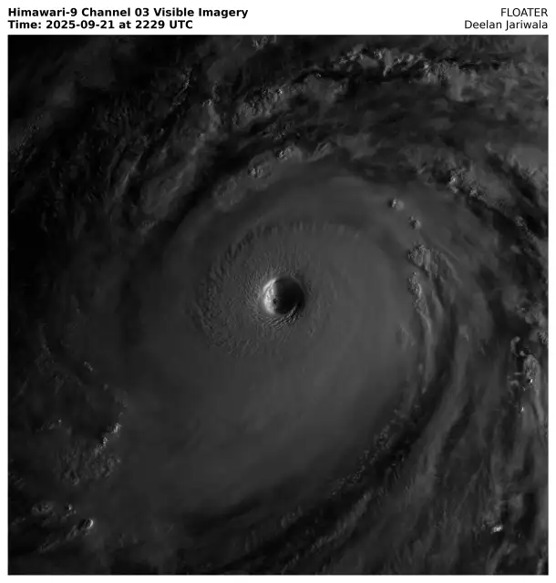                                                                                                | 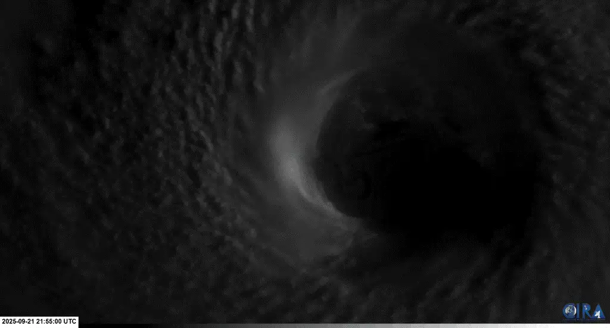 | 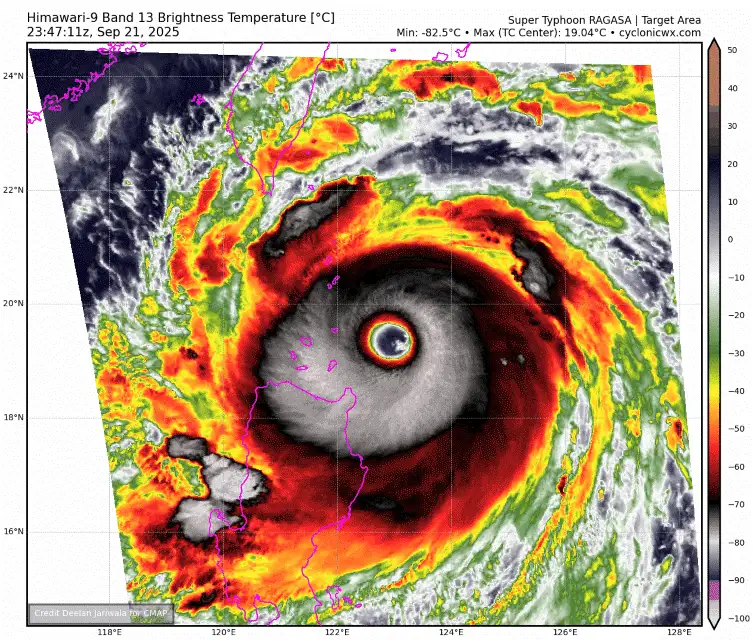                                             |
| ----------------------------------------------------------------------------------------------------------------------------------------------------------------------------------------- | --------------------------------------------------------------------------------- | --------------------------------------------------------------------------------------------------------------------------------------- |
| 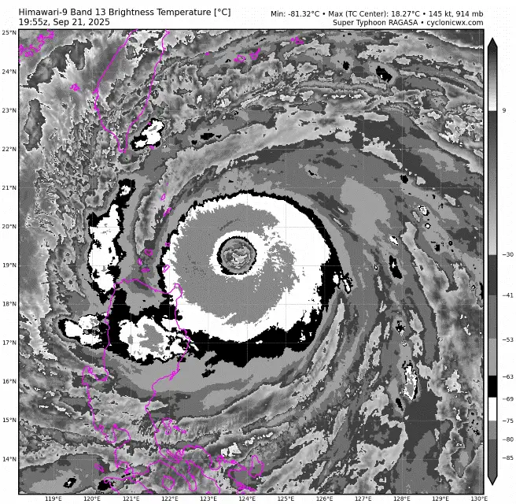 | 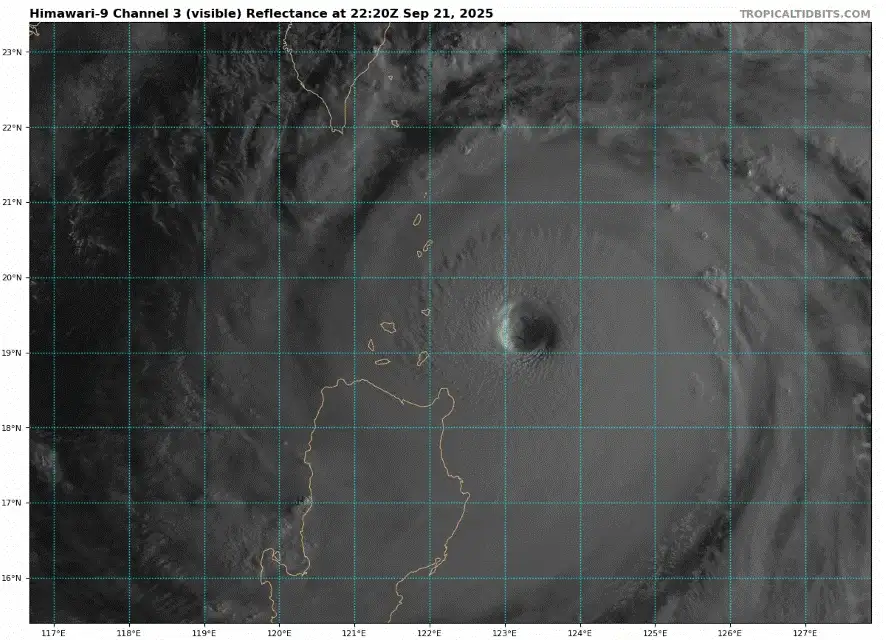  | 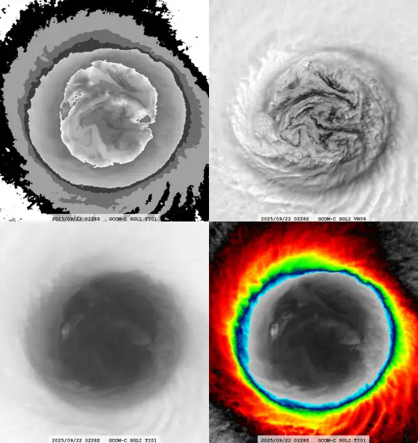 |
|                                                                                                                                                                                           |                                                                                   |                                                                                                                                         |

As Ragasa began nearing landfall on one of the Babuyan islands it maintained its intensity. However, new microwave imagery indicated that another EWRC was fast approaching - a testament to how primed the environment was for the formation of secondary eyewalls, especially when considering how large the eye was - a feature usually inhibiting concentric banding from forming.

The storm lade landfall early on the 22nd, around 4:30z (UTC). The storm likely fell slightly below its peak intensity at this time, as the CDO had began warming, however it was still an extremely powerful category 5 equivalent super typhoon. 

Around this time, the international space station flew over the storm, producing absolutely stunning images of the eye and core of the typhoon.

| 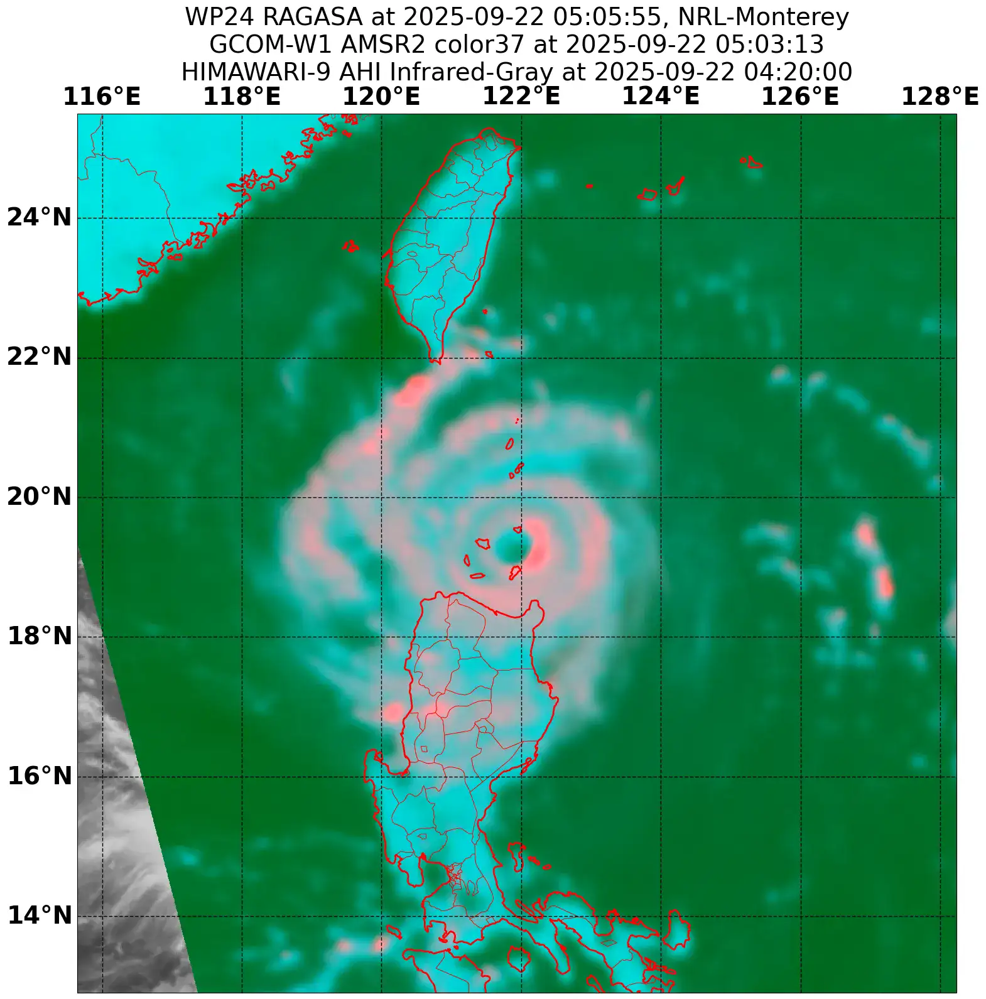 | 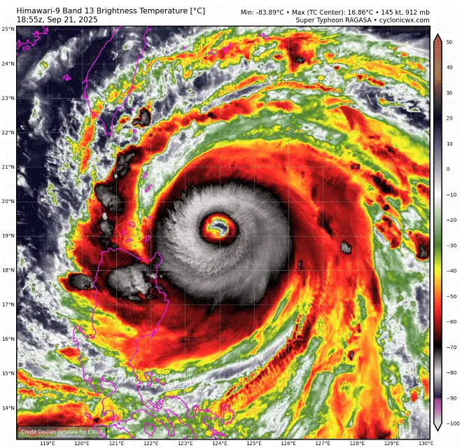 |  |
| -------------------------------------------------------------------------------------------------------------------- | ------------------------------------------------------------------------------------- | ---------------------------------------------------------------------------------------- |

|  |
| ------------------------------------------------------------------------------- |

The residents of the island on which Ragasa made landfall "enjoyed" a once-in-a-lifetime view directly up into the eye of a category 5 equivalent super typhoon after the western eyewall battered their homes. A chaser's dream, a civilian's nightmare.

|  |  |
| ------------------------------------------------------------------------ | ------------------------------------------------------------------------- |

#### Third Eyewall Replacement Cycle and Landfall

Soon after Ragasa's first landfall on the Babuyan islands, the eyewall replacement cycle fully set in. This EWRC clearly wasn't going as smoothly as the previous one - many features that indicate weakening appeared to form in or around the typhoon's eye. 

It quickly became evident that Ragasa was not going to come out unscathed from this EWRC, and it had likely already peaked in intensity, which of course turned out to be true.

|                                                            |  |
| ----------------------------------------------------------------------------------------------------------------------------------- | ---------------------------------------------------------------------------------------------------------------------------------------------------------------- |
|  |                                             |
|                                                                                                                                     |                                                                                                                                                                  |

This EWRC managed to wrap up quite quickly, taking about 10 hours to finish, completing around 15z on the 22nd of September. Ragasa began improving its convective structure, the eye warmed once more and CDO cooled, which let the storm climb up slightly in Dvorak analysis, all the way up to T6.6. Still though, the eye remained much more disorganized than prior to the EWRC - Ragasa was not coming back to its powerful category 5 status.

However, just to really hammer in the point that this system loved EWRCs, soon after this one finished, another cycle was about to begin; the third one. We could tell this was going to occur thanks to a handy microwave pass around 20z, which gave us insight into the storm's core, which did indeed exhibit a partial concentric banding feature.

|  |   |
| ---------------------------------------------------------------------------------------------------------- | -------------------------------------------------------------------------------------------- |

The EWRC which began late on the 22nd would last all the way up until its third and final landfall, as the inner eyewall of Ragasa proved to be quite resilient. 

In the meantime, radar images from the Chinese mainland gave us a real time look at the dynamics of the process. A large moat had developed between the inner and outer eyewalls, indicating that the inner core's fate was sealed, however, as said, it would maintain itself in some shape until the storm's death.

The CDO smoothed out and began to warm, as well as expanding drastically in size, especially to the north. A moat also appeared on visible satellite imagery - Ragasa was, simply put, stuck in EWRC purgatory.

|  |  |
| ---------------------------------------------------------------------------------------------------------------------- | ------------------------------------------------------------------------------------------------------------------- |
|                                        |                  |
|                                                                                                                        |                                                                                                                     |

Around mid day on the 23rd of September, the moat around Ragasa became highly visible in all types of satellite imagery. The typhoon, even while weakening, was showing off unusual and beautiful phenomena - once again proving how unique this storm was.

An exceptional microwave pass was captured by METOP-C at mid day of the 23rd, showed a perfectly separated inner eyewall - an extraordinarily clear view of an EWRC from satellite.

|  |  |  |
| ------------------------------------------------------------------------------- | ------------------------------------------------------------------------------------------------------------------------- | ------------------------------------------------------------------------------------------------------- |

Ragasa was now nearing its final landfall, as well as quickly feeling the worsening environmental factors; on top of the EWRC, shear had increased whilst SSTs decreased, dooming the storm to a slow death - overall, a great outcome, considering the storm was nearing landfall in a populated area.

The sun has now risen late on the 23rd (Zulu time), showing that the inner eye of the typhoon was still maintaining well, only being cirrus filled.

|  |                                                                                                              |
| ------------------------------------------------------------------------------------------------ | ---------------------------------------------------------------------------------------------------------------------------------------------------------------------------- |
|               |  |
|                                                                                                  |                                                                                                                                                                              |

Ragasa made landfall on the rocky islands of China around 7z on the 24th of September, as a much weaker and somewhat disorganized storm. Non the less, due to its massive size, as well as prior strength the typhoon impacted the coast with deadly storm surge and torrential rainfall. 

|  |  |
| ----------------------------------------------------------------------------------------------------- | -------------------------------------------------------------------------------------------- |

A very notable thing that Ragasa managed to do happened during its first landfall at peak intensity, during which the storm devastated one of the Babuyan islands, with satellite imagery revealing that almost all of the vegetation on the island was obliterated. 

Tropical vegetation evolved with typhoons, and thus is much more resilient to high winds, considering which Ragasa's obliteration of this island's flora proves how extremely intense it was. Other storms which managed to pull this off in recent years were Chido (2024, C4, SWIO), Irma (2017, C5, NATL) and Goni (2020, C5, WPAC)

|  |
| ----------------------------------------------------------------------------------------------------------------- |

No gallery section this time, as I used up all the data I had saved for the article itself! Hope you enjoyed!

