Bualoi formed on the back (east) side of a large monsoonal gyre/trough, which earlier in the month consolidated cyclones Mitag (TS) and Ragasa (C5). Bualoi struck quite the balance between the powerful 910mb monster Ragasa and weak, disorganized Mitag. 

Soon after becoming an invest, the vortex began drifting westward towards the Philippines. Models originally expected it to rapidly intensify before coming ashore, however this did not pan out, and the storm became a CCC (Central cold convection) "blob", a disorganized tower of convection without much structure. 

| 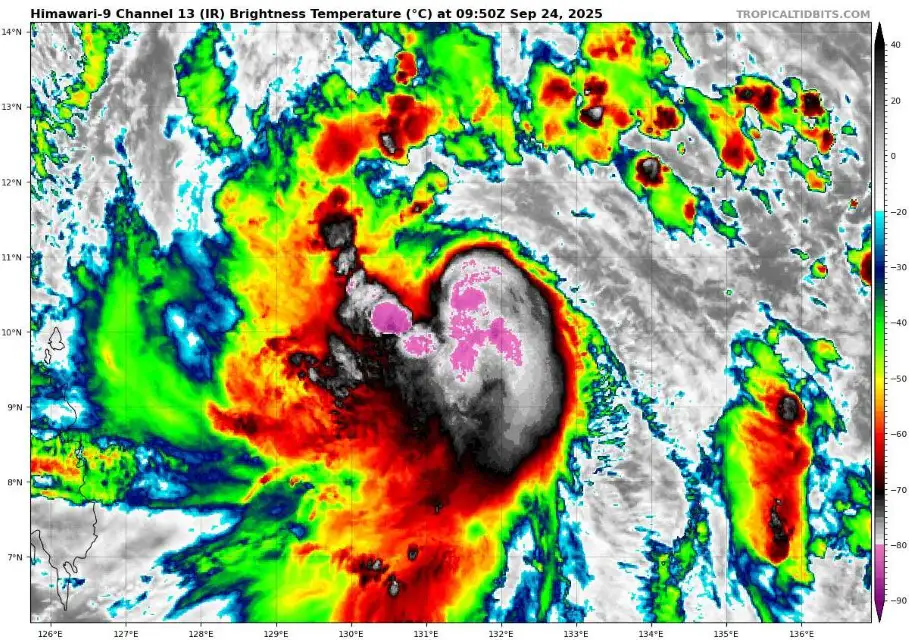 | 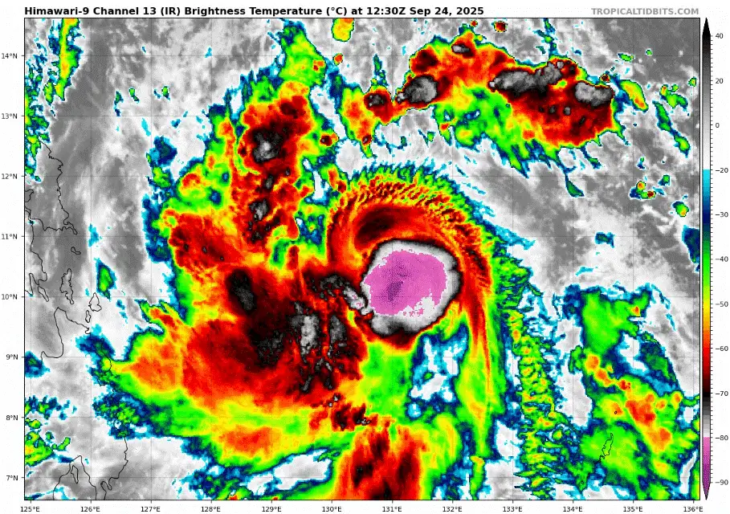 |
| -------------------------------------------------------------------------- | --------------------------------------------------------------------------------- |

Due to the extremely anomalous oceanic heat content, as well as sea surface temperatures beneath, the convection in Bualoi's CCC was extremely tall and cold, being as cold as -98.5C at some points, while typical TC cloud top temperatures hover around 70-80C.

| 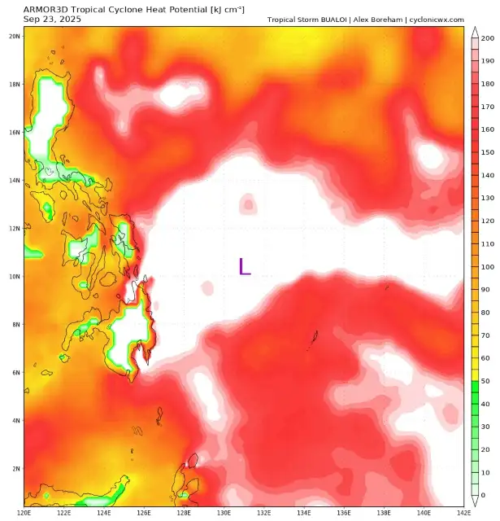 | 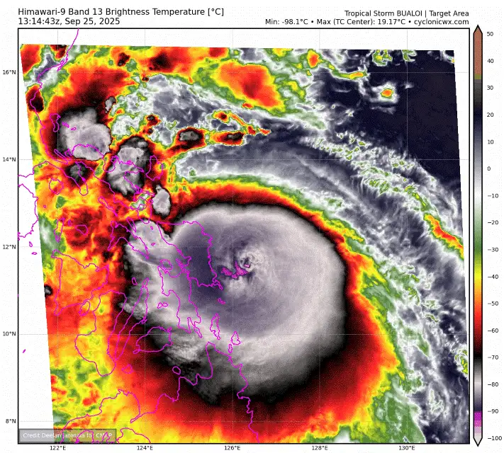 |
| -------------------------------------------------------------------------- | --------------------------------------------------------------------------------- |

After making an uneventful landfall in the Philippine island chain, Bualoi set its sights on Vietnam. During this time there was quite a bit of uncertainty as to just how strong it would get before making landfall, with forecasts ranging from 70 to 95 knots.

The storm itself had been designated a typhoon soon after crossing into the South China Sea, and was now showing marginal signs of organization. A microwave pass around midnight of the 26th/27th of September showed some weak curved banding in the mid levels of the cyclone, indicating that some consolidation of a mid level core began.

| 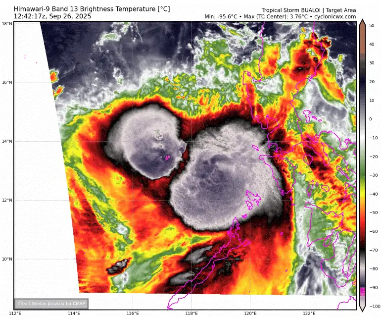 | 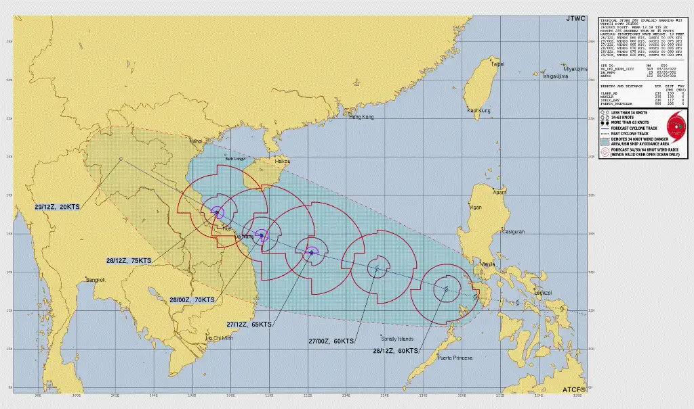                                    |
| ----------------------------------------------------------------------------------------- | -------------------------------------------------------------------------------------------------------------------- |
| 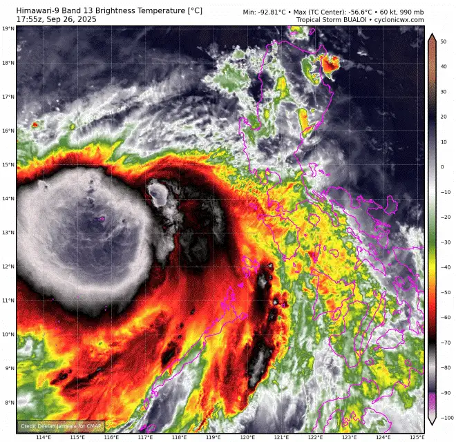                     | 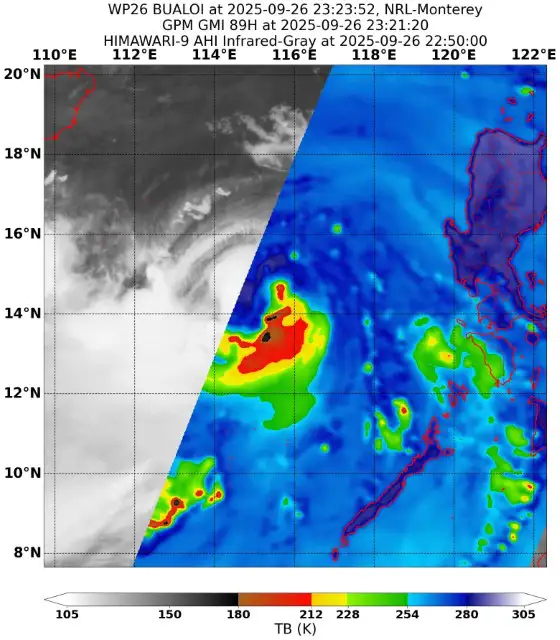 |
|                                                                                           |                                                                                                                      |

Not much changed for a while - Bualoi just looked sloppy on satellite whilst slowly drifting westward, however a microwave pass from mid day on the 27th showed that the storm had indeed formed a pretty decent core. This would allow the typhoon to strengthen once wind shear lessened.

The storm was also looking better on satellite imagery. Rotational movement became more apparent as bursts began to curve into the storm's core, instead of being stationary above it.

| 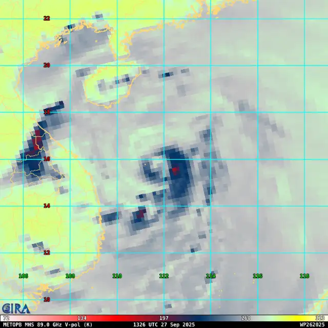 | 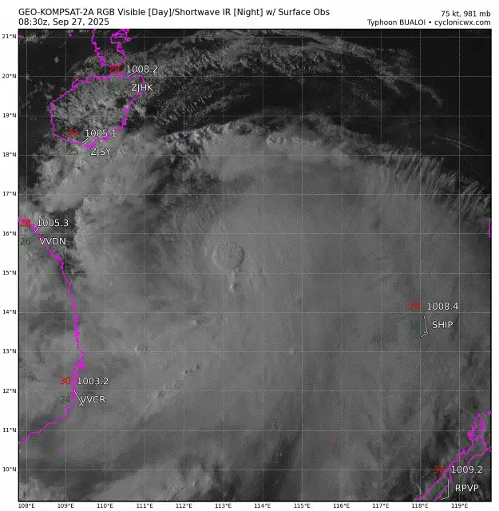 |
| ------------------------------------------------------------------------------------------ | -------------------------------------------------------------------------------------------------------------------- |

The organization trend did not last long as the typhoon hiccupped once more, however soon this would change as landfall approached and shear lessened.

As Bualoi was nearing the Vietnamese coast on the 28th, a singular convective burst managed to fully wrap around and begin forming a proper core. Soon enough, a nascent eye appeared on satellite imagery as radar showed a decently consolidated eyewall.

| 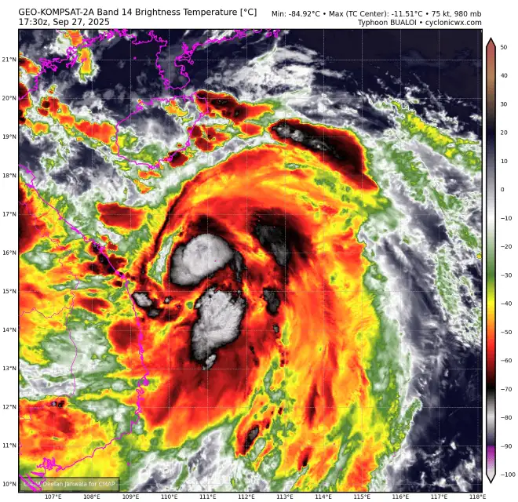           | 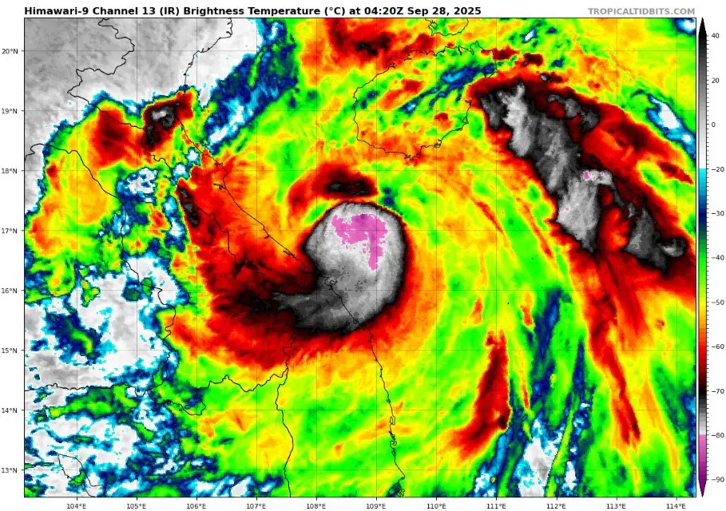 |
| ------------------------------------------------------------------------------------------ | ----------------------------------------------------------------------------------------------------- |
| 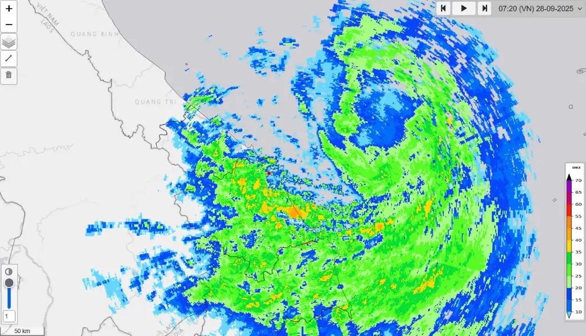 | 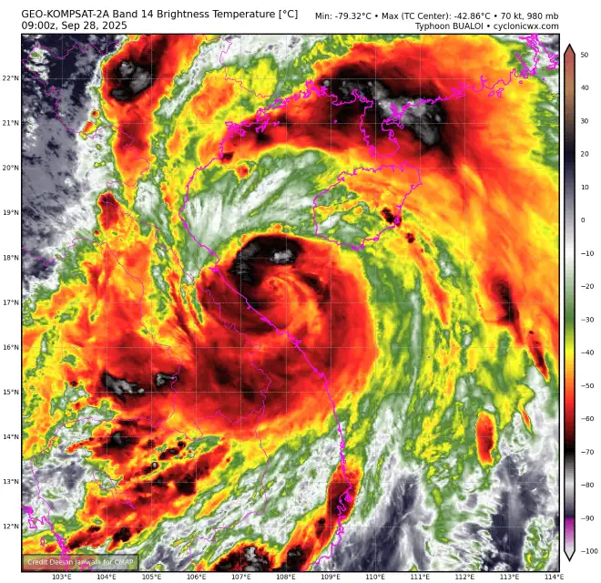                     |

Soon after the nascent eye appeared, new convective bursts fired around it, leading to increased subsidence in the center and leading to partial clearing. This occurred right as the storm was heading for landfall - a bad sign for the area, which is especially surge prone due to lowlands on the coast, as well as a river delta just south of the landfall point.

| 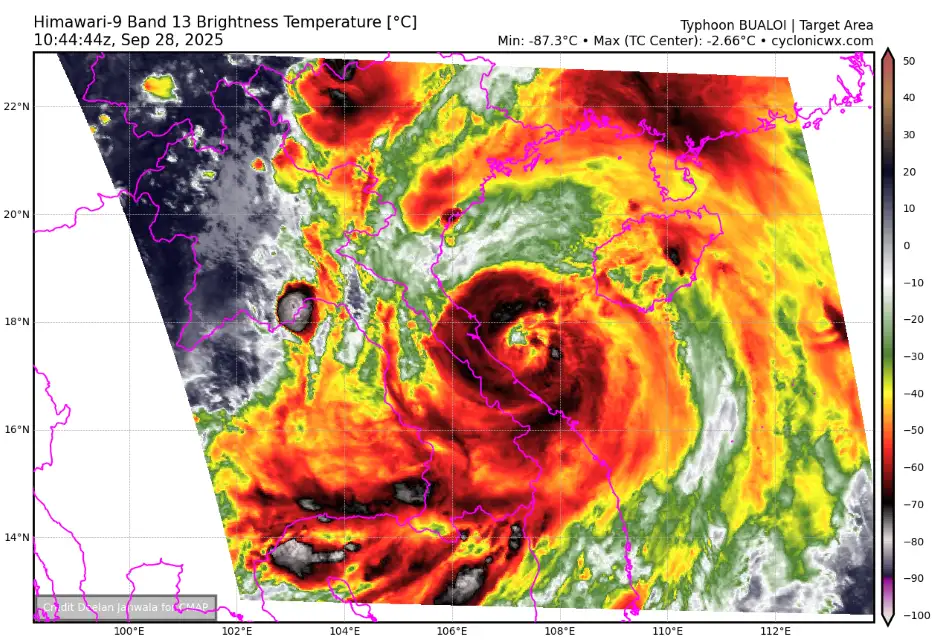 | 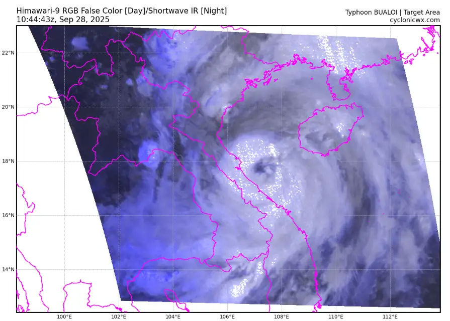 | 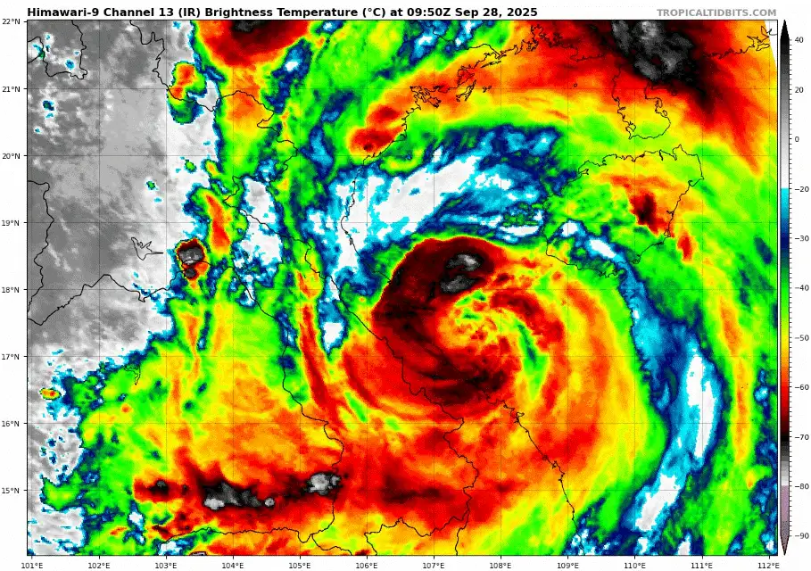 |
| ------------------------------------------------------------------------ | ----------------------------------------------------------------------------------- | ---------------------------------------------------------------------------------------------- |

Bualoi made landfall around 15:10z on September 28th as a disorganized C1-C2 storm, with a partially clear eye. Despite being meteorologically unamusing and somewhat bland, the storm caused immense human suffering, becoming the 3rd ever costliest storm in Vietnam, as well as leading to the deaths of nearly 100 people.

Along the horrific human cost the storm brought were tornadoes - an extremely rare phenomenon in Vietnam due to mountainous terrain and lack of synoptic setups for supercellular storms. One of the tornadoes which touched down reached EF2 intensity - the strongest in the country's history.

| 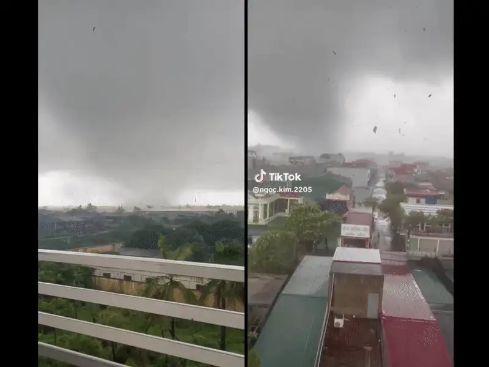 |
| -------------------------------------------------------------------------------------------- |

Bualoi dissipated rapidly once inland on the 30th of September. 

Worth noting are the similarities between typhoon Kajiki and Bualoi:

- Occurred just one month apart
- Both category 2 equivalent
- Both had somewhat clear eyes
- The typhoons were larger than average (more surge and rain)
- Heavy human and economic toll

All in all, these were strikingly similar systems, also sadly reflected in the human toll they both brought.

No gallery section today as I didn't archive as much data for this storm - sorry!
