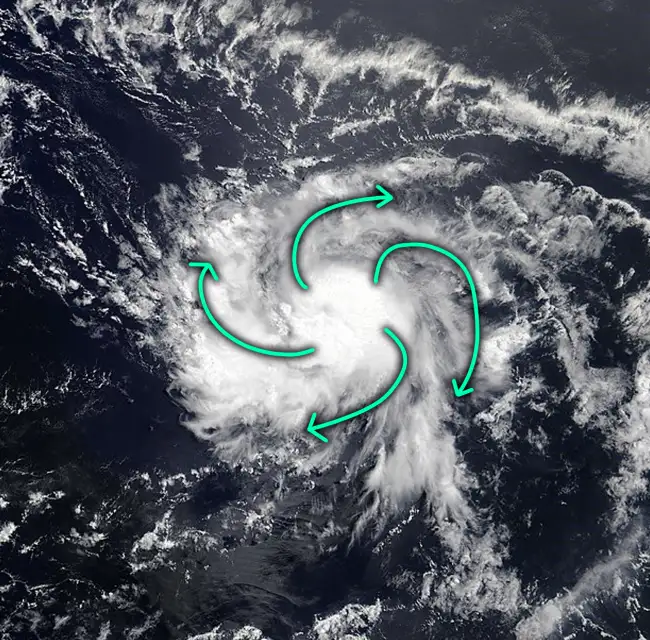

# Glossary

> ## Table of Contents
> - [Tropical Cyclones](#tropical-cyclones)
>   - [Tier 0](#tier-0)
>   - [Tier 1](#tier-1)
>   - [Tier 2](#tier-2)
>   - [Tier 3](#tier-3)
>   - [Tier 4](#tier-4)

## Tropical Cyclones 
## Tier 0 
## Tier 1 
## Tier 2 
## Tier 3 

#### ULAC - **U**pper **L**evel **A**nti **C**yclone

ULACs are high pressure areas high in the atmosphere that rotate anticyclonically. They enhance outflow for storms and are one of the steering/shearing features for storms. Outflow from a storm is enhanced when an ULAC is positioned on top of a storm, and it shears storms when it is positioned nearby.

  

Attached below is an example of an ULAC affecting a TC on a computer model graphic in:

1. Negative manner (shear)

2. Positive manner (outflow enhancing)

|  |  |
| ------------------------------------------------------- | ------------------------------------------------------- |

#### Westerly wind burst

  

WWBs (Westerly wind bursts) are phenomena that occur around the equator. They form most often during El Nino years and show as a simultaneous increase in 500mb and 850mb wind at the equator directed west to east, which then in turn causes an increase in vorticity south and north of it. These events can lead to the formation of TCs, on rare occasions dual TCs on both hemispheres.

  

Attached below is an example of dual TCs resulting from a WWB (Mocha and Fabien 2023) with the area where the WWB occurred marked with the arrow. The second image shows a world wide hollomover model image, with the enhancement of zonal flow marked in the circle around September 15th.

|  |  |
| -------------------------------------------- | ------------------------------------------------- |
#### Microwave imagery

Microwave imagery, also known as "MW" or "Passes" (stemming from satellite passes) are a crucial tool in TC forecasting. MW allows us to see deep into the structure of the storm and make assumptions about its intensity, structure and future. It works based on measuring the amount of reflected microwaves, thus assuming temperature and density of water droplets in a storm. MW has three channels we use the most:

- 89H: Used for internal structure analysis of the whole storm, shows us what the eyewall and rain bands are like

- color89H: Different color scale for 89H that better accents mid level core features

- Color37H: These passes strictly focus on the low level of a storm, allowing us to see its core structure and eyewall similar to a radar image

  

Attached below are 3 example images of typhoon Man-Yi (2024) in each of the wavelengths described above using the AMSR2 instrument

|  |  |  |
| ------------------------- | ------------------------------------------------ | ------------------------- |

#### Storm band

A large area of storms disjointed from the center of the storm that temporarily inhibits development. These are usually indicative of a young storm that formed not long ago, and the bands will keep it from intensifying due to localized shear from the band's outflow. The band usually diminishes within 12-24hrs, which often signals shear lessening, and intensification ensues, assuming other conditions for intensification are met.

  

Attached below is an image of tropical storm Kristy (2024) exhibiting a storm band to the west of its center

#### Gravity waves

Gravity waves are a physical phenomena that form in bodies of fluid or gas. In tropical cyclones, they most often show up in large convective bursts, radiating away from bursts, as well as in developed stable CDOs. They work similar to waves in the water - a large disturbance causes a waving motion in the troposphere, which depending on its source can appear in a myriad of ways. Most common gravity wave sightings look as such:

- Ripples in the upper levels of the CDO after a large, persistent burst.

- Large singular waves emanating away from the origin point of a very large convective burst.

- Rounds of waves propagating away from the eye in strong, well developed cyclones.

Gravity waves in a tropical cyclone are a sign of extreme upward movements in the air which hit the tropopause and began spreading outward, and due to its positive buoyancy at the start began moving in a waving motion.

Attached below are examples of the three most common ways in which gravity waves appear in cyclones.

|  |  |  |
| ---------------------------------------------------------------------------------------------------------------- | ---------------------------------------------------------------------------------------------------------------------------------------- | ------------------------------------------------------------------------------------------------------------------------------------- |

#### BOE - Brown Ocean Effect

Usually, storms weaken after landfall. However, in rare cases where the soil is extremely damp/moist, such as in marshlands or plateaus following large amounts of rainfall (such as from the outer bands of a large cyclone), latent heat releases from more rapidly warming ground compared to water, which in turn feeds the storm. This can cause maintenance, or in extreme cases strengthening of a cyclone post landfall.

  

Attached below is an extreme case of BOE, with cyclone Kelvin (2018) strengthening and clearing an eye deep inland in the dry terrain of Australia. Note the large size of the storm producing rain well ahead of the CDO - one of the causes of BOE

#### Mesovoritices

A mesovortex is small sub vortex on the inner edge of the eyewall. They are fairly common in strong storms, and their evolution is crucial to the development of eyewalls and EWRCs. They often cause the radar image of an eyewall to become polygonal, with the number of edges depending on the strength and number of mesovorticies. Mesovoritices form due a rapid increase in vorticity in the eyewall, and once they are reabsorbed they can cause rapid strengthening of the storm, as well as often leading to an EWRC due to the large increase of zonal vorticity in the vicinity of the eye. They are sometimes evident on visible satellite imagery, as well as infrared in rare cases.

  

Attached below is a satellite video showing mesovorticies rapidly rotating in the eye of Typhoon Ampil, as well as satellite imagery showing the mesovortex filled eye of Cyclone Chido

  

|  |  |  |
| --------------------------------------------------------------- | ----------------------------------------------------------------- | ------------------------------------------------------------------------------------------------------------------------------------- |

#### Fujiwhara

The fujiwhara effect is a rare phenomena that occurs only when two storms are within 400km or less of each other. If that criteria is met, the storms will start to influence one another and eventually orbit around a joint center located in between the two storms. Sometimes, the storms might become separate after a period of fujiwhara, in rare cases they might merge, or, most often, the weaker storm dissipates/gets absorbed by the larger one.

  

Attached below is an example of cyclone Seroja undergoing a fujiwhara interaction with cyclone Odette (2021). The video is sped up multiple times.

#### Eyewall lightning

Eyewall lightning is simply the process of lightning occurring in the eyewall of a storm. A large increase in lightning activity is most often correlated with a rapid intensification or rapid weakening period. It is still unknown how these processes aid in lightning production.

  

Attached below is a GIF showing the extreme eyewall lightning in Hurricane Milton (2024)

#### Eyewall hail

In extreme cases (strong category 5 storms), cyclones can exhibit hail in their eyewalls. This forms due to extremely rapid upward motion in a storm, allowing for water droplets to freeze around one another, despite the tropical nature of the storm, which usually prohibits hail formation as the core is unusually warm.

  

Attached below is an example of a Hurricane Hunter aircraft note about hail in the eyewall of Hurricane Milton (2024)

#### Outflow channels

Every tropical cyclone has an outflow pattern, which simply describes how and where the cirrus outflow of a storm leaves the CDO/Eye. Most common outflow patterns include:

- Radial

- Dual channel

- Cirrus shield

- Jet stream interaction

  

Here they are desctribed below:

- Radial: This is the pattern most common with weaker, bursting style storms, and describes cirrus leaving the storm in a uniform, circular manner in an environment without a centralized outflow feature, such as a jet or ULAC,

- Dual channel: This pattern is the most common with decently strong storms, it describes cirrus coming out from two localized channels on opposite sides of the storm in an anticyclonic fashion. It most often occurs when an ULAC is situated nearby a storm.

- Anticyclonic cirrus shield: An ULAC positioned above a storm can lead way to the formation of a so called cirrus shield, which expands radially away from the storm. This cirrus deck rotates anticyclonically above the storm.

- Jet stream interaction: A pattern like such occurs during an upper level jet interaction, causing the outflow to be congregated towards one direction in a mass flux manner. These outflow channels often cause the cirrus to get blown away thousands of kilometers away from the storm.

  

Attached below are examples of annotated outflow channels for each common pattern in order. (Radial, dual, cirrus, jet) Source of all images: NOAA

|  |          |
| --------------------------------------------------------------- | --------------------------------------------------------------- |
|   |  |

### Tier 4

#### Feeding Band/Feeder Band
A feeding band is a rare type of EWRC feature in which the outer eyewall contains a feeding band that causes energy to flow to the decaying inner eyewall, allowing it to maintain for longer. This feature is usually only evident on radar as it is microscale, and dissipates fairly quickly, most times persisting for a few hours at max.

Attached below is an example of Cyclone Zelia 2025 and Hurricane Ida 2021 (fig.2) exhibiting a feeding band.

|                                                                                        |                                                                                               |
| -------------------------------------------------------------------------------------- | --------------------------------------------------------------------------------------------- |
|  |  |

#### Stable cirrus band
This phenomenon occurs (as far as we're aware - might be incorrect, as there are no studies on this) due to the effects of shear on strong pulses of convection in storms. If shear onset occurs right after a large convective pulse the resulting upward motion is forced sideways, producing gravity waves which show themselves in the upper levels of the troposphere as cirrus clouds.

Attached below are two examples of the cirrus band from 2024, with typhoon Krathon and cyclone Chido respectively.

|                                                                                                   |                                                                                                 |
| ------------------------------------------------------------------------------------------------- | ----------------------------------------------------------------------------------------------- |
|  |  |
#### Cirrus vortex tubes
Cirrus vortex tubes are a very rare phenomena that occur in the upper levels of the eyes of some strong (Category 4+) storms. On rare occasions after a strong VHT some cirrus may become trapped in the inner eye of a storm, and due to the extreme vorticity present form tube(s) of cirrus that slowly dissipate over the course of a few hours. These features usually only occur after a period of rapid intensification and signal extreme vorticity being present in the environment. 

Attached below is an example of category 5 Hurricane Kristy (2024) displaying cirrus vortex tubes

#### Diurnal cycle
The diurnal cycle is an extremely important process occurring in every TC. They affect different strength TCs differently, from weak bursts to massive size expansions. This is due to the latent heat release from seawater. The diurnal cycle occurs on a 24hr time loop, with the diurnal maximum (best conditions) positioned temporally near sunset to early night, and worst conditions occurring near noon.

Attached below is a graph from Dunion et. al. 2014 showing the change of solar radiation and energy emission being largely dependent on the diurnal cycle.

#### Diurnal Pulse
A diurnal pulse is a phenomenon closely related to diurnal cycles - these occur roughly around sunset in any given TCs and are characterized by a large expansion of the wind field and cloud cover of a storm. They occur due to the change in solar radiation, as well as differentiating latent heat release from the water below based on the time of day.

Attached below is a graph showing a diurnal pulse in Hurricane Sam (2021) showing a large expansion of the cloud cover, as evident in differential imagery in fig. D

