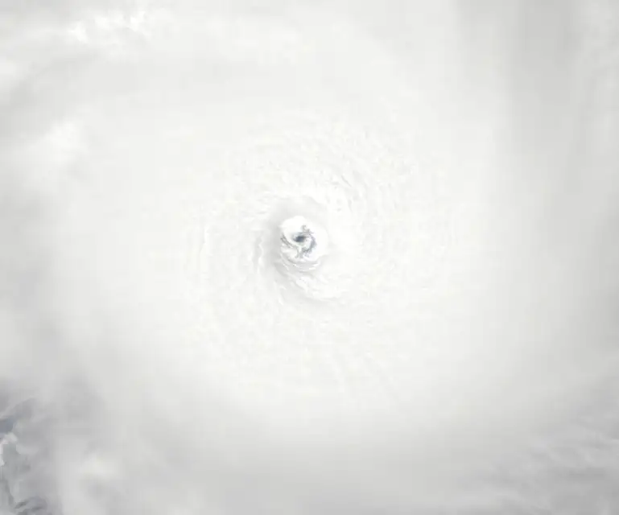
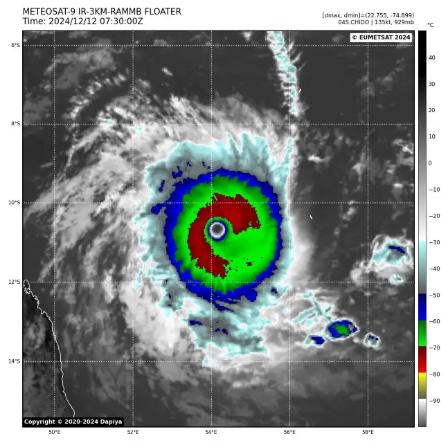
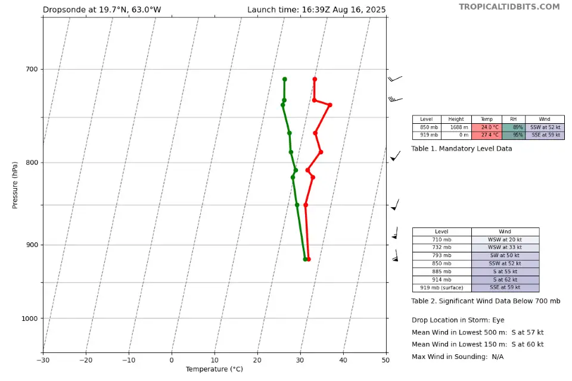
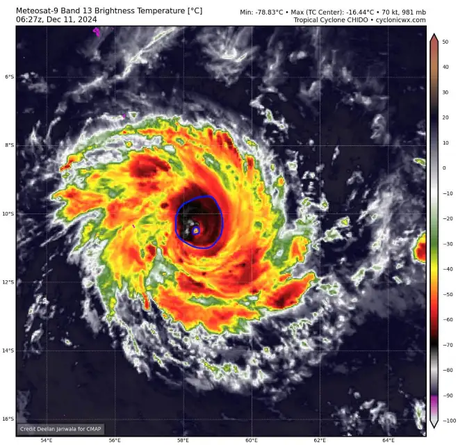
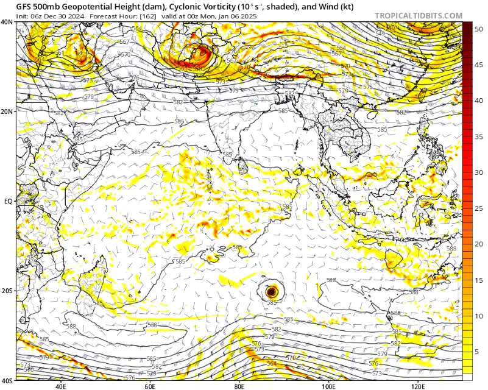
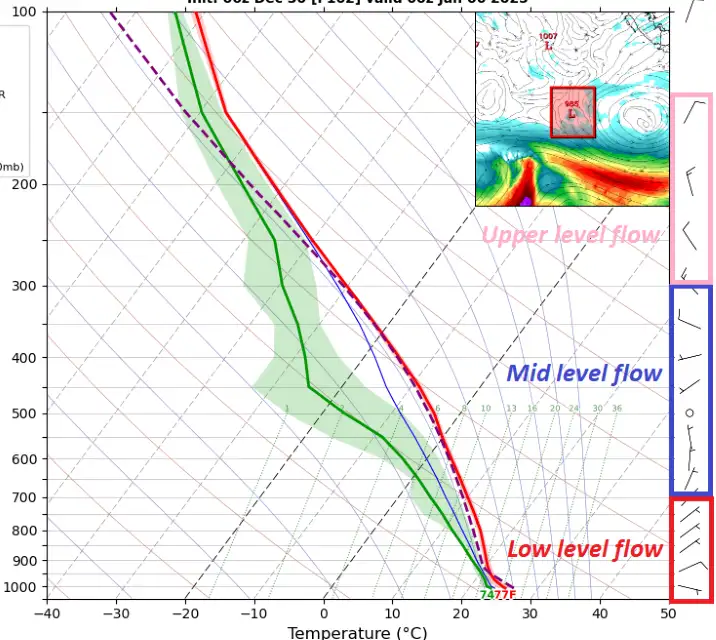

# Glossary

> ## Table of Contents 
> 
> - Tropical Cyclones 
>   - [Introduction](#introduction) 
>   - [Terminology](#terminology)
>   - [Basic Concepts](#basic-concepts) 
>   - [In-depth](#in-depth) 
>   - [Advanced](#advanced) 
> # &nbsp; 

# Tropical Cyclones 

## Introduction

**In this introductory section you can learn the (over)simplified basics of TCs, where they form and what they need to exist and thrive. Feel free to skip this if you know the extreme basics!**

#### What is a cyclone?
A TC (tropical cyclone) is a general term for large low-pressure systems that bring strong winds, rain, etc. They are characterized by:
- Development over water temperatures above 26°C (usually, with exceptions)
- A central low-pressure point with eye-like characteristics
- Strong winds around the eye, relatively calm within the eye
- Deep, moist convection
- Lack of connection with atmospheric fronts (!!! Very important)

#### Where do they form?
TCs form in regions (called basins) that exist in almost every ocean in the world. The main cyclone basins are:
- Western Pacific
- Eastern Pacific
- Northern Atlantic
- Southern Indian Ocean

Other cyclone basins with less average activity in any given season are:
- North Indian Ocean
- South Pacific

Basins with very rare (<1 per year) but possible TC activity are:
- Mediterranean Sea
- South Atlantic
#### What does a TC need to form?
- Water, which has sea surface temperatures above 26°C and a minimum depth of 200m (you can check this using SST maps - sea surface temperature).
- Low shear, as high shear values cause different TC levels to not overlap, making the large-scale convection process less effective.
- A large amount of moisture. TCs cannot develop in dry air masses, because cyclonic convection is a process in which air moves upwards en-masse, while dry air descends. This, in turn weaks the TC. On top of that, heat is not released from dry air as effectively, which further degrades the process of convection.
- An atmospheric disturbance that can develop into a TC. For example, large areas of showers or the equatorial zone of thunderstorms.
- A suitable distance from the equator. TCs require a balance of the Coriolis force to form, which means they cannot form very close (5 degrees or less) or very far (45-55 degrees or more) from the equator.
#### What are the core elements of TCs?

- The eye. This is the center of a low-pressure system, which, like any low-pressure system (tornado, mesocyclone, non-tropical cyclone), has a calm center where there is no wind. Eyes usually appear from around Category 2. Strong TCs have calm, warm, and dry eyes. The drier and warmer the TC, the stronger the system The size of the eye also matters, as smaller eyes usually indicate stronger winds, similar to the example of a ballerina who brings her arms together and spins faster. The more symmetrical and smooth the eye, the stronger the updrafts and downdrafts within the cyclone.
- The eyewall is the zone of the strongest winds in a TC, located around the eye. This is where we will record the strongest winds, precipitation, and possible lightning or even hail. You can imagine a TC as a large chimney – the eyewall is the smoke rising through the chimney, and this is where most of the TC's energy is processed.
- Rain bands. In addition to the eye and eyewall, there are also rain bands surrounding the eye. These have locally stronger winds than the areas with little to no rain.
#### How do we classify TCs?

There are several TC strength scales, but the most commonly used is the SSHWS (Saffir Simpson Hurricane Wind Scale). It is divided into five categories, and wind speed is measured in knots. 
A TCs wind has to sustain itself for a minute straight for it to be taken as a solid piece of data. If a cyclone has winds of 100 knots for 1 minute straight with stronger gusts interspersed within, the TCs wind is rated as 100 knots, despite the gusts being stronger.
The SSHWS goes as such:
- Tropical depression (<33kt)
- Tropical storm (35kt-64kt)
- Category 1 (65kt-82kt)
- Category 2 (83kt-95kt)
- Category 3 (96kt-112kt)
- Category 4 (113kt-136kt)
- Category 5 (136+kt)

Other scales exist, but this one is the most often used. Aside from TC strength, cyclones have different names depending on the region where they form. Everywhere they start with Tropical Storm, after which they are called cyclones, typhoons or hurricanes.
## Terminology
#### Satellites
One of the main tools we use for tracking TCs are satellites - we have an array of them in geostationary orbit covering every part of the globe. 

GEOSTATIONARY SATELLITES:
- GOES 16 and 18: they cover the area from the Central Pacific to western Europe, and are the main satellites we use in tracking hurricanes in the Central and Eastern Pacific, North Atlantic, as well as rare South Pacific and South Atlantic cyclones.
- HIMAWARI-8: This is a Japanese satellite used to track storms in the Western Pacific as well as parts of the Indian and South-East Pacific basins.
- METEOSAT-11: A very low resolution imagery satellite that covers the Indian ocean and Europe. It has now been replaced by MTG (Meteosat-12), however it is still operational in orbit.
- MTG/METEOSAT-12: A new generation European satellite used to cover Africa, Europe and the Indian ocean. It also covers parts of the Northern Atlantic.

NON GEOSTATIONARY INSTRUMENTS:
- AMSR2: A satellite that provides microwave passes in high resolution.
- GMI: Same as AMSR2 
- SSMI: Similar to AMSR2 and GMI, however covers a larger area and has lower resolution imagery.
- SAR: A fairly new Canadian satellite that provides extremely high resolution passes that show the wind field and wind speed of a cyclone. 
- MODIS/TERRA: Satellites that circle the globe and provide once-a-day high resolution images of the surface

Attached below are example images from GOES, MTG, AMSR2, SSMI, SAR and MODIS, in order.

|  |                |        |
| ------------------------------------------------ | ------------------------------------------------------------- | ---------------------------------------------------------- |
|              |  |  |
|                                                  |                                                               |                                                            |
#### Basin abbreviations 
- **NATL** - North Atlantic 
- **SATL** - South Atlantic 
- **MED** - Mediterranean 
- **NIO** - North Indian Ocean 
- **SWIO** - South West Indian Ocean 
- **AUS** - Australian region 
- **WPAC** - Western Pacific 
- **SPAC** - Southern Pacific 
- **CPAC** - Central Pacific 
- **EPAC** - Eastern Pacific

#### RSMC - Regional specialized meteorological center
These organizations are responsible for issuing warnings and "cones" - track forecasts for TCs with a margin of error. There are currently 11 RSMCs in the world, shown in the map below. Missing from the map is JTWC and PASAGA.

JTWC: Joint typhoon warning center. The JTWC is a US navy led project that forecasts typhoons and cyclones in the Indian and pacific ocean using the Saffir Simpson wind scale (category 1-5)
PASAGA: Philippine Atmospheric, Geophysical and Astronomical Services Administration. Local RSMC that gives second names on top of the JMA RSMCs names. Operates in and around the Philippine islands.

|  |
| ------------------------------------- |
#### Landfall
Landfall is simply the process of a cyclone coming ashore. Unless the brown ocean effect is in place, storms usually rapidly weaken or completely dissipate. Landfall is more damaging to storms if the terrain is mountainous. 

Attached below is a satellite animation showing landfall of Typhoon Man-Yi, and its subsequent rapid weakening.

|  |
| --------------------------------------------------------- |
#### Eyewall 
The area of strongest wind, rain, surge and pressure gradient in a tropical cyclone. They surround the eyes of storms, providing a stark contrast between the calm eye and ferocious eyewall.

Attached below is a radar image of the extreme eyewall of hurricane Milton (2024), as well as a weaker storm's eyewall (Hurricane Francine 2024). Note the shape and strength difference between the storms - eyewalls come in all shapes, sizes and strengths. 

|  |  |
| ------------------------------------------------------------------- | ----------------------------------------------- |
#### Eye
Localized area of subsidence in the center of a tropical cyclone. They come in all shapes and sizes, raging from tiny pinholes (<10nm) to gigantic eyes (200nm+). They form due to extreme subsidence caused by the deep convection in the eyewall, which surrounds the eye. The minimal central pressure of a TC is found in the eye, as well as the lowest wind speeds, with strong TCs having completely clear and calm eyes.

Attached below are examples of 3 eyes in different size categories: the pinhole of hurricane Milton (2024), average sized eye of Cyclone Chido (2024) and enormous eye of Typhoon Winnie (1997) 

|  |  |  |
| -------------------------- | ------------------------------------------ | -------------------------- |
#### Tropical waves
Tropical waves are troughs (not closed circulations) of low pressure oriented north to south which make presence during late spring to early fall, which most often move westward.  They contain disorganized convective activity, and are highly sensitive to their surrounding environment. TWs make approximately 60% of tropical cyclone formation cases in the North Atlantic basin, and actively contribute to tropical cyclone genesis in the Eastern Pacific as they cross Central America. Tropical waves can be dangerous by themselves, especially if slow moving, such as the case with the tropical wave which was the precursor to Hurricane Erin (2025), which lead to the death of 9 people in the Cabo Verde islands.

Attached below is an example of an active MDR with 3 healthy tropical waves, as well as a synoptic map showing tropical waves.

|  |  |
| ------------------------------------------------------ | ----------------------------------------------------- |
#### AEW - African Easterly Wave

AEWs are tropical waves which originate from the northern half of the African continent (around 5-20 degrees north).

Attached below is a diagram showing an originating AEW moving through the African continent. 

|  |
| ---------------------------------------- |

#### IR - infrared imagery 
The most commonly used type of satellite imagery we use to analyze tropical cyclones. IR comes in a variety of modes and colour tables, but in gist it allows us to see how deep (tall - the colder the taller) the convection in a storm is. Other things IR is used for:
- Analysis of VHTs/CBs
- Structure analysis of the CDO
- Analysis of the structure of the eye itself 
- Gauging the track of a storm where radar data is not available 
- Expansion of a storm upshear
- Determining a storm's likely intensity using the DVORAK method (ADT)
- Looking really, really awesome

Attached below is an example image of IR imagery in different colour tables of Cyclone Chido (2024) (OTT, DVORAK, RAMMB) All images are sourced from dapiya.top

|  |  |  |
| ------------------------ | ------------------------- | ------------------------- |

#### Anticyclones

Anticyclones are vast areas of high pressure that guide TCs along their edges. They are most often co-located with large ridges, however upper level anticyclones exist, and will be talked about farther in the glossary. Anticyclones, aside steering storms impact shear on them if the storm is positioned too close to one. They, alongside with wide troughs are the main steering features which determine a TCs track.

Attached below is an example of a vast anticyclone in 200mb flow and 500mb geopotential height anomaly maps.

|  |  |
| ------------------------------------------------------------------------ | ------------------------------------------------------------------------------ |

#### Convective burst
Not to be confused with Cb, cumulonimbus.
Convective bursts are simply large bursts of cold, deep convection firing near the center of a storm. They indicate that a storm is not yet properly organized, however it is attempting to strengthen. In weakening storms they indicate that shear is inhibiting the formation of more organized convection. Most storms begin their life by firing multiple CBs before intensifying enough as to where they can produce VHTs.

Attached below are examples of CBs firing in multiple types of imagery from typhoon Kajiki.

|  |  |
| --------------------------------------------------------------------------------------------------- | ----------------------------------------------------------------------------------------------------------------------------------- |

#### Medicane
A Medicane is a semi-colloquial term for a tropical cyclone in the Mediterranean sea. The name is a combination of Mediterranean and hurricane. They generally form 0-2 times a year on average, and are usually weak - not surpassing the 50kt sustained 1min wind threshold. Sometimes however, they can be quite strong and damaging, even reaching category two intensity, such as Medicane Ianos (2020). They most often form from cut off upper level lows, large gyres coming off the Sahara, or as a transition from an extratropical cyclone. They usually struggle with high shear, low SSTs and copious amounts of dry air. Despite no RSMC officially monitoring them, agencies such as ESTOFEX track them in the basin whenever they occur. They are fully tropical in nature, and are similar to upper latitude NATL storms, such as Pablo 2019.

Attached below are images of Medicane Ianos (strongest medicane on record) and Medicane Daniel (the deadliest and most damaging medicane on record) Source: NASA

|  |  |
| ------------------------------- | ------------------------------- |

#### Jet stream
The jet stream is an area of massively enhanced flow that encircles the globe in the middle latitudes at ~200mb (upper level). It is the main driver of weather in the middle latitudes as diffluence in the jet stream can lead to the development of low pressure systems are the main influences on weather patterns in the mid latitudes. For tropical cyclones, the jet stream and its troughs are what guide TCs in the upper tropics, pulling them farther poleward or pushing them to the sides, with troughs and ridges. 

Attached below is an example of the jet stream undulating in late august of 2025. 

|  |
| ----------------------------------------------------------------------------------------------------------------------------------------------------- |
#### Saharan Air Layer
The SAL is an area of dry air filled with aerosols from the Saharan desert with often inhibits tropical cyclone development in the tropical north Atlantic.

Attached below is an example of an extreme Saharan dust plume in the SAL.

|  |
| ---------------------------------------------------------------------------------- |

#### Zonal flow
Zonal flow is simply flow that goes from west to east. Zonal flow is also characterised by jet streaks (areas of enhanced/stronger flow) moving through periodically. This specific kind of wind flow is used to describe a stable, sheared pattern which is in conducive to specific kinds of weather such as cyclones or strong thunderstorms.

Attached below is an example of zonal flow over Europe at 250mb (jet stream) and 500mb (mid level) Source: tropicaltidbits.com

|  |  |
| -------------------------------------- | -------------------------------------- |

#### Meridional flow
Contrary to the zonal flow described earlier, a meridional flow exhibits a highly unstable jet stream dominated by large troughs and ridges. These environments are common with a weak polar vortex in the winter, as well as spring and autumn. In tropical meteorology, troughs pull storms towards themselves as they accelerate with the flow, whilst ridges push storms away along their 500mb counterparts. Meridional flow is also the most favorable flow type for severe weather, as the troughs move unstable air masses northward where they can be sheared by non tropical cyclones/low pressure systems.

Attached below is an example of meridional flow over Europe, with a well pronounced trough and ridge. Source: tropicaltidbits.com

|  |  |
| ------------------------------------------ | ------------------------------------------ |

#### ASCAT - Advanced Scatterometer
A series of instruments which scan the ocean surface in order to determine wind velocity and direction. This data comes in handy to show and monitor the wind structure and strength of developing disturbances and nascent tropical cyclones. However, ASCAT resolution limits the instrument for stronger systems, where it becomes more helpful to determine wind field size. ASCAT data is displayed in maps with wind barbs that follow a colour scale to show a quick way to differentiate areas with varying wind speeds. 

Attached below there are 4images/ First two are two visual representations of ASCAT data, both from passes of tropical storm Hector (2024), and the remaining two are quick guides to understand wind barbs and help on reading ASCAT data more easily. Source: manati.star.nesdis.noaa.gov

|  |  |
| ---------------------------- | ---------------------------- |
|  |  |
|                              |                              |

#### Entrainment
Entrainment, or dry air entrainment is simply the process of dry air mixing with the moist core of a tropical cyclone, causing it to weaken. The storm cannot release as much energy with drier air choking it out, therefore it weakens. Dry air entrainment is easiest to notice on visible and water vapor imagery, as IR usually becomes messy when a storm chokes on dry air. In rare cases, dry air entrainment can cause the eye to form more rapidly if a pocket of air gets trapped in the core, drying the eye out faster than by traditional means. Dry air can also cause the onset of an EWRC if the inner eye becomes separated from the rest of the storm by a pocket of dry air.

Attached below is a GIF showing Hurricane Helene suffering from dry air entrainment, as well as a water vapor image. Included also is the onset of an EWRC caused by dry air in Hurricane Erin.

|  |  |  |
| ------------------------------------------------------------- | -------------------------------------------------------- | --------------------------------------------------------------- |

#### Subtropical Cyclone 
Subtropical storms are storms that exhibit characteristics of both tropical and non tropical low pressure systems. Their main attributes are:
- A wide wind field which extends farther from the storm's center
- Maximum wind measurements located farther from the center of the storm, in contrast to fully tropical cyclones in which the eyewall contains the strongest winds
- Subtropical cyclones posses windspeeds between 35-65kt, any hurricane force storm is assumed to have become fully tropical.
- Warmer cloud tops than fully tropical cyclones

Attached below is an image of a Subtropical storm in the south eastern Pacific with the second and third image showing examples of some of the traits listed above. Source: NOAA/MODIS/TERRA

|  |  |  |
| ---------------------------------- | ---------------------------------- | ---------------------------------- |
#### SAR
SAR is a Canadian satellite that circles the globe providing extremely high resolution wind and rainfall data from tropical cyclones. It has two main issues: its high resolution means that it often misses the target due to a small area it samples, as well as an underestimation bias in strong systems, similarly to ASCAT, however the second issue is minor as it only shows in storms above category 3 intensity. It allows us to see in detail the structure and wind field of a storm, as well as accurately estimate a storms intensity. 

Attached below is are some example SAR wind passes of storms in 2024. Source: NOAA star.nesdis.noaa.gov

|  |  |
| -------------------------- | -------------------------- |
|  |  |
|                            |                            |
#### RI - Rapid intensification

Rapid intensification is the process of a storm intensifying at least 35kt in 24hrs. They are characterized by large bursts of convection as well as VHTs rotating around the eye in stronger storms, especially dual VHTs on opposite sides of the eye. If a system intensifies 65kt/24h or more, the process is called explosive intensification

Attached below is an IR satellite video showing the explosive intensification of Hurricane Milton (2024)

|  |
| ---------------------------------------------------------------------------------------- |

## Basic Concepts 
#### Reconnaissance Aircraft Data - Recon
Recon data is the most important and valuable tool we have for gauging a storm's true intensity. NOAA's Hurricane Hunter aircraft flies into the center of a storm conducing passes through it's core and outer bands, deploying dropsondes and producing vortex data messages. What data can we obtain from recon?
- Very accurate measurements of the pressure inside the eye
- Accurate flight level and extrapolated surface wind data in the eyewall and outer bands (flight level winds should be reduced by ~10% to get an accurate surface level wind reading)
- Temperature and humidity inside the eye (if the eye dropsonde has wind, reduce 1mb for every 10kt reading)
- Data about the internal structure of a storm with tail-end doppler missions
- Photographs taken by the pilots, which do not provide much information, but are some of the most stunning images we can get from TCs
- Vortex data messages (VDMs) which describe the structure of the eyewall
How do we read recon data? Many websites, such as tropicaltidbits.com and cyclonicwx.com parse the raw data into more readable graphs, from which we can ascertain info about the storm.

Attached below is a plethora of recon data from Hurricane Erin 2025, which was crucial in estimating its intensity.

|                                        |                                                                                   |  |
| -------------------------------------------------------------------------------------------------------------------------------------------------------------------------------- | --------------------------------------------------------------------------------------------------------------------------------------------------------------------------------------------------------------- | ----------------------------------------------------------------------------------------------------------------------------------------------------------------------------------- |
|  |                                                           |                                                     |
|                                                       |  |                                                        |
|                                                                                                                                                                                  |                                                                                                                                                                                                                 |                                                                                                                                                                                     |

#### OHC - Oceanic Heat Content
OHC is a measure of how much latent heat is stored in the ocean at any given point. It is a measure of how much energy a storm moving over said location can access, and the higher the value of OHC the larger the potential a storm has, assuming other environmental conditions are met. Contrary to SSTs, OHC takes into account upwelling with subsurface temperatures, to see how well a storm can fare in a given environment no matter its size.

Attached below is an example of OHC data from peak hurricane season in the north Atlantic in 2025. 

|  |
| ------------------------------------------------------------------------------------------------------------------------------- |

#### Pinhole eyes
Eyes call in all sizes, however the most dreaded one is the pinhole. Characterized by a size smaller than 10 nautical miles (18.5km) they are the most dangerous eye type and often bring extreme impacts to areas they landfall in. Usually, pinholes do not last long however due to eyewall replacement cycles forming easier around the small eye, as well as small systems being less resilient to shear, allowing for miniscule changes in the environment to lead to the weakening or collapse of a pinhole eye. Despite this, pinhole eyes are usually a sign of a powerful storm. 

Attached below are examples of pinhole eyes from multiple storms. Source: NOAA/JMA

|  |  |
| ----------------------------------------------------- | ------------------------------------------------- |
|      |   |
|                                                       |                                                   |

#### Ensemble models
Ensemble models, colloquially known as spaghetti models are models that run many instances of the atmosphere at once with slight changes to show the possible range of solutions available for a storm. The most common type of ensemble we use is a spaghetti plot showcasing windspeeds at a specific time period. We currently use 3 main ensemble model groups: 
- ECMWF ensemble (EPS)
- GFS ensemble (GEFS)
- Google DeepMind (GDM-FNV3)
- Google DeepMind (GDM-GENC)

Attached below are ensemble models showcasing a forecast active period in the eastern Pacific basin. The colour of the lines indicates wind speed in an ensemble member paramertizing a cyclone a specific time. Source: weathernerds.com

|  |  |
| ------------------------------- | ------------------------------- |
|  |  |
|                                 |                                 |

#### OFB - Outflow Boundary 
Outflow boundaries usually form on the edges of cyclones, where weaker storms which form due to the large amount of rising air from the pressure gradient in and around the cyclone sometimes collapse due to dry air entrainment. When this occurs, smaller thunderstorms can form outflow boundaries - local areas of convergence which move away from their point of origin in a circular or semi-circular manner. Outflow boundaries signal dry air enveloping a storm and can be the sign of future, or ongoing weakening.

Attached below is an example of outflow boundaries originating from the center of tropical storm Tammy (2023)

|  |
| ------------------------------------------------------------------------------------------------------------ |

#### CDO - Central Dense Overcast 
The area of convection viewed from satellite located around the eye/center of the storm is called the central dense overcast. It comes in many forms - curved band, disorganized post-CB "blob", eye with surrounding bursting CDO, eye with surrounding stable and cold CDO. It, along with the eye, are the main things we analyze from satellite.

Attached below are IR satellite images showing different shapes that a CDO can take, all images come from Cyclone Chido (2024) Source of all all imagery is cyclonicwx.com

|  |  |
| -------------------------- | -------------------------- |
|  |  |
|                            |                            |

#### EWRC - **E**ye**W**all **R**eplacement **C**ycle
Strong hurricanes often undergo EWRCs. In hurricanes with a well defined eyewall, a local area of banding around the eye may form, choking out the inner eye from warm, moist air, causing it to weaken and eventually dissipate. The outer eyewall then contracts and overtakes the inner one, becoming the new eyewall. This process most often causes the maximum wind to temporarily slow down, and the wind field to expand, often causing the storm to produce higher values of storm surge. The storm may re-intensify after the EWRC concludes, although storms usually do not overtake their initial peak in intensity. The smaller the eyewall, the easier an EWRC may occur. Sometimes, EWRCs can take more than a day to complete. In some cases, EWRCs occur right after one another, causing the storm to weaken drastically.

Many factors influence how an EWRC develops, yet a few key factors stand out as main inhibitors for a complete EWRC:
- Landfall
- Dry air entrainment into the core 
- Wind shear onset as EWRC progresses 
- Other internal structure weaknesses, such as banding forming around the outer eyewall

Attached below are examples of EWRCs ongoing using MIMIC microwave imagery, of hurricane Ike (2008) and hurricane Wilma (2005) respectively. Souce: tropic.ssec.wisc.edu

|  |  |
| --------------------------- | --------------------------- |
#### Extratropical Cyclones (EXT)

Extratropical cyclones are frontal, baroclinic features that most often form due to the undulations in the jet stream. They are characterized by frontal boundaries (cold front, warm front and sometimes occluded front) being attached to the center of circulation. They bring winds sometimes up to category 2 strength if they contain a sting jet, and are one of the main drivers of weather in the middle latitudes. Most tropical cyclones end their lives by turning into an extratropical cyclone as they head poleward, being picked up by the jet stream and attaining frontal features. Storms most often massively expand their wind field, become less organized and pick up speed.

Attached below is an example of extratropical transition (Hurricane Fiona 2022). Notice how the storm rapidly expands and speeds up.

|  |
| --------------------------------------------------------------------------------------------------------- |

#### Gyres
Gyres are extensive low-level cyclonic circulations (over 2500 kilometers wide), which are usually the product from the passage of the Madden-Julian Oscillation (MJO). Characterized by a cloud band bordering the southern through eastern periphery of the vortex, they tend to be long lived (approximately ~14 days). Gyres are a common birthplace to multiple tropical cyclones from small/medium sized vortices that form within the gyre, however on some occasions the whole system can consolidate into a large TC.

Attached below is an example of an idealized gyre on a graph, as well as a satellite image marking a gyre over central America

|  |  |
| ----------------------------------------- | --------------------------------------------------- |

#### Cutoff Upper Level Low
Cutoff upper level lows or simply cutoff lows are upper level (500mb to 250mb) areas of low pressure that steer/shear storms similarly to upper level anticyclones. They form due to undulations in the jet stream at 250mb that then become "cut off" from the rest of the flow, becoming their own entity. They can also aid in tropical cyclogenesis, as the air under a cutoff low is conducive to convection and in ideal circumstances can help form a subtropical or weak tropical storm. This process is the most common cause of formation for medicanes.

Below is an example of a cutoff low on 500mb and 250mb model fields. This low has an associated low level cyclone as well. The low is located at the southern tip of Italy. Source: tropicaltidbits.com

|  |  |
| ----------------------------- | ----------------------------- |

#### VHT - Vortical Hot Tower 
VHTs are convective bursts (CBs) that rotate rapidly around the storm's center/eye. They are characterized by relatively small size and are a textbook sign of the storm's intensification, sometimes rapid (RI). VHTs are different than normal convective bursts (CBs) in a sense that CBs are usually larger and mostly stationary, while VHTs are smaller and only occur near the cyclone's center, around which they rotate. VHTs can lead to the rapid clearing of the eye due to subsidence, or filling of the eye if the VHT is disorganized and fills the eye with cirrus.

Attached is an example of multiple small VHTs rapidly firing around the center of Cyclone Chido, as well as a comparison to a convective burst. Notice how the VHTs rotate rapidly around the center and are much smaller than the large, mostly stationary CB. Source: tropicaltidbits.com

|  |  |
| -------------------------- | -------------------------- |

#### 850mb, 500mb, and 200mb flow

- 850mb flow 
Also known as low level flow: this area of the troposphere is responsible for low level dynamics of the storm, such as eyewall interference and general low level shear. 
- 500mb flow
Also known as mid level flow, this area is responsible for steering storms, as well as the most common source of shear that disrupts TCs. Most common sources of external 500mb are mid level ridges and throughs, as well as cutoff lows and anticyclones
- 200mb flow
Otherwise known as upper level flow, it is responsible for dictating the type of outflow a storm has. It can also act as a shearing agent weakening the storm, or provide interesting interactions with upper level lows and throughs.

Attached below are examples of 850, 500 and 200 flow, as well as a skew-t log-p diagram marking where each level lies on the wind barb cross section. Source: tropicaltidbits.com

|  |  |
| --------------------------- | --------------------------- |
|  |  |
|                             |                             |
#### ENSO - El Niño Southern Oscillation,
One of the key phenomena that globally define atmospheric behavior. Consists of two opposite phases, El Niño which manifests in the ocean as anomalous sea surface warming across the equatorial pacific, and La Niña which makes presence as anomalously cold waters emerging within the same area. Both phenomena present their respective effects in the EPAC and NATL hurricane seasons, El Niño enhancing activity in the former while suppressing activity in the latter, vice versa for La Niña. 

Attached below is a picture of the four equatorial pacific ENSO sectors used to determine the nature, intensity and evolution of El Niño phenomena. Second image is how an El Niño phenomenon looks in a sea surface temperature anomaly map, third image is the same but for La Niña instead. Source: NOAA

|  |  |  |
| ---------------------------------------- | ----------------------------------- | ----------------------------------- |
#### Stadium Effect
The stadium effect is a fairly common phenomenon in which storm's eyewall slope outwards with height from the center of the eye, which gives the eye an appearance of a sports stadium. This indicates that the upward movement in the eye is extreme, as well as looking very cool in satellite imagery.

Attached below is an example of the stadium effect from inside the eye of Typhoon Saola

|  |
| -------------------------------------------------------- |

## In-depth 
#### TUTT
Standing for Tropical Upper Tropospheric Trough, is a trough located around the ~200mb level, its presence is often detrimental for tropical cyclone development as it produces higher values of vertical wind shear. However, depending on placement, it can also aid TC genesis or improve the upper level pattern of a pre-existing TC, enhancing a rising motion and better outflow. 

Attached below is an image of the North Atlantic basin seen in a water vapor channel, making easier to locate the TUTT and its effects across the basin, as well as an ensemble model showing a well developed TUTT over the north Atlantic.

|  |  |
| ------------------------------------------------------------------------------ | -------------------------------------------------------------------------------------------------------------------- |

#### MJO - Madden Julian Oscillation

The MJO is a seasonal variability on the range of 30-90 days which passes around the equator producing enhanced conditions for tropical cyclone formation. We can forecast it with medium confidence up to 30 days in advance, and its position is crucial in long term (14d+) TC forecasts, such as the one issued by NOAA in its global hazards outlook.

Attached below is an example forecast of the MJO as well as a global tropical hazards outlook.

|  |  |
| -------------------------------------------------------------------------------- | -------------------------------------------------------------------------------------- |

#### ULAC - Upper Level Anti Cyclone
ULACs are high pressure areas high in the atmosphere that rotate anticyclonically. They enhance outflow for storms and are one of the steering/shearing features for storms. Outflow from a storm is enhanced when an ULAC is positioned on top of a storm, and it shears storms when it is positioned nearby.

Attached below is an example of an ULAC affecting a TC on a computer model graphic in:
1. Negative manner (shear)
2. Positive manner (outflow enhancing)

|  |  |
| ------------------------------------------------------- | ------------------------------------------------------- |
#### Westerly wind burst

WWBs (Westerly wind bursts) are phenomena that occur around the equator. They form most often during El Nino years and show as a simultaneous increase in 500mb and 850mb wind at the equator directed west to east, which then in turn causes an increase in vorticity south and north of it. These events can lead to the formation of TCs, on rare occasions dual TCs on both hemispheres. 

Attached below is an example of dual TCs resulting from a WWB (Mocha and Fabien 2023) with the area where the WWB occurred marked with the arrow. The second image shows a world wide hollomover model image, with the enhancement of zonal flow marked in the circle around September 15th.

|  |  |
| -------------------------------------------- | ------------------------------------------------- |

#### Microwave imagery
Microwave imagery, also known as "MW" or "Passes" (stemming from satellite passes) are a crucial tool in TC forecasting. MW allows us to see deep into the structure of the storm and make assumptions about its intensity, structure and future. It works based on measuring the amount of reflected microwaves, thus assuming temperature and density of water droplets in a storm. MW has three channels we use the most:
- 89H: Used for internal structure analysis of the whole storm, shows us what the eyewall and rain bands are like
- color89H: Different color scale for 89H that better accents mid level core features
- Color37H: These passes strictly focus on the low level of a storm, allowing us to see its core structure and eyewall similar to a radar image

Attached below are 3 example images of typhoon Man-Yi (2024) in each of the wavelengths described above using the AMSR2 instrument

|  |  |  |
| ------------------------- | ------------------------------------------------ | ------------------------- |

#### Storm band
A large area of storms disjointed from the center of the storm that temporarily inhibits development. These are usually indicative of a young storm that formed not long ago, and the bands will keep it from intensifying due to localized shear from the band's outflow. The band usually diminishes within 12-24hrs, which often signals shear lessening, and intensification ensues, assuming other conditions for intensification are met.

Attached below is an image of tropical storm Kristy (2024) exhibiting a storm band to the west of its center

|  |
| ----------------------------------------------------------- |

#### Gravity waves 
Gravity waves are a physical phenomena that form in bodies of fluid or gas. In tropical cyclones, they most often show up in large convective bursts, radiating away from bursts, as well as in developed stable CDOs. They work similar to waves in the water - a large disturbance causes a waving motion in the troposphere, which depending on its source can appear in a myriad of ways. Most common gravity wave sightings look as such:
- Ripples in the upper levels of the CDO after a large, persistent burst.
- Large singular waves emanating away from the origin point of a very large convective burst.
- Rounds of waves propagating away from the eye in strong, well developed cyclones.
Gravity waves in a tropical cyclone are a sign of extreme upward movements in the air which hit the tropopause and began spreading outward, and due to its positive buoyancy at the start began moving in a waving motion.

Attached below are examples of the three most common ways in which gravity waves appear in cyclones. 

|  |  |  |
| ---------------------------------------------------------------------------------------------------------------- | ---------------------------------------------------------------------------------------------------------------------------------------- | -------------------------------------------------------------------------------------------------------------------------------------------------- |
#### BOE - Brown Ocean Effect 
Usually, storms weaken after landfall. However, in rare cases where the soil is extremely damp/moist, such as in marshlands or plateaus following large amounts of rainfall (such as from the outer bands of a large cyclone), latent heat releases from more rapidly warming ground compared to water, which in turn feeds the storm. This can cause maintenance, or in extreme cases strengthening of a cyclone post landfall.

Attached below is an extreme case of BOE, with cyclone Kelvin (2018) strengthening and clearing an eye deep inland in the dry terrain of Australia. Note the large size of the storm producing rain well ahead of the CDO - one of the causes of BOE

|  |
| ------------------------------------------------------- |

#### Mesovoritices
A mesovortex is small sub vortex on the inner edge of the eyewall. They are fairly common in strong storms, and their evolution is crucial to the development of eyewalls and EWRCs. They often cause the radar image of an eyewall to become polygonal, with the number of edges depending on the strength and number of mesovorticies. Mesovoritices form due a rapid increase in vorticity in the eyewall, and once they are reabsorbed they can cause rapid strengthening of the storm, as well as often leading to an EWRC due to the large increase of zonal vorticity in the vicinity of the eye. They are sometimes evident on visible satellite imagery, as well as infrared in rare cases.

Attached below is a satellite video showing mesovorticies rapidly rotating in the eye of Typhoon Ampil, as well as satellite imagery showing the mesovortex filled eye of Cyclone Chido

|  |  |  |     |
| --------------------------------------------------------------- | ----------------------------------------------------------------- | ------------------------------------------------------------------------------------------------------------------------------------- | --- |
#### Fujiwhara 
The fujiwhara effect is a rare phenomena that occurs only when two storms are within 400km or less of each other. If that criteria is met, the storms will start to influence one another and eventually orbit around a joint center located in between the two storms. Sometimes, the storms might become separate after a period of fujiwhara, in rare cases they might merge, or, most often, the weaker storm dissipates/gets absorbed by the larger one.

Attached below is an example of cyclone Seroja undergoing a fujiwhara interaction with cyclone Odette (2021). The video is sped up multiple times.

|  |
| ----------------------------------------------------------------------------------------------------------------------------------------------------------- |

#### Eyewall lightning
Eyewall lightning is simply the process of lightning occurring in the eyewall of a storm. A large increase in lightning activity is most often correlated with a rapid intensification or rapid weakening period. It is still unknown how these processes aid in lightning production.

Attached below is a GIF showing the extreme eyewall lightning in Hurricane Milton (2024)

|  |
| -------------------------------------------------------------------------------------------------------------------------------- |

#### Eyewall hail
In extreme cases (strong category 5 storms), cyclones can exhibit hail in their eyewalls. This forms due to extremely rapid upward motion in a storm, allowing for water droplets to freeze around one another, despite the tropical nature of the storm, which usually prohibits hail formation as the core is unusually warm.

Attached below is an example of a Hurricane Hunter aircraft note about hail in the eyewall of Hurricane Milton (2024)

|  |
| -------------------------------------------------------------------------------------------------------------------------- |

#### Outflow channels
Every tropical cyclone has an outflow pattern, which simply describes how and where the cirrus outflow of a storm leaves the CDO/Eye. Most common outflow patterns include:
- Radial 
- Dual channel
- Cirrus shield
- Jet stream interaction

Here they are desctribed below:
- Radial: This is the pattern most common with weaker, bursting style storms, and describes cirrus leaving the storm in a uniform, circular manner in an environment without a centralized outflow feature, such as a jet or ULAC,
- Dual channel: This pattern is the most common with decently strong storms, it describes cirrus coming out from two localized channels on opposite sides of the storm in an anticyclonic fashion. It most often occurs when an ULAC is situated nearby a storm.
- Anticyclonic cirrus shield: An ULAC positioned above a storm can lead way to the formation of a so called cirrus shield, which expands radially away from the storm. This cirrus deck rotates anticyclonically above the storm.
- Jet stream interaction: A pattern like such occurs during an upper level jet interaction, causing the outflow to be congregated towards one direction in a mass flux manner. These outflow channels often cause the cirrus to get blown away thousands of kilometers away from the storm.

Attached below are examples of annotated outflow channels for each common pattern in order. (Radial, dual, cirrus, jet) Source of all images: NOAA

|  |          |
| --------------------------------------------------------------- | --------------------------------------------------------------- |
|   |  |
|                                                                 |                                                                 |

## Advanced

#### Feeding Band/Feeder Band
A feeding band is a rare type of EWRC feature in which the outer eyewall contains a feeding band that causes energy to flow to the decaying inner eyewall, allowing it to maintain for longer. This feature is usually only evident on radar as it is microscale, and dissipates fairly quickly, most times persisting for a few hours at max.

Attached below is an example of Cyclone Zelia 2025 and Hurricane Ida 2021 (fig.2) exhibiting a feeding band.

|  |  |
| -------------------------------------------------------------------------------------- | --------------------------------------------------------------------------------------------- |
#### Stable cirrus band
This phenomenon occurs (as far as we're aware - might be incorrect, as there are no studies on this) due to the effects of shear on strong pulses of convection in storms. If shear onset occurs right after a large convective pulse the resulting upward motion is forced sideways, producing gravity waves which show themselves in the upper levels of the troposphere as cirrus clouds.

Attached below are two examples of the cirrus band from 2024, with typhoon Krathon and cyclone Chido respectively.

|  |  |
| ------------------------------------------------------------------------------------------------- | ----------------------------------------------------------------------------------------------- |
#### Cirrus vortex tubes
Cirrus vortex tubes are a very rare phenomena that occur in the upper levels of the eyes of some strong (Category 4+) storms. On rare occasions after a strong VHT some cirrus may become trapped in the inner eye of a storm, and due to the extreme vorticity present form tube(s) of cirrus that slowly dissipate over the course of a few hours. These features usually only occur after a period of rapid intensification and signal extreme vorticity being present in the environment. 

Attached below is an example of category 5 Hurricane Kristy (2024) displaying cirrus vortex tubes

|  |
| ------------------------------------------------------------ |

#### Diurnal cycle
The diurnal cycle is an extremely important process occurring in every TC. They affect different strength TCs differently, from weak bursts to massive size expansions. This is due to the latent heat release from seawater. The diurnal cycle occurs on a 24hr time loop, with the diurnal maximum (best conditions) positioned temporally near sunset to early night, and worst conditions occurring near noon.

Attached below is a graph from Dunion et. al. 2014 showing the change of solar radiation and energy emission being largely dependent on the diurnal cycle.

|  |
| ---------------------------------------------------------------- |

#### Orographic Waves
In rare cases where a mountain range is oriented semi perpendicularly to a cyclone's wind field the omega Pa+ anomaly along the lee side of the mountain can produce upper tropospheric waves which manifest as stationary cirrus clouds on visual and infrared satellite imagery. 

Attached below is a gif showcasing stationary cirrus plumes above mountains on Hainan island, as well as a cross section showcasing the ascent and descent of air along the mountains.

|  |  |
| ---------------------------------------------------------------------------------------------------------------------------------------------------------------- | ------------------------------------------------------------------------------------------------------------------------------------------------- |

#### Diurnal Pulse
A diurnal pulse is a phenomenon closely related to diurnal cycles - these occur roughly around sunset in any given TCs and are characterized by a large expansion of the wind field and cloud cover of a storm. They occur due to the change in solar radiation, as well as differentiating latent heat release from the water below based on the time of day.

Attached below is a graph showing a diurnal pulse in Hurricane Sam (2021) showing a large expansion of the cloud cover, as evident in differential imagery in fig. D

|  |
| -------------------------------------------------------------------------------------------------- |

#### Trochoidal Wobbles
Trochoidal Wobbles are a specific type of movement (Trochoidal motion is a circular motion that moves forward along a linear path.) seen with small to large eyes undergoing eyewall replacement cycles. They are a telltale sign that an EWRC is in its mature stage, as the inner eyewall has become entirely separate form the outer eyewall, and now wobbles as mesovorticies enter the eyewall aiding to a local vorticity anomaly, dragging the inner eyewall a specific direction.

Attached below is an example of Super Typhoon Bolaven showcasing trochoidal wobbles along its track.

|  |
| ---------------------------------------------------------------------------- |

